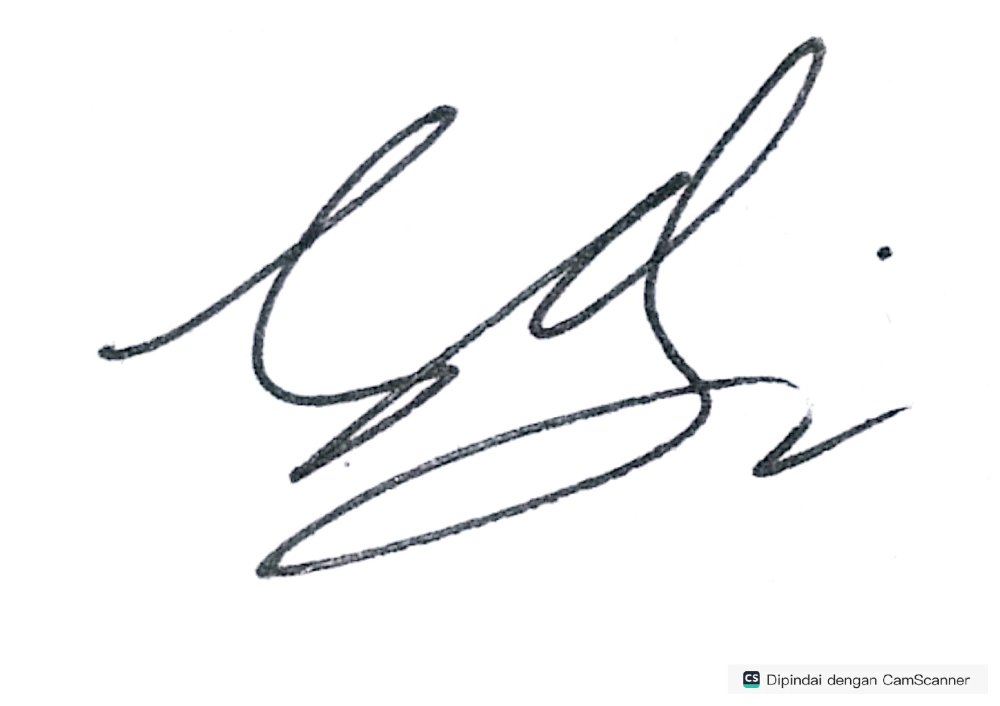
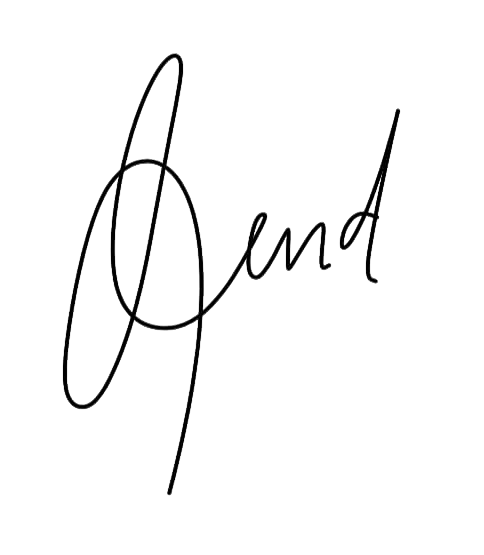
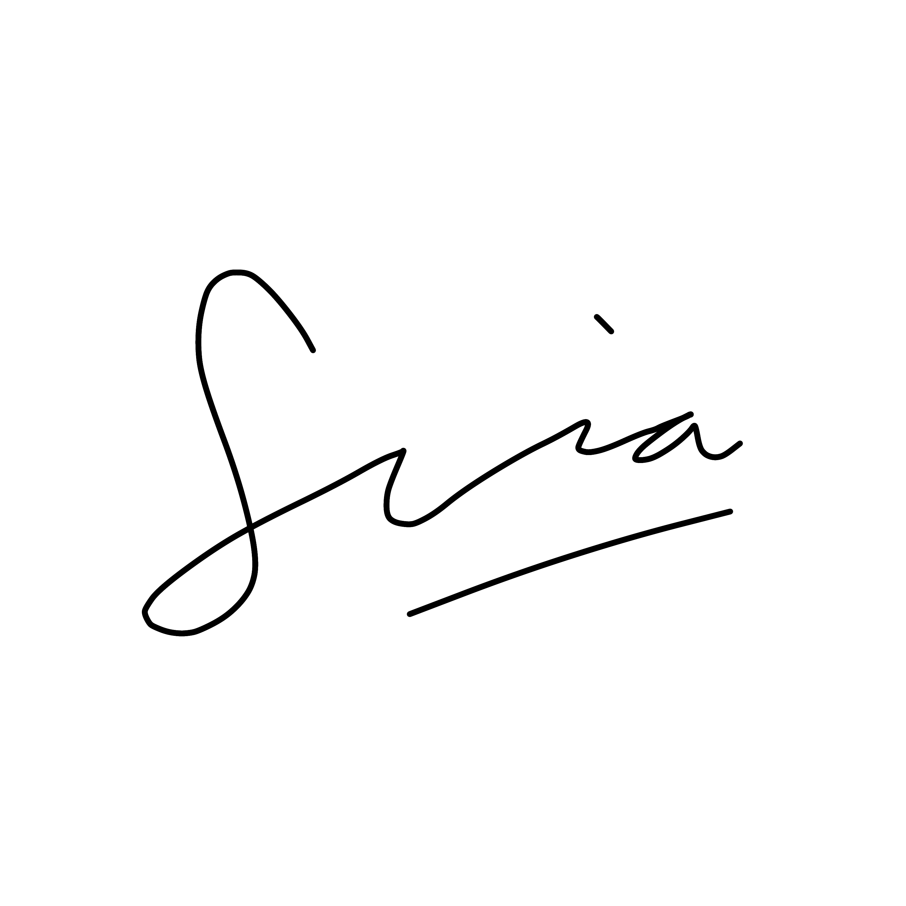

# Deklarasi Penggunaan AI

## Tugas Besar IF2150 - Rekayasa Perangkat Lunak

| Informasi | Keterangan |
|---|---|
| Kelas | *03* |
| Nomor Kelompok | *04* |
| Nama Kelompok | *pakespinwheel* |
| Nama Perangkat Lunak | *Mahasehat: Mental Health Monitoring App for Students* |

**Anggota Kelompok:**

| NIM | Nama |
|---|---|
| *13525021* | *Haikal Muhammad Royyan* |
| *13525066* | *Cynthia Winda Wijaya* |
| *13525081* | *Rendy Salastra Putra* |
| *13525090* | *Sophia Imelda Rogate Marpaung* |
| *13525141* | *Christabelcyne Costan* |

---

### Daftar Isi
* [Milestone 1](#milestone-1)
* [Milestone 2](#milestone-2)

---

### Log Penggunaan AI per Milestone

### Milestone 1
| Tool AI | Tujuan Penggunaan | Contoh Prompt Utama | Modifikasi & Validasi Manusia |
| :--- | :--- | :--- | :--- |
| | | | | |
| | | | | |

### Milestone 2
| Tool AI | Tujuan Penggunaan | Contoh Prompt Utama | Modifikasi & Validasi Manusia |
| :--- | :--- | :--- | :--- |
| | | | | |
| | | | | |

---
### Pernyataan Integritas dan Persetujuan

Kami yang bertanda tangan di bawah ini menyatakan bahwa seluruh log penggunaan AI di atas adalah benar. Kami telah memvalidasi seluruh hasil AI dan bertanggung jawab penuh atas orisinalitas, keamanan, dan kebenaran hasil akhir dari tugas ini.

| Tanda Tangan | Nama Anggota |
| :---: | :--- |
|  | **13525021 - Haikal Muhammad Royyan** |
|  | **13525066 - Cynthia Winda Wijaya** |
|  | **13525081 - Rendy Salastra Putra** |
|  | **13525090 - Sophia Imelda Rogate Marpaung** |
|  | **13525141 - Christabelcyne Costan** |