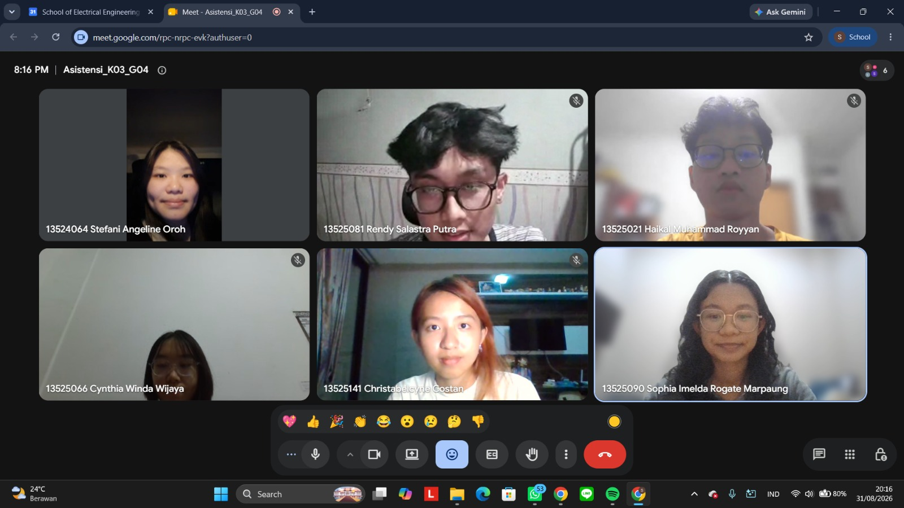

# Form Asistensi

## Tugas Besar IF2150 - Rekayasa Perangkat Lunak

| Informasi | Keterangan |
| --- | --- |
| **Hari** | *Senin* |
| **Tanggal** | *31/08/2026* |
| **Kelas** | *03* |
| **Nomor Kelompok** | *04*  |
| **Nama Kelompok** | *pakespinwheel*  |
| **Nama Perangkat Lunak** | *Mahasehat: Mental Health Monitoring App for Students*  |
| **Dokumen** | *K03_G04_TB.md*  |

### Anggota Kelompok

| NIM | Nama |
| --- | --- |
| *13525021* | *Haikal Muhammad Royyan* |
| *13525066* | *Cynthia Winda Wijaya* |
| *13525081* | *Rendy Salastra Putra* |
| *13525090* | *Sophia Imelda Rogate Marpaung* |
| *13525141* | *Christabelcyne Costan* |

### Catatan

| Catatan |
| --- |
| 1. *Bagian latar belakang masalah dan analisis kondisi saat ini sudah cukup bagus, sudah ada data yang mendukung juga.* |
| 2. *Bagian deskripsi perangkat lunak bisa diperjelas lagi, misalnya alasan mengapa memilih aplikasi mobile. Bagian asumsi dan batasan juga bisa dipanjangin lagi paragrafnya, jangan hanya 1-2 kalimat saja.* |
| 3. *Jika ada masalah seperti aksesibilitas atau budget, maka bisa dijelaskan di bagian batasan sistem. Batasan utama yang harus dijelaskan adalah ruang lingkup, sumber daya, dan hukum.* |
| 4. *Tambahkan psikolog/psikiater sebagai aktor pada bagian identifikasi aktor.* |
| 5. *Jangan lupa menambahkan subbab 3.3 Deskripsi Aktivitas. Diagramnya dibuat per aktivitas/alur sistem yang konteksnya beda.* |

## Dokumentasi

<!--  -->

  

  <i>Gambar 1. Dokumentasi kegiatan asistensi.</i>

