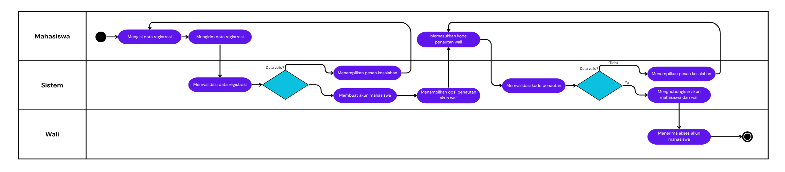
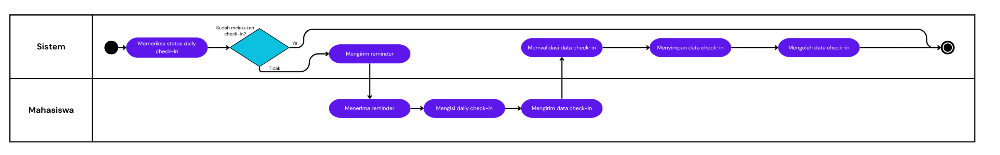
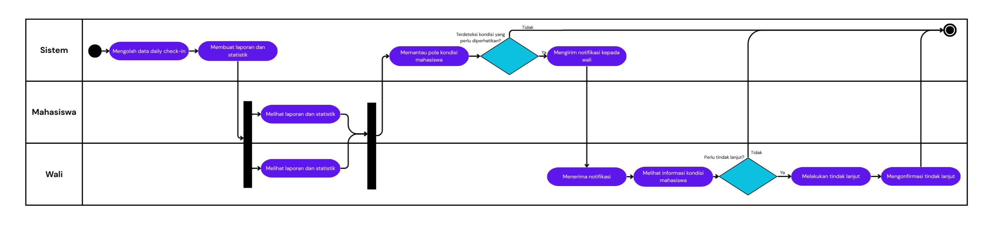
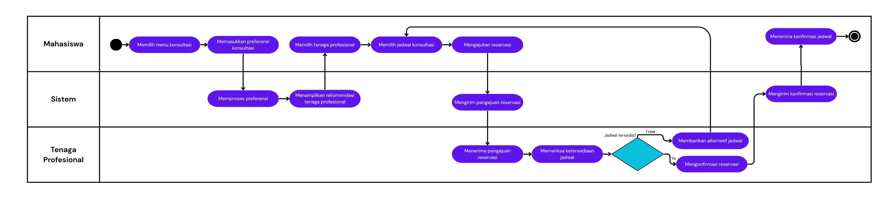

<h1>
IF2150 REKAYASA PERANGKAT LUNAK
 
TUGAS 1
 
TOPIC BRAINSTORMING
</h1>
 

## Mahasehat: Mental Health Monitoring App for Students

### Untuk: *Stefani Angeline Oroh*

Dipersiapkan oleh:
| Informasi | Keterangan |
| --- | --- |
| Kelas | *03* |
| Kelompok | *04*  |

| NIM | Nama |
|---|---|
| *13525021* | *Haikal Muhammad Royyan* |
| *13525066* | *Cynthia Winda Wijaya* |
| *13525081* | *Rendy Salastra Putra* |
| *13525090* | *Sophia Imelda Rogate Marpaung* |
| *13525141* | *Christabelcyne Costan* |
---

 
 

# BAB 1: Analisis Permasalahan

## 1.1 Latar Belakang Masalah
Kesehatan mental remaja menjadi salah satu isu kesehatan yang mendesak tetapi masih kurang mendapat perhatian di Indonesia. Survei nasional Indonesia-National Adolescent Mental Health Survey (I-NAMHS) pada 2022 mencatat sebanyak 15,5 juta remaja Indonesia (setara 1 dari 3 remaja usia 10-17 tahun) mengalami masalah kesehatan mental. Data terbaru program Cek Kesehatan Gratis (CKG) periode 2025-2026 dari Kementerian Kesehatan juga menemukan gejala masalah kesehatan mental seperti kecemasan dan depresi pada hampir 10% anak di Indonesia.

Dampak yang ditimbulkan tidak berakhir pada gangguan psikologis sementara saja tetapi dapat berujung pada kematian juga. Badan Riset dan Inovasi Nasional (BRIN) mencatat bahwa dari 2.112 kasus bunuh diri di Indonesia sepanjang 2012-2023, sebanyak 985 kasus atau sekitar 46,63% terjadi pada kelompok remaja. Meskipun pemerintah sudah berusaha meningkatkan akses fasilitas kesehatan, hanya sedikit remaja yang mencari bantuan profesional untuk masalah kesehatan mental mereka. Menurut peneliti utama I-NAMHS, hanya 2,6% dari remaja yang memiliki masalah kesehatan mental menggunakan fasilitas kesehatan mental atau konseling untuk membantu mengatasi masalah emosi dan perilaku mereka.

Permasalahan ini berkaitan erat dengan Tujuan Pembangunan Berkelanjutan (SDGs) ke-3 tentang Kehidupan Sehat dan Sejahtera, khususnya target 3.4 yang menekankan penurunan angka kematian dini akibat penyakit tidak menular termasuk gangguan kesehatan mental. Remaja merupakan kelompok usia yang diharapkan menjadi penopang bonus demografi menuju Indonesia Emas 2045. Jika masalah kesehatan mental pada remaja terus dibiarkan tanpa mekanisme deteksi dini dan akses penanganan yang memadai, maka risiko penurunan kualitas hidup, produktivitas, bahkan hilangnya nyawa generasi muda akan terus meningkat sehingga berdampak besar bagi masa depan bangsa.

## 1.2 Analisis Kondisi Saat Ini
Kesadaran masyarakat, terutama generasi muda, akan pentingnya kesehatan mental menunjukkan peningkatan yang signifikan dalam beberapa tahun terakhir. Namun dalam praktiknya, pemantauan kesehatan secara mandiri serta akses ke layanan profesional masih menghadapi berbagai kendala. Saat ini, sebagian besar masyarakat melakukan pemantauan kondisi emosional secara intuitif tanpa pencatatan yang terstruktur. Selain itu, pencarian lokasi layanan psikolog dan penjadwalan konsultasi sering sekali masih dilakukan secara terpisah melalui mesin pencari umum dan media sosial. Di sisi lain, meskipun sekarang terdapat beberapa solusi digital untuk pemantauan kondisi emosional pengguna dan layanan konsultasi secara daring, kebanyakan aplikasi tersebut cenderung berfokus pada satu domain saja, misalnya aplikasi khusus mood tracking, aplikasi khusus konsultasi, atau aplikasi khusus pemantauan kondisi fisik. Hal ini menyebabkan pengguna terpaksa mengunduh banyak aplikasi sehingga pemantauan terasa merepotkan dan kurang efisien. Oleh karena itu, diperlukan suatu perangkat lunak terpadu yang mampu mengintegrasikan mood tracking, pemantauan aktivitas fisik, dan layanan konsultasi serta aksesibilitas layanan psikolog terdekat dalam satu ekosistem yang mudah diakses.

---

# BAB 2: Analisis Solusi

## 2.1 Deskripsi Perangkat Lunak
Sistem ini merupakan aplikasi berbasis web yang dirancang untuk memantau kesehatan mental kalangan pelajar secara berkala, mencakup siswa sekolah hingga mahasiswa perguruan tinggi. Masalah yang sering terjadi adalah kebiasaan pelajar memendam tekanan emosional dan beban akademik seorang diri, baik bagi yang tinggal bersama keluarga maupun yang sedang merantau, sehingga pihak wali kerap terlambat menyadari memburuknya kondisi psikologis mereka. Untuk menjembatani masalah tersebut, aplikasi ini menyediakan ruang pencatatan mandiri yang privat bagi pelajar, dasbor ringkasan perkembangan bagi orang tua atau wali tanpa melanggar ruang pribadi pengguna, serta jalur rujukan ke layanan konseling profesional terdekat.

Secara umum, alur kerja sistem terbagi ke dalam tiga fitur utama:

1. **Pencatatan Harian Pelajar:** Fitur ini digunakan pelajar setiap hari untuk mencatat kondisi yang sedang dialami. Pelajar memilih tingkatan suasana hati dari angka 1 (sangat buruk) sampai 5 (sangat baik), memasukkan perkiraan jam tidur malam sebelumnya, memilih faktor pemicu emosi harian (seperti tugas akademik, ujian, perkuliahan, pertemanan, atau masalah keluarga), serta menuliskan cerita bebas pada kolom buku harian digital.
2. **Dasbor Pemantau Orang Tua atau Wali:** Sistem mengolah data angka pencatatan harian menjadi visualisasi grafik mingguan yang mudah dibaca oleh orang tua atau pihak wali. Dari dasbor ini, wali dapat melihat pola naik-turun suasana hati dan rata-rata jam istirahat pelajar. Sistem menerapkan pembatasan data yang tegas, yaitu wali hanya memiliki akses terhadap grafik rangkuman data dan tidak dapat membaca isi tulisan curhat atau buku harian pribadi yang ditulis oleh pelajar.
3. **Pencarian Tempat Konseling dan Bantuan Awal:** Apabila catatan suasana hati pelajar menunjukkan penurunan berkelanjutan selama beberapa hari berturut-turut, sistem secara otomatis memunculkan kuesioner singkat untuk mengevaluasi tingkat stres atau kejenuhan (*burnout*). Jika hasil evaluasi mengindikasikan perlunya konsultasi lanjutan, sistem menyajikan daftar fasilitas kesehatan mental atau tempat praktik psikolog terdekat, lengkap dengan alamat, kontak, kisaran biaya layanan, dan formulir untuk membuat janji temu.

### Bentuk Aplikasi dan Alasan Pemilihan
Aplikasi ini dibangun berbasis situs web yang dioptimalkan khusus untuk tampilan layar ponsel (*mobile-friendly*), dengan pertimbangan praktis berikut:

1. **Kemudahan Akses Lintas Perangkat:** Pelajar dapat langsung membuka tautan aplikasi melalui peramban ponsel di sela-sela jam pelajaran atau kuliah, serta dapat menyematkan ikon pintasan aplikasi di menu utama ponsel tanpa membebani kapasitas memori penyimpanan. Di sisi lain, orang tua, wali, maupun pihak konselor dapat membuka dasbor dengan nyaman melalui layar laptop atau tablet.
2. **Pemanfaatan Fitur Lokasi Bawaan Ponsel:** Penentuan jarak ke fasilitas kesehatan atau psikolog terdekat memanfaatkan fitur pembaca lokasi yang sudah menjadi standar bawaan pada peramban web pengguna. Pendekatan ini membuat sistem tidak memerlukan modul atau program tambahan yang rumit untuk menghitung perkiraan jarak tempuh.
3. **Tetap Ringan dan Memiliki Pengingat:** Berkas tampilan web disimpan di penyimpanan lokal peramban sehingga halaman tetap dapat dibuka dengan responsif meskipun koneksi internet di area sekolah, kampus, atau tempat tinggal sedang lambat. Aplikasi juga dilengkapi fitur pengingat rutin melalui notifikasi peramban agar pelajar konsisten mengisi catatan harian.
4. **Pengembangan dan Pengujian Efisien:** Berbasis situs web mempermudah alur kerja tim pengembang dalam melakukan uji coba berkala bersama dosen pembimbing maupun pengguna. Perbaikan antarmuka atau pembaruan kode dapat langsung dicoba secara daring melalui tautan web tanpa perlu membuat dan membagikan berkas instalasi aplikasi secara berulang.

### Keunggulan Sistem
1. **Menjaga Batas Privasi Pengguna:** Kendala utama pada aplikasi pemantau keluarga adalah enggannya pelajar bersikap jujur karena merasa diawasi secara penuh. Sistem ini menerapkan pemisahan data yang ketat, yaitu isi tulisan curhat tersimpan aman dan hanya bisa diakses oleh pelajar yang bersangkutan, sedangkan wali hanya menerima visualisasi tren emosi dan durasi tidur. Pelajar memegang kendali untuk menyetujui atau menautkan akses pemantauan wali. Untuk pemutusan akses, sistem menerapkan masa tenggang sebelum akses benar-benar terputus (khususnya jika status darurat sedang aktif) supaya mekanisme notifikasi darurat ke wali tetap bisa berjalan sesuai fungsinya.
2. **Menghubungkan Pola Istirahat dengan Kondisi Emosi:** Berbeda dengan aplikasi buku harian biasa yang hanya memuat teks, sistem ini menyandingkan data durasi tidur dengan perubahan suasana hati harian dalam grafik mingguan hingga bulanan. Visualisasi ini membantu pelajar memahami secara nyata dampak kurang tidur terhadap penurunan konsentrasi dan kestabilan emosi mereka.
3. **Alur Bantuan yang Konkret dan Terpadu:** Sistem tidak berhenti sebatas pencatatan grafik suasana hati. Ketika terdeteksi indikasi tekanan emosional yang berkepanjangan, aplikasi langsung mengarahkan pengguna ke pilihan solusi nyata berupa daftar fasilitas kesehatan mental terdekat beserta formulir pendaftaran jadwal konsultasi, sehingga pengguna tidak perlu mencari rujukan secara terpisah.

---

## 2.2 Asumsi dan Batasan

### Asumsi Pengembangan

#### Asumsi Pengguna
- Pelajar mengisi data suasana hati, waktu tidur, dan pilihan aktivitas harian secara mandiri dan jujur sesuai dengan kondisi yang dialami.
- Orang tua atau wali memahami cara membaca grafik perkembangan sederhana yang ditampilkan pada dasbor, serta menghargai batas privasi catatan tertulis pelajar.
- Pengguna memberikan izin akses saat peramban meminta otorisasi pembacaan lokasi dan izin pengiriman notifikasi pengingat harian.

#### Asumsi Teknis
- Pengguna menjalankan aplikasi melalui peramban web modern versi terkini (seperti Google Chrome, Mozilla Firefox, atau Safari).
- Perangkat pengguna memiliki fungsi penunjuk lokasi yang aktif (melalui sensor GPS atau jaringan seluler/Wi-Fi).
- Perangkat pengguna terhubung ke internet agar catatan yang diisi di ponsel bisa tersimpan ke sistem.

#### Asumsi Data
- Data alamat fasilitas layanan kesehatan mental, nomor kontak klinik, dan izin praktik tenaga psikolog yang dihimpun ke dalam sistem merupakan data resmi yang masih aktif dan valid di wilayah uji coba.

### Batasan Sistem

#### Batasan Aturan dan Perlindungan Data
- Berdasarkan Pasal 25 UU No. 27 Tahun 2022 tentang Pelindungan Data Pribadi (UU PDP) yang mewajibkan izin orang tua bagi anak yaitu pelajar di bawah 18 tahun, sedangkan pelajar di atas usia tersebut dapat mendaftar langsung secara mandiri. Selain itu, karena catatan emosi termasuk data kesehatan pribadi menurut Pasal 4 UU PDP, datanya wajib dilindungi dan pembagian grafik ke akun wali hanya berjalan atas persetujuan pelajar.

#### Batasan Pengerjaan Proyek
- **Waktu Pengerjaan:** Proses perancangan, pembuatan antarmuka, penulisan kode program, hingga pengujian sistem dibatasi dalam rentang waktu satu semester akademik.
- **Kapasitas Tim Pengembang:** Aplikasi dikembangkan oleh kelompok yang terdiri atas lima mahasiswa Teknik Informatika, dengan pembagian tugas yang diselaraskan bersama beban perkuliahan paralel lainnya.
- **Biaya Pengembangan:** Proyek ini dikerjakan tanpa anggaran khusus, sehingga kebutuhan server dan penyimpanan data sepenuhnya mengandalkan layanan gratis (*free-tier*).

#### Batasan Fitur dan Ruang Lingkup
- **Batasan Fungsi Medis:** Sistem ini murni berfungsi sebagai sarana pencatatan mandiri dan deteksi dini tingkat stres, bukan instrumen medis untuk menetapkan diagnosis gangguan kejiwaan formal ataupun memberikan resep obat. Penetapan diagnosis dan tindakan medis lanjutan tetap sepenuhnya berada di bawah wewenang psikolog atau psikiater berlisensi.
- **Batasan Layanan Darurat:** Sistem tidak menyediakan tenaga medis atau operator yang berjaga selama 24 jam. Untuk situasi darurat, aplikasi hanya menyediakan tombol pintasan yang langsung mengarahkan panggilan ke kontak bantuan resmi, seperti saluran kesehatan jiwa 119 ekstensi 8.
- **Pencatatan Aktivitas Istirahat Manual:** Sistem tidak terhubung langsung ke sensor jam tangan pintar (*smartwatch*). Durasi waktu tidur dan pemilihan jenis pemicu aktivitas diisi secara manual oleh pelajar pada formulir harian.
- **Peniadaan Transaksi Finansial di Aplikasi:** Fitur konsultasi hanya mencakup pencarian informasi ketersediaan jadwal dan pengisian formulir reservasi temu. Sistem tidak memproses transaksi pembayaran secara daring. Seluruh biaya konsultasi diselesaikan langsung oleh pengguna di tempat fasilitas layanan yang dipilih.
- **Cakupan Wilayah Terbatas:** Basis data fasilitas kesehatan dan daftar tenaga psikolog pada tahap awal percontohan ini dibatasi pada area regional tertentu (wilayah Bandung Raya dan sekitarnya) menggunakan data publik terverifikasi yang dihimpun oleh tim pengembang.
  
---

# BAB 3: Spesifikasi Kebutuhan dan Proses Bisnis

## 3.1 Identifikasi Aktor

| Aktor | Deskripsi |
| :--- | :--- |
| Pelajar | Pelajar merupakan pengguna utama yang melakukan pencatatan kondisi diri secara mandiri, meliputi suasana hati, pola makan, tidur, aktivitas fisik, dan kondisi kesehatan lainnya. Pelajar dapat melihat perkembangan kondisi dirinya, memperoleh rekomendasi atas informasi kesehatannya, melakukan konsultasi dengan tenaga profesional, serta menghubungi layanan darurat ketika membutuhkan bantuan. Karakteristik dari aktor ini adalah kemudahan penggunaan, kecepatan input data, keamanan dan privasi, visualisasi informasi, akses konsultasi, dan akses bantuan darurat. |
| Orang Tua / Wali | Wali merupakan pihak yang berperan dalam memantau kondisi pelajar berdasarkan informasi yang dibagikan. Wali dapat melihat ringkasan perkembangan kondisi pengguna, menerima notifikasi apabila terdapat kondisi yang memerlukan perhatian, serta memperoleh informasi lain yang dapat membantu proses pengawasan. Karakteristik dari aktor ini adalah kemudahan penggunaan, kelengkapan metrik pemantauan, kemudahan memahami kondisi pengguna, notifikasi, dan informasi real-time. |
| Psikolog | Psikolog merupakan tenaga ahli yang memberikan layanan konsultasi dan pendampingan psikologis kepada pengguna. Psikolog dapat melihat informasi kesehatan dan riwayat kondisi yang telah diberikan oleh pengguna, melakukan konsultasi, memberikan asesmen atau rekomendasi, serta memantau perkembangan kondisi psikologis pengguna. Karakteristik dari aktor ini adalah kemudahan penggunaan, kelengkapan data psikologis, riwayat kondisi pengguna, keamanan data, dan kemudahan konsultasi. |
| Psikiater | Psikiater merurpakan tenaga medis yang memberikan konsultasi dan penanganan terkait kondisi kesehatan jiwa pengguna. Psikiater dapat mengakses informasi yang relevan dengan persetujuan pengguna, melakukan asesmen, memberikan rekomendasi penanganan, serta melakukan tindak lanjut terhadap kondisi pengguna. Karakteristik dari aktor ini adalah kemudahan penggunaan, kelengkapan riwayat kesehatan, akurasi informasi, keamanan data medis, dan kemudahan konsultasi. |
| Instansi Pemerintah | Instansi Pemerintah merupakan pihak yang menerima permintaan bantuan ketika pengguna mengalami kondisi darurat. Mereka dapat menerima informasi yang diperlukan untuk proses penanganan, seperti identitas pengguna, lokasi, dan jenis keadaan darurat. Karakteristik dari aktor ini adalah kecepatan menerima laporan, kelengkapan informasi darurat, akurasi lokasi, informasi real-time, dan kemudahan koordinasi. |
| Administrator | Administrator merupakan pihak yang bertanggung jawab terhadap pengelolaan sistem, akun pengguna, data layanan, serta operasional aplikasi. Karakteristik dari aktor ini adalah kemudahan pengelolaan sistem, kemudahan pengelolaan akun dan hak akses, kemudahan pemantauan sistem, keamanan data, serta kemudahan pengelolaan informasi.|

## 3.2 Kebutuhan Pengguna Awal

| ID | Aktor | Kebutuhan / Aktivitas | Tujuan / Nilai |
| :--- | :--- | :--- | :--- |
| US-01 | *Pelajar* |  *Membuat akun dan mendaftarkan informasi awal serta kontak wali* | *Mempermudah penggunaan aplikasi dan menyediakan informasi yang diperlukan untuk pemantauan* |
| US-02 | *Pelajar* | *Mendapatkan pengingat untuk melakukan daily check-in* | *Menjaga konsistensi pencatatan kondisi diri* |
| US-03 | *Pelajar* | *Mencatat kondisi mood, aktivitas fisik, pola makan, dan tidur secara berkala* | *Memantau kondisi kesehatan fisik dan mental sehari-hari* |
| US-04 | *Pelajar* | *Melihat hasil pengolahan dan statistik kondisi diri* | *Memahami pola dan perubahan kondisi kesehatan dari waktu ke waktu* |
| US-05 | *Pelajar & Orang Tua / Wali* | *Mendapatkan laporan rangkuman kondisi kesehatan secara berkala* | *Memahami perkembangan kondisi diri dan mengetahui kondisi yang perlu diperhatikan* |
| US-06 | *Pelajar* | *Mendapatkan rekomendasi psikolog atau psikiater* | *Menemukan tenaga profesional yang sesuai dengan kebutuhan dan preferensi.* |
| US-07 | *Pelajar / Psikolog / Psikiater* | *Menjadwalkan dan mengonfirmasi konsultasi* | *Mempermudah pengguna mendapatkan layanan konsultasi dengan tenaga profesional* |
| US-08 | *Orang Tua / Wali* | *Menerima notifikasi ketika terjadi kondisi darurat atau pola kebiasaan yang aneh* | *Membantu wali memantau kondisi pengguna dan memberikan bantuan/perhatian yang diperlukan* |
| US-09 | *Orang Tua / Wali* | *Mengonfirmasi penerimaan dan tindak lanjut notifikasi darurat* | *Memastikan penindaklanjutan kondisi darurat* |

## 3.3 Deskripsi Aktivitas
Berikut adalah daftar seluruh aktivitas yang terdapat dalam sistem solusi, lengkap dengan ID dan penjelasan.
| ID | Aktivitas | Penjelasan | ID User Story |
| :--- | :--- | :--- | :--- |
| A01 | *Melakukan Registrasi* | *User membuat akun termasuk riwayat kesehatan mental dan mendaftarkan kontak orang tua/wali.* | *US-01* |
| A02 | *Mengirim Reminder* | *Sistem mengirim notifikasi pengingat jika user belum check-in di waktu tertentu.* | *US-02* |
| A03 | *Melakukan Daily Check-in* | *User mengisi kebutuhan daily check-in, mulai dari skala mood harian, mengisi detail aktivitas fisik, hingga pola makan dan tidur harian.* | *US-03* |
| A04 | *Memantau Daily Check-in* | *Sistem memantau user rutin melakukan daily check-in setiap hari atau tidak.* | *US-02* |
| A05 | *Menyimpan Data* | *Sistem menyimpan histori daily check-in user ke database untuk keperluan analisis dan laporan.* | *US-03* |
| A06 | *Mengolah Data* | *Sistem menghitung dan menganalisis statistik input daily check-in user dalam suatu periode.* | *US-04* |
| A07 | *Menyusun Laporan* | *Sistem membuat dokumen rangkuman laporan terstruktur terkait kondisi kesehatan mental user dalam suatu periode, termasuk indikator risiko berbasis aturan ambang batas (rule-based) yang menandai pola tidak biasa pada data user.* | *US-05* |
| A08 | *Memberi Rekomendasi Tenaga Medis* | *Sistem memberikan pilihan psikolog/psikiater berdasarkan lokasi, estimasi biaya konsultasi, dan analisis kondisi user.* | *US-06* |
| A09 | *Merencanakan Konsultasi* | *User memilih tenaga medis sesuai preferensinya lalu menjadwalkan konsultasi melalui sistem.* | *US-07* |
| A10 | *Mengonfirmasi Konsultasi* | *Tenaga medis mengecek jadwal konsultasi lalu mengonfirmasi pengajuan konsultasi user.* | *US-07* |
| A11 | *Mengirim Laporan* | *Sistem mengirimkan laporan dalam suatu periode kepada user dan/atau orang tua/wali.* | *US-05* |
| A12 | *Mendeteksi Kondisi Darurat* | *Sistem menandai kondisi berisiko ketika ketidakaktifan check-in berhari-hari disertai tren laporan kesehatan memburuk, berdasarkan ambang batas yang telah ditentukan (bukan hasil diagnosis klinis).* | *US-05/US-08* |
| A13 | *Mengirim Notifikasi Darurat* | *Sistem mengirim notifikasi atau pesan ke kontak orang tua/wali yang terdaftar saat kondisi darurat terdeteksi.* | *US-08* |
| A14 | *Mengonfirmasi Notifikasi Darurat* | *Orang tua/wali mengonfirmasi telah menerima dan menindaklanjuti notifikasi darurat.* | *US-09* |

## 3.4 Model Proses Bisnis

Model proses bisnis dibuat untuk menggambarkan bagaimana pengguna berinteraksi dengan sistem dalam menjalankan fungsi-fungsi utama aplikasi. Berdasarkan aktivitas yang sudah diidentifikasi pada bagian sebelumnya, proses bisnis sistem dibagi menjadi beberapa alur berdasarkan konteks aktivitas yang berbeda, yaitu:
1. Alur pendaftaran dan penautan akun wali
2. Alur pencatatan kondisi harian (_Daily Check-in_)
3. Alur pemantauan kondisi dan penanganan darurat
4. Alur pencarian dan reservasi konsultasi profesional

### 3.4.1 Alur Pendaftaran dan Penautan Akun Wali
Alur ini menggambarkan proses awal ketika mahasiswa membuat akun dan menghubungkan akun dengan orang tua/wali. Mahasiswa mengisi informasi yang diperlukan, kemudian sistem melakukan proses verifikasi dan membuat akun. Setelah itu, mahasiswa dapat menautkan akun wali agar wali dapat menerima informasi dan memantau kondisi.

  <i>Gambar 1. Alur Pendaftaran dan Penautan Akun Wali</i>

### 3.4.2 Alur Pencatatan Kondisi Harian (_Daily Check-in_)
Alur ini menggambarkan proses mahasiswa dalam melakukan pencatatan kondisi sehari-hari. Mahasiswa mendapatkan pengingat dari sistem apabila belum melakukan check-in, kemudian mengisi informasi mengenai mood, aktivitas fisik, pola makan, dan pola tidur. Data yang telah diisi akan disimpan oleh sistem dan digunakan untuk melihat perkembangan kondisi mahasiswa dari waktu ke waktu.

  <i>Gambar 2. Alur Pencatatan Kondisi Harian (_Daily Check-in_)</i>

### 3.4.3 Alur Pemantauan Kondisi dan Penanganan Darurat
Alur ini menggambarkan proses sistem dalam mengolah data _daily check-in_ untuk mengetahui perkembangan kondisi mahasiswa. Sistem akan mengolah data menjadi laporan dan statistik yang dapat dilihat oleh mahasiswa dan wali sesuai dengan hak aksesnya. Apabila sistem menemukan pola kondisi yang perlu diperhatikan, seperti penurunan kondisi secara terus-menerus atau mahasiswa tidak melakukan check-in selama beberapa hari, sistem dapat mengirimkan notifikasi kepada wali.

  <i>Gambar 3. Alur Pemantauan Kondisi dan Penanganan Darurat</i>

### 3.4.4 Alur Pencarian dan Reservasi Konsultasi Profesional
Alur ini menggambarkan proses mahasiswa ketika membutuhkan bantuan dari tenaga profesional. Mahasiswa dapat melihat rekomendasi psikolog atau psikiater berdasarkan kondisi dan preferensinya, seperti lokasi dan biaya. Setelah memilih tenaga profesional yang sesuai, mahasiswa dapat memilih jadwal konsultasi dan mengajukan reservasi. Tenaga profesional kemudian dapat melihat pengajuan tersebut dan melakukan konfirmasi jadwal.

  <i>Gambar 4. Alur Pencarian dan Reservasi Konsultasi Profesional</i>

# Referensi

- Undang-Undang Republik Indonesia Nomor 27 Tahun 2022 tentang Pelindungan Data Pribadi: https://peraturan.bpk.go.id/Details/229798/uu-no-27-tahun-2022
- Alarm Kesehatan Mental Anak: CKG Temukan Ratusan Ribu Anak Bergejala Cemas dan Depresi: https://kemkes.go.id/id/alarm-kesehatan-mental-anak-ckg-temukan-ratusan-ribu-anak-bergejala-cemas-dan-depresi
- Hasil Survei I-NAMHS: Satu dari Tiga Remaja Indonesia Memiliki Masalah Kesehatan Mental: https://ugm.ac.id/id/berita/23086-hasil-survei-i-namhs-satu-dari-tiga-remaja-indonesia-memiliki-masalah-kesehatan-mental/
- Pemeriksaan Kesehatan Mental Gratis Bagi Remaja: https://berkas.dpr.go.id/pusaka/files/isu_sepekan/Isu%20Sepekan---I-PUSLIT-Februari-2025-217.pdf
- Sustainable Development Goal 3 Good Health and Well-Being: https://www.un.org/sustainabledevelopment/health/
