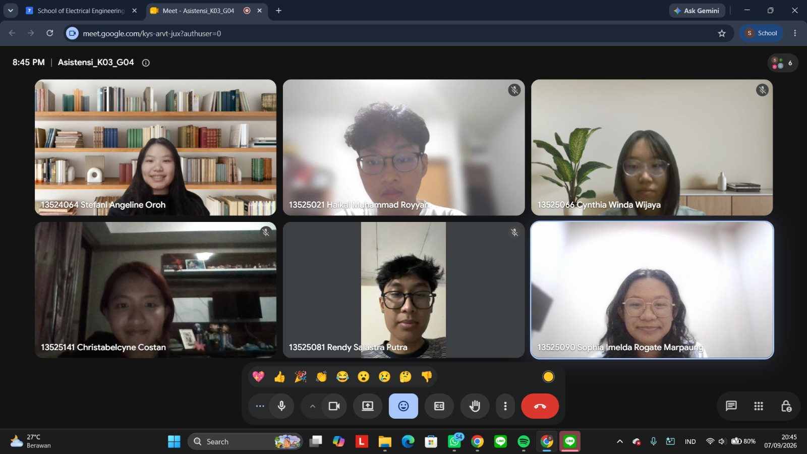

# Form Asistensi

## Tugas Besar IF2150 - Rekayasa Perangkat Lunak

| Informasi | Keterangan |
| --- | --- |
| **Hari** | *Senin* |
| **Tanggal** | *07/09/2026* |
| **Kelas** | *03* |
| **Nomor Kelompok** | *04*  |
| **Nama Kelompok** | *pakespinwheel*  |
| **Nama Perangkat Lunak** | *Mahasehat: Mental Health Monitoring App for Students*  |
| **Dokumen** | *K03_G04_RG.md*  |

### Anggota Kelompok

| NIM | Nama |
| --- | --- |
| *13525021* | *Haikal Muhammad Royyan* |
| *13525066* | *Cynthia Winda Wijaya* |
| *13525081* | *Rendy Salastra Putra* |
| *13525090* | *Sophia Imelda Rogate Marpaung* |
| *13525141* | *Christabelcyne Costan* |

### Catatan

| Catatan |
| --- |
| 1. *Aktor psikolog dan psikiater digabungin saja jadi satu aktor (misalnya tenaga medis) karena perannya tidak jauh berbeda.*  |
| 2. *Layangan darurat dan administrator tidak perlu dimasukkan ke bagian aktor. Anggap job administrator dilakukan dengan otomatisasi saja.* |
| 3. *Penamaan aktor pelajar/mahasiswa disarankan pakai rentang usia saja agar tetap sejalan dengan latar belakang.* |
| 4. *Kebutuhan Fungsional (KF) dan Kebutuhan Non-Fungsional (KNF) ditulis dengan EARS. Pastikan semua ID Kebutuhan masuk ke bagian KF dan KNF, kecuali yang tidak didukung oleh perangkat lunak.* |
| 5. *Di bagian KF, beberapa ID Kebutuhan bisa digabungin menjadi satu, khususnya yang deskripsi kebutuhannya mirip atau ID Aktivitasnya sama.* |
| 6. *Di bagian KNF, pastikan menganalisis semua parameter. Misalnya, portability: perangkat lunak hanya didukung oleh Windows 10, memory: ukurannya berapa mb, response time: generate analisis kondisi kesehatannya berapa ms, security: data pengguna jangan sampai leak.* |
| 7. *Periksa kembali bagian yang masih typo dan jangan sampai ada subbab yang tidak selaras dengan subbab lainnya (inkonsistensi).* |

## Dokumentasi

<!--  -->

  

  <i>Gambar 1. Dokumentasi kegiatan asistensi.</i>

