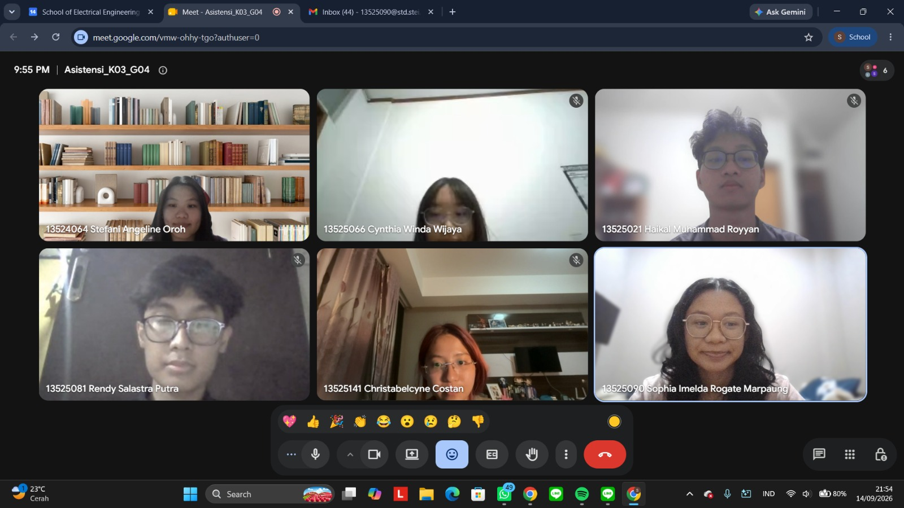

# Form Asistensi

## Tugas Besar IF2150 - Rekayasa Perangkat Lunak

| Informasi | Keterangan |
| --- | --- |
| **Hari** | *Senin* |
| **Tanggal** | *14/09/2026* |
| **Kelas** | *03* |
| **Nomor Kelompok** | *04*  |
| **Nama Kelompok** | *pakespinwheel*  |
| **Nama Perangkat Lunak** | *Mahasehat: Mental Health Monitoring App for Students*  |
| **Dokumen** | *K03_G04_UC.md*  |

### Anggota Kelompok

| NIM | Nama |
| --- | --- |
| *13525021* | *Haikal Muhammad Royyan* |
| *13525066* | *Cynthia Winda Wijaya* |
| *13525081* | *Rendy Salastra Putra* |
| *13525090* | *Sophia Imelda Rogate Marpaung* |
| *13525141* | *Christabelcyne Costan* |

### Catatan

| Catatan |
| --- |
| 1. *Di bagian skenario use case, aksi aktor yang masih diisi dengan "-" sebaiknya digabung ke aksi lainnya yang bersesuaian karena reaksi perangkat lunak ada setelah aksi aktor.*  |
| 2. *Untuk skenario alternatif UC02, bisa ditambahkan "Orang tua/wali tidak segera menekan tombol persetujuan dalam batas waktu tertentu".* |
| 3. *Untuk skenario UC03, bisa ditambahkan tombol konfirmasi. Pada skenario alternatif, bisa kondisi masukan yang tidak sesuai format formulir daily check-in.* |
| 4. *Tambahkan use case untuk masuk akun (log in) dan keluar akun (log out). Nanti akan berdampak pada penambahan KF dan pemenuhan kebutuhan. Keterangan penambahannya dicantumkan di tabel perubahan M3 saja.* |
| 5. *Usahakan setiap keputusan krusial di sistem menampilkan pop up error prevention.* |
| 6. *Tentukan alternatif solusi notifikasi jika tidak bisa diimplementasikan di web, misalnya dengan menghubungkan ke akun WhatsApp atau Telegram pengguna.* |
| 7. *Untuk diagram use case, cukup menampilkan aktor utama sistem saja (pelajar, orang tua/wali, dan tenaga kesehatan). Gunakan include extend dan pastikan semua use case sudah termasuk ke diagram.* |

## Dokumentasi

<!--  -->

  

  <i>Gambar 1. Dokumentasi kegiatan asistensi.</i>

