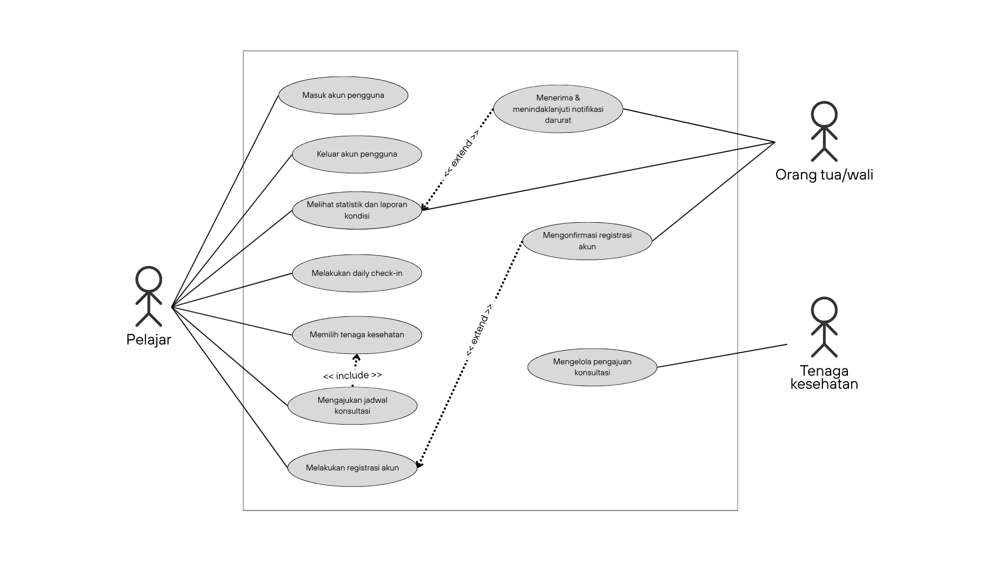

<h1>
IF2150 REKAYASA PERANGKAT LUNAK
 
TUGAS 3
 
USE CASE & SCENARIO USE CASE
</h1>
 

## *Mahasehat: Mental Health Monitoring App for Students*

### Untuk: *Stefani Angeline Oroh*

Dipersiapkan oleh:
| Informasi | Keterangan |
| --- | --- |
| Kelas | *03* |
| Kelompok | *04*  |

| NIM | Nama |
|---|---|
| *13525021* | *Haikal Muhammad Royyan* |
| *13525066* | *Cynthia Winda Wijaya* |
| *13525081* | *Rendy Salastra Putra* |
| *13525090* | *Sophia Imelda Rogate Marpaung* |
| *13525141* | *Christabelcyne Costan* |
---

## Daftar Perubahan

| Revisi | Deskripsi |
| :--- | :--- |
| *A* | *Penambahan kebutuhan R31 dan R32 untuk login dan logout akun.* |
| *B* | *Penambahan kebutuhan fungsional KF22, KF23, dan KF24* |

 
 

# BAB 1: Deskripsi Perangkat Lunak
Mahasehat merupakan sistem pemantauan kesehatan mental berbasis web responsif yang dirancang untuk kalangan pelajar dan mahasiswa. Sistem ini dikembangkan untuk menjawab permasalahan nyata di lingkungan pendidikan, di mana banyak pelajar cenderung memendam stres akademik maupun masalah pribadi seorang diri. Di sisi lain, orang tua/wali sering terlambat menyadari penurunan kondisi psikologis anak karena minimnya komunikasi atau keterbatasan jarak, khususnya bagi mahasiswa rantau. Mahasehat memadukan pencatatan mandiri oleh pelajar, dasbor pemantauan bagi orang tua/wali, serta alur rujukan bantuan profesional ke dalam satu sistem yang tetap mengutamakan kerahasiaan data pribadi pengguna.

### Ekspektasi Pengguna
1. **Pelajar (Usia 10-24 tahun):** Membutuhkan sarana pencatatan kondisi harian (*daily check-in*) yang cepat diakses lewat peramban ponsel tanpa membebani rutinitas harian. Ekspektasi paling mendasar adalah adanya jaminan privasi penuh. Pelajar bersedia mengisi data secara jujur apabila catatan curahan hati atau jurnal bebas mereka terjamin tidak bisa dibaca oleh pihak lain, termasuk orang tua. Selain itu, pelajar mengharapkan solusi konkret yang langsung mengarahkan ke layanan bantuan ketika kondisi mereka memburuk.
2. **Orang Tua/Wali:** Menginginkan sarana untuk memantau stabilitas kondisi anak secara berkala tanpa terkesan mengintervensi ruang pribadi anak. Orang tua/wali mengharapkan visualisasi data yang sederhana dan mudah dipahami, serta notifikasi peringatan otomatis jika terdeteksi indikasi stres berkepanjangan atau anomali pengisian data.
3. **Tenaga Kesehatan (Psikolog/Psikiater):** Mengharapkan alur pendaftaran konsultasi awal yang terdata dengan rapi. Riwayat tren tidur dan catatan suasana hati yang dibagikan atas izin pengguna juga diharapkan dapat membantu proses asesmen awal saat konsultasi berlangsung.

### Alur Kerja Utama Sistem
Berikut adalah alur kerja utama sistem yang mengandung pembahasan fitur, fungsi utama, dan cakupan sistem.
1. **Pencatatan Mandiri Berkala:** Pelajar menerima notifikasi pengingat harian dari sistem untuk memasukkan skala suasana hati (1–5), perkiraan durasi tidur, pola makan, faktor pemicu stres (seperti beban tugas, perkuliahan, atau masalah relasi), serta tulisan refleksi diri opsional pada kolom jurnal/catatan pribadi.
2. **Pengolahan Data dan Dasbor Terpisah:** Data numerik yang dihimpun diolah menjadi grafik tren mingguan atau bulanan. Pelajar dapat melihat korelasi antara pola istirahat dengan perubahan suasana hatinya. Sedangkan akun orang tua/wali yang terhubung hanya bisa melihat grafik ringkasan, tanpa bisa membaca isi jurnal pelajar.
3. **Peringatan Otomatis dan Rujukan Bantuan:** Jika hasil tren kondisi kesehatan mengindikasikan perlu bantuan lebih lanjut, sistem akan menampilkan rekomendasi klinik atau tenaga kesehatan terdekat lengkap dengan perkiraan biaya dan formulir jadwal konsultasi di akun pelajar. Di saat yang sama, sistem mengirimkan notifikasi perhatian ke dasbor orang tua/wali agar dapat memantau situasi. Notifikasi darurat ini juga menyertakan status yang harus dikonfirmasi dan ditindaklanjuti oleh orang tua/wali.

### Harapan Penerapan Solusi
Pemisahan hak akses ini dirancang agar pelajar merasa aman saat berinteraksi dengan sistem. Selama ini, keengganan pelajar untuk mencatat kondisi emosionalnya secara rutin sering kali dipicu oleh rasa cemas bahwa tulisan pribadinya akan dihakimi atau diawasi berlebihan oleh orang tua. Dengan kepastian bahwa catatan jurnal bersifat privat dan orang tua/wali hanya menerima visualisasi grafik tren, pelajar diharapkan tidak ragu untuk mengisi data secara jujur dan konsisten. Data yang valid inilah yang menjadi dasar bagi sistem untuk mendeteksi indikasi penurunan kondisi psikologis secara tepat. Namun, Mahasehat tetap tidak diposisikan sebagai pengganti diagnosis klinis dari psikolog atau psikiater. Perangkat lunak ini murni berfungsi sebagai sarana deteksi awal sekaligus jembatan rujukan, sehingga pelajar yang mulai mengalami tekanan mental berat dapat menyadari kondisinya lebih dini dan segera terhubung dengan penanganan profesional.

---

# BAB 2: Kebutuhan Fungsional (KF)

| ID KF | ID Kebutuhan | Penjelasan |
| :--- | :--- | :--- |
| *KF01* | *R01* | *Ketika pengguna mengakses halaman registrasi, Perangkat Lunak harus menyediakan formulir untuk menerima masukan data diri, riwayat kesehatan mental, dan kontak orang tua/wali.* |
| *KF02* | *R03* | *Bila usia pengguna di bawah 18 tahun, maka Perangkat Lunak harus menahan aktivasi akun sampai konfirmasi persetujuan orang tua/wali.* |
| *KF03* | *R04 dan R05* | *Ketika pengguna belum check-in pada jam yang ditentukan, Perangkat Lunak harus mengirimkan pengingat agar pengguna tidak lupa melakukan pencatatan harian.* |
| *KF04* | *R06* | *Ketika pengguna mengirimkan catatan skala mood, pola tidur, pola makan, atau catatan harian, Perangkat lunak harus menyimpan data tersebut ke dalam sistem.* |
| *KF05* | *R08* | *Ketika pengguna mengirimkan catatan skala mood, pola tidur, pola makan, atau catatan harian, Perangkat Lunak harus memvalidasi kelengkapan data check-in sebelum disimpan.* |
| *KF06* | *R09* | *Perangkat Lunak harus mencatat dan menghitung jumlah hari pengguna tidak melakukan check-in dari selisih tanggal saat ini dengan tanggal check-in terakhir.* |
| *KF07* | *R10* | *Perangkat Lunak harus menyimpan seluruh riwayat check-in ke basis data secara terenkripsi.* |
| *KF08* | *R11 dan R12* | *Ketika pengguna mengakses halaman riwayat visualisasi, Perangkat Lunak harus menampilkan visualisasi grafik yang dapat dilihat pengguna dalam periode mingguan ataupun bulanan.* |
| *KF09* | *R13* | *Perangkat Lunak harus menampilkan laporan rangkuman kondisi kesehatan secara berkala ke pengguna dan orang tua/wali.* |
| *KF10* | *R15* | *Ketika menyusun laporan rangkuman kondisi kesehatan, Perangkat Lunak harus menerapkan aturan ambang batas untuk menandai pola tidak biasa pada data pengguna.* |
| *KF11* | *R16* | *Ketika pengguna menggunakan fitur pencarian, Perangkat Lunak harus menampilkan halaman daftar tenaga kesehatan serta lokasi dan estimasi biaya konsultasi.* |
| *KF12* | *R18* | *Ketika pengguna menggunakan fitur pencarian, Perangkat Lunak dapat mengakses lokasi pengguna melalui GPS dan mengkalkulasikan jarak ke fasilitas kesehatan terdekat.* |
| *KF13* | *R19* | *Ketika pengguna melihat profil tenaga kesehatan, Perangkat Lunak dapat menyediakan formulir pengajuan jadwal konsultasi dengan tenaga kesehatan.* |
| *KF14* | *R20* | *Selama pengguna membuka formulir penjadwalan, Perangkat Lunak harus aktif memperbarui dan menampilkan ketersediaan jadwal tenaga kesehatan.* |
| *KF15* | *R21* | *Ketika tenaga kesehatan membuka halaman jadwal, Perangkat Lunak harus menampilkan daftar pengajuan konsultasi yang masuk dan menyediakan tombol aksi untuk konfirmasi.* |
| *KF16* | *R23* | *Ketika tenaga kesehatan menyetujui permintaan konsultasi, Perangkat Lunak harus mengirimkan notifikasi kepada pengguna.* |
| *KF17* | *R24* | *Ketika periode pelaporan berakhir, Perangkat lunak harus membagikan laporan rangkuman kepada pengguna dan orang tua/wali sesuai hak akses masing-masing.* |
| *KF18* | *R26* | *Ketika pengguna tidak aktif check-in dan tren kondisinya memburuk melebihi ambang batas tertentu, Perangkat Lunak harus mengubah status pengguna menjadi darurat secara otomatis.* |
| *KF19* | *R27 dan R28* | *Ketika status pengguna ditandai darurat, Perangkat Lunak harus segera mengirimkan notifikasi darurat ke kontak orang tua/wali yang terdaftar.* |
| *KF20* | *R29* | *Ketika orang tua/wali menerima notifikasi darurat, Perangkat Lunak harus menerima konfirmasi bahwa notifikasi telah diterima dan sedang ditindaklanjuti.* |
| *KF21* | *R30* | *Ketika orang tua/wali mengonfirmasi bahwa notifikasi darurat sedang ditindaklanjuti, Perangkat Lunak harus mencatat status konfirmasi dan waktu tindak lanjut.* |
| *KF22* | *R31* | *Ketika pengguna mengakses log in, Perangkat Lunak harus menampilkan formulir untuk login.* |
| *KF23* | *R31* | *Ketika pengguna mengirimkan formulir login, Perangkat Lunak harus memvalidasi data masukan pengguna dan mengarahkan antarmuka ke dashboard utama sesuai dengan role mereka.* |
| *KF24* | *R32* | *Ketika pengguna memilih menu keluar akun, Perangkat Lunak harus mengakhiri sesi penggunaan akun tersebut dan mengalihkan antarmuka ke halaman login.* |

---

# BAB 3: Model Use Case

## 3.1 Identifikasi Aktor

| Aktor | Deskripsi |
| :--- | :--- |
| *Pelajar* | *Pengguna ini bertindak sebagai pihak yang bertanggung jawab untuk melakukan pencatatan kondisi kesehatan sehari-hari yang meliputi aktivitas diri, mood, pola makan, dan pola tidur. Karakteristik dari pengguna ini adalah mengutamakan kemudahan dan kecepatan dalam melakukan input, informasi yang mudah dipahami, serta keamanan dan privasi data pribadi. Pelajar yang dimaksud secara spesifik ialah yang berusia 10-24 tahun.* |
| *Orang Tua/Wali* | *Pengguna ini bertindak sebagai pihak yang bertanggung jawab untuk mendampingi dan memantau kondisi pelajar berdasarkan informasi yang dibagikan oleh pengguna. Karakteristik dari pengguna ini adalah mengutamakan kemudahan penggunaan, kemudahan memahami informasi kondisi pelajar, serta kecepatan menerima notifikasi.* |
| *Tenaga Kesehatan* | *Pengguna ini bertindak sebagai pihak yang bertanggung jawab untuk memberikan layanan konsultasi dan penanganan terkait kondisi kesehatan pelajar sesuai dengan ruang lingkup profesinya masing-masing. Karakteristik dari pengguna ini adalah mengutamakan kelengkapan informasi, kemudahan akses, serta keamanan dan kerahasiaan data pengguna. Tenaga kesehatan yang berkaitan adalah psikolog dan psikiater.* |

## 3.2 Identifikasi Use Case

| ID UC | Nama Use Case | Deskripsi Singkat | Aktor Terlibat | ID KF Terkait |
| :--- | :--- | :--- | :--- | :--- |
| *UC01* | *Melakukan Registrasi Akun* | *Sebagai pengguna baru, pelajar mengisi identitas diri, riwayat kesehatan mental, dan kontak orang tua/wali.* | *Pelajar* | *KF01* |
| *UC02* | *Mengonfirmasi Registrasi Akun* | *Untuk pelajar di bawah 18 tahun, orang tua/wali memberi konfirmasi persetujuan pembuatan akun (misalnya melalui e-mail).* | *Orang Tua/Wali* | *KF02* |
| *UC03* | *Melakukan Daily Check-in* | *Pelajar menerima reminder check-in, mencatat skala mood, pola tidur, atau catatan harian.* | *Pelajar* | *KF03, KF04, KF05, KF07* |
| *UC04* | *Melihat Statistik dan Laporan Kondisi* | *Pelajar dan orang tua/wali melihat statistik tren dan laporan rangkuman kondisi kesehatan secara berkala sesuai hak akses masing-masing.* | *Pelajar, Orang Tua/Wali* | *KF06, KF08, KF09, KF10, KF17* |
| *UC05* | *Menentukan Tenaga Kesehatan* | *Pelajar memilih tenaga kesehatan dari daftar rekomendasi sesuai kondisi kesehatan, estimasi biaya konsultasi, dan lokasi fasilitas kesehatan. Pemilihan dapat diawasi atau dilakukan bersama orang tua/wali, khususnya pelajar di bawah umur.* | *Pelajar* | *KF11, KF12* |
| *UC06* | *Mengajukan Jadwal Konsultasi* | *Pelajar mengisi formulir pengajuan jadwal konsultasi dengan pengawasan orang tua/wali, khususnya pelajar di bawah umur.* | *Pelajar* | *KF13, KF14* |
| *UC07* | *Mengelola Pengajuan Konsultasi* | *Tenaga kesehatan meninjau pengajuan konsultasi yang masuk lalu mengonfirmasi persetujuan atau reschedule.* | *Tenaga Kesehatan* | *KF15, KF16* |
| *UC08* | *Menerima dan Menindaklanjuti Notifikasi Darurat* | *Jika sistem mendeteksi kondisi darurat, orang tua/wali akan menerima notifikasi, mengonfirmasi, lalu menindaklanjuti kondisi kritis tersebut.* | *Orang Tua/Wali* | *KF18, KF19, KF20, KF21* |
| *UC09* | *Masuk Akun Pengguna* | *Jika sudah mendaftarkan akun, pengguna dapat masuk atau melakukan login dengan username/e-mail dan password.* | *Pelajar, Orang Tua/Wali, Tenaga Kesehatan* | *KF22, KF23* |
| *UC10* | *Keluar Akun Pengguna* | *Jika sudah menyelesaikan segala aktivitasnya atau ingin berpindah akun, pengguna dapat memilih opsi keluar akun.* | *Pelajar, Orang Tua/Wali, Tenaga Kesehatan* | *KF24* |

*Keterangan Tambahan:* Pengawasan orang tua/wali yang dimaksud pada UC05 dan UC06 tidak dilakukan melalui sistem, tetapi melalui diskusi/komunikasi langsung, sehingga orang tua/wali tidak dimasukkan ke dalam aktor yang "menyentuh" sistem untuk kedua use case tersebut.

## 3.3 Use Case Diagram
Berikut adalah *Use Case Diagram* yang menggambarkan seluruh interaksi fungsional antara aktor dan sistem aplikasi Mahasehat:
 

  

  <i><b>Gambar 1.</b> Use Case Diagram Mahasehat</i>

 

## 3.4 Skenario Use Case

### 3.4.1 Skenario UC01

**Nama Use Case:** *Melakukan Registrasi Akun*

**Skenario Normal**

| No | Aksi Aktor | Reaksi Perangkat Lunak |
| :--- | :--- | :--- |
| 1 | *Pelajar memilih menu registrasi* | *Sistem menampilkan antarmuka formulir registrasi* |
| 2 | *Pelajar memasukkan identitas diri, riwayat kesehatan mental, dan kontak orang tua/wali dan menekan tombol daftar* | *Sistem memeriksa kelengkapan data dan format masukan pengguna dan mengirimkan kode verifikasi (misalnya melalui e-mail) jika sudah valid* |
| 4 | *Pelajar melakukan verifikasi* | *Sistem mengaktifkan akun baru dan menyimpan data ke database* |

 

**Skenario Alternatif 1: Masukan pengguna tidak valid**

| No | Aksi Aktor | Reaksi Perangkat Lunak |
| :--- | :--- | :--- |
| 1 | *Pelajar memilih menu registrasi* | *Sistem menampilkan antarmuka formulir registrasi* |
| 2 | *Pelajar memasukkan identitas diri, riwayat kesehatan mental, dan kontak orang tua/wali dengan tidak lengkap ataupun kesalahan format dan menekan tombol daftar* | *Sistem mendeteksi data tidak valid, mengirim pesan kesalahan dan meminta masukan kembali* |
| 3 | *Pelajar melengkapi data atau memasukkan data kembali dengan format yang benar dan menekan tombol daftar* | *Sistem kembali ke langkah 2 skenario normal* |

### 3.4.2 Skenario UC02

**Nama Use Case:** *Mengonfirmasi Registrasi Akun*

**Skenario Normal**

| No | Aksi Aktor | Reaksi Perangkat Lunak |
| :--- | :--- | :--- |
| 1 | *Orang tua/wali menerima dan membuka tautan konfirmasi registrasi akun* | *Sistem menampilkan halaman konfirmasi registrasi akun* |
| 2 | *Orang tua/wali menekan tombol persetujuan* | *Sistem mengaktifkan akun pelajar dan mengirimkan pesan keberhasilan* |

 

**Skenario Alternatif 1: Orang tua/wali tidak mengonfirmasi registrasi akun**

| No | Aksi Aktor | Reaksi Perangkat Lunak |
| :--- | :--- | :--- |
| 1 | *Orang tua/wali menerima dan membuka tautan konfirmasi registrasi akun melewati batas waktu tertentu* | *Sistem memeriksa kevalidan tautan* |
| 2 | *Orang tua/wali tidak segera menekan tombol persetujuan dalam batas waktu tertentu* | *Sistem mendapati tautan telah kadaluwarsa dan menandai akun pelajar gagal terverifikasi* |

### 3.4.3 Skenario UC03

**Nama Use Case:** *Melakukan Daily Check-in*

**Skenario Normal**

| No | Aksi Aktor | Reaksi Perangkat Lunak |
| :--- | :--- | :--- |
| 1 | *Pelajar mengetuk tombol untuk memulai daily check-in* | *Sistem memulai proses daily check-in dan menampilkan form suasana hati* |
| 2 | *Pelajar memasukkan nilai suasana hati dalam skala 1-5* | *Sistem mencatat nilai suasana hati yang dimasukkan dan menampilkan form pola tidur* |
| 3 | *Pelajar memasukkan waktu tidur dan waktu bangun* | *Sistem mencatat waktu tidur dan waktu bangun yang dimasukkan dan menampilkan form pola makan* |
| 4 | *Pelajar memasukkan waktu makan dan jenis makanan yang dikonsumsi* | *Sistem mencatat waktu makan dan jenis makanan yang dimasukkan dan menampilkan form refleksi harian* |
| 5 | *Pelajar memasukkan catatan refleksi harian* | *Sistem mencatat refleksi dan menampilkan rangkuman data daily check-in.* |
| 6 | *Pelajar memeriksa dan mengonfirmasi data daily check-in.* | *Sistem menyimpan seluruh data daily check-in dan menampilkan pemberitahuan bahwa daily check-in berhasil dilakukan* |

 

**Skenario Alternatif 1: Pelajar tidak mengisi catatan refleksi harian**

| No | Aksi Aktor | Reaksi Perangkat Lunak |
| :--- | :--- | :--- |
| 1 | *Pelajar mengetuk tombol untuk memulai daily check-in* | *Sistem memulai proses daily check-in dan menampilkan form suasana hati* |
| 2 | *Pelajar memasukkan nilai suasana hati dalam skala 1-5* | *Sistem mencatat nilai suasana hati yang dimasukkan dan menampilkan form pola tidur* |
| 3 | *Pelajar memasukkan waktu tidur dan waktu bangun* | *Sistem mencatat waktu tidur dan waktu bangun yang dimasukkan dan menampilkan form pola makan* |
| 4 | *Pelajar memasukkan waktu makan dan jenis makanan yang dikonsumsi* | *Sistem mencatat waktu makan dan jenis makanan yang dimasukkan dan menampilkan form refleksi harian* |
| 5 | *Pelajar tidak memasukkan catatan refleksi harian* | *Sistem menampilkan pop-up konfirmasi untuk memastikan apakah pelajar ingin melanjutkan tanpa membuat catatan refleksi* |
| 6 | *Pelajar mengonfirmasi untuk tidak membuat catatan refleksi* | *Sistem menampilkan rangkuman data daily check-in* |
| 7 | *Pelajar memeriksa dan mengonfirmasi data daily check-in.* | *Sistem menyimpan seluruh data daily check-in dan menampilkan pemberitahuan bahwa daily check-in berhasil dilakukan* |

### 3.4.4 Skenario UC04

**Nama Use Case:** *Melihat Statistik dan Laporan Kondisi*

**Skenario Normal**

| No | Aksi Aktor | Reaksi Perangkat Lunak |
| :--- | :--- | :--- |
| 1 | *Pelajar/Wali mengetuk tombol untuk melihat kondisi kesehatan Pelajar* | *Sistem memeriksa ketersediaan data daily check-in dan menampilkan statistik kondisi berdasarkan data daily check-in yang telah dicatat* |
| 2 | *Pelajar/Wali memilih periode statistik yang ingin dilihat* | *Sistem menampilkan statistik kondisi yang sesuai periode yang dipilih* |
| 3 | *Pelajar/Wali memilih suatu pola kondisi atau catatan refleksi yang ingin dilihat* | *Sistem menampilkan visualisasi dan informasi mengenai data yang dipilih* |
| 4 | *Pelajar/Wali memilih untuk melihat laporan kondisi* | *Sistem menampilkan rangkuman kondisi kesehatan serta rekomendasi kesehatan berdasarkan data pada periode yang dipilih* |

 

**Skenario Alternatif 1: Data check-in belum dapat divisualisasikan**

| No | Aksi Aktor | Reaksi Perangkat Lunak |
| :--- | :--- | :--- |
| 1 | *Pelajar/Wali mengetuk tombol untuk melihat kondisi kesehatan Pelajar* | *Sistem memeriksa ketersediaan data daily check-in dan menampilkan pemberitahuan bahwa data daily check-in belum mencukupi untuk menampilkan statistik* |
| 2 | *Pelajar/Wali mengetuk tombol untuk kembali ke halaman sebelumnya* | *Sistem kembali ke halaman sebelumnya* |

### 3.4.5 Skenario UC05

**Nama Use Case:** *Menentukan Tenaga Kesehatan*

**Skenario Normal**

| No | Aksi Aktor | Reaksi Perangkat Lunak |
| :--- | :--- | :--- |
| 1 | *Pelajar membuka fitur pencarian tenaga kesehatan* | *Sistem menampilkan daftar tenaga kesehatan beserta lokasi dan estimasi biaya konsultasi serta meminta izin akses lokasi perangkat* |
| 2 | *Pelajar memberikan izin akses lokasi perangkat* | *Sistem mengakses lokasi pelajar, menghitung jarak, dan menampilkan jarak ke setiap fasilitas kesehatan yang tersedia* |
| 3 | *Pelajar memilih salah satu tenaga kesehatan* | *Sistem menampilkan profil tenaga kesehatan yang dipilih* |

 

**Skenario Alternatif 1: Akses Lokasi Tidak Diberikan**

| No | Aksi Aktor | Reaksi Perangkat Lunak |
| :--- | :--- | :--- |
| 1 | *Pelajar membuka fitur pencarian tenaga kesehatan* | *Sistem menampilkan daftar tenaga kesehatan beserta lokasi dan estimasi biaya konsultasi serta meminta izin akses lokasi perangkat* |
| 2 | *Pelajar tidak memberikan izin akses lokasi perangkat* | *Sistem tidak mengakses lokasi pelajar dan tetap menampilkan daftar tenaga kesehatan tanpa informasi jarak* |
| 3 | *Pelajar memilih salah satu tenaga kesehatan* | *Sistem menampilkan profil tenaga kesehatan yang dipilih* |

### 3.4.6 Skenario UC06

**Nama Use Case:** *Mengajukan Jadwal Konsultasi*

**Skenario Normal**

| No | Aksi Aktor | Reaksi Perangkat Lunak |
| :--- | :--- | :--- |
| 1 | *Pelajar membuka profil tenaga kesehatan yang telah dipilih* | *Sistem menampilkan profil tenaga kesehatan dan formulir pengajuan konsultasi beserta jadwal yang tersedia* |
| 2 | *Pelajar memilih jadwal konsultasi* | *Sistem memeriksa ketersediaan jadwal dan menampilkan jadwal yang dipilih pada formulir pengajuan konsultasi* |
| 3 | *Pelajar mengisi formulir pengajuan konsultasi* | *Sistem memperbarui dan menampilkan ketersediaan jadwal terbaru selama formulir dibuka* |
| 4 | *Pelajar mengirimkan pengajuan jadwal konsultasi* | *Sistem menyimpan pengajuan untuk ditinjau oleh tenaga kesehatan* |

 

**Skenario Alternatif 1: Jadwal Konsultasi Tidak Lagi Tersedia**

| No | Aksi Aktor | Reaksi Perangkat Lunak |
| :--- | :--- | :--- |
| 1 | *Pelajar membuka profil tenaga kesehatan yang telah dipilih* | *Sistem menampilkan profil tenaga kesehatan dan formulir pengajuan konsultasi beserta jadwal yang tersedia* |
| 2 | *Pelajar memilih jadwal konsultasi* | *Sistem memeriksa ketersediaan jadwal dan menampilkan pemberitahuan bahwa jadwal yang dipilih sudah tidak tersedia, lalu menampilkan pilihan jadwal lain* |
| 3 | *Pelajar memilih jadwal lain yang masih tersedia* | *Sistem memeriksa ketersediaan jadwal baru dan menampilkannya pada formulir pengajuan konsultasi* |
| 4 | *Pelajar mengisi formulir pengajuan konsultasi* | *Sistem memperbarui dan menampilkan ketersediaan jadwal terbaru selama formulir dibuka* |
| 5 | *Pelajar mengirimkan pengajuan jadwal konsultasi* | *Sistem menyimpan pengajuan untuk ditinjau oleh tenaga kesehatan* |

### 3.4.7 Skenario UC07

**Nama Use Case:** *Mengelola Pengajuan Konsultasi*

**Skenario Normal**

| No | Aksi Aktor | Reaksi Perangkat Lunak |
| :--- | :--- | :--- |
| 1 | *Tenaga kesehatan membuka halaman jadwal konsultasi* | *Sistem menampilkan daftar pengajuan konsultasi yang masuk beserta detail dan tombol aksi (Setuju/Reschedule)* |
| 2 | *Tenaga kesehatan meninjau detail pengajuan dan menekan tombol "Setuju"* | *Sistem memperbarui status pengajuan menjadi "Disetujui" dan mengirimkan notifikasi persetujuan kepada pelajar* |

 

**Skenario Alternatif 1: Reschedule Jadwal Konsultasi**

| No | Aksi Aktor | Reaksi Perangkat Lunak |
| :--- | :--- | :--- |
| 1 | *Tenaga kesehatan membuka halaman jadwal konsultasi* | *Sistem menampilkan daftar pengajuan konsultasi yang masuk beserta detail dan tombol aksi (Setuju/Reschedule)* |
| 2 | *Tenaga kesehatan meninjau detail pengajuan dan menekan tombol "Reschedule"* | *Sistem menampilkan formulir untuk memilih slot jadwal alternatif yang tersedia* |
| 3 | *Tenaga kesehatan memilih jadwal alternatif dan mengirimkan tawaran tersebut* | *Sistem memperbarui status pengajuan menjadi "Menunggu Konfirmasi Ulang" dan mengirimkan notifikasi tawaran jadwal baru kepada pelajar* |

### 3.4.8 Skenario UC08

**Nama Use Case:** *Menerima dan Menindaklanjuti Notifikasi Darurat*

**Skenario Normal**

| No | Aksi Aktor | Reaksi Perangkat Lunak |
| :--- | :--- | :--- |
| 1 | *Orang tua/wali membuka notifikasi darurat yang diterima pada perangkat mereka* | *Sistem menampilkan detail notifikasi berisi ringkasan kondisi pelajar yang memicu status darurat* |
| 2 | *Orang tua/wali menekan tombol "Konfirmasi Diterima"* | *Sistem mencatat status notifikasi sebagai "Diterima" beserta waktu konfirmasi* |
| 3 | *Orang tua/wali melakukan tindak lanjut terhadap kondisi pelajar (misalnya menghubungi pelajar bersangkutan atau tenaga kesehatan), lalu menekan tombol "Tandai Sudah Ditindaklanjuti"* | *Sistem mencatat status tindak lanjut sebagai "Sudah Ditindaklanjuti" beserta waktu tindak lanjut tersebut* |

 

**Skenario Alternatif 1: Notifikasi Darurat Tidak Direspon**

| No | Aksi Aktor | Reaksi Perangkat Lunak |
| :--- | :--- | :--- |
| 1 | *Orang tua/wali menerima notifikasi darurat namun tidak membukanya dalam batas waktu tertentu* | *Sistem mengirimkan ulang notifikasi darurat (reminder) kepada orang tua/wali yang bersangkutan* |
| 2 | *Orang tua/wali tetap tidak merespon hingga batas waktu terlewati* | *Sistem meneruskan notifikasi darurat ke kontak darurat cadangan yang terdaftar (atau ke layanan darurat)* |

### 3.4.9 Skenario UC09

**Nama Use Case:** *Masuk Akun Pengguna*

**Skenario Normal**

| No | Aksi Aktor | Reaksi Perangkat Lunak |
| :--- | :--- | :--- |
| 1 | *Pengguna memilih menu masuk akun (log in)* | *Sistem menampilkan kolom masukan username/e-mail dan password* |
| 2 | *Pengguna memasukkan username/e-mail dan password yang terdaftar, lalu menekan tombol masuk* | *Sistem memvalidasi kecocokan kredensial dengan data akun, lalu mengarahkan pengguna ke halaman utama (dashboard)* |

 

**Skenario Alternatif 1: Kredensial Tidak Valid**

| No | Aksi Aktor | Reaksi Perangkat Lunak |
| :--- | :--- | :--- |
| 1 | *Pengguna memilih menu masuk akun (log in)* | *Sistem menampilkan kolom masukan username/e-mail dan password* |
| 2 | *Pengguna memasukkan username/e-mail dan password yang salah, lalu menekan tombol masuk* | *Sistem mendeteksi kredensial tidak cocok, menampilkan pesan kesalahan, dan meminta pengguna memasukkan kembali* |
| 3 | *Pengguna memasukkan ulang username/e-mail dan password yang benar* | *Sistem memvalidasi kecocokan kredensial dengan data akun, lalu mengarahkan pengguna ke halaman utama (dashboard)* |

 

**Skenario Alternatif 2: Akun Belum Terverifikasi**

| No | Aksi Aktor | Reaksi Perangkat Lunak |
| :--- | :--- | :--- |
| 1 | *Pelajar memilih menu masuk akun (log in)* | *Sistem menampilkan kolom masukan username/e-mail dan password* |
| 2 | *Pelajar memasukkan username/e-mail dan password yang terdaftar namun akunnya belum dikonfirmasi orang tua/wali, lalu menekan tombol masuk* | *Sistem mendeteksi status akun belum aktif, menampilkan pesan bahwa akun masih menunggu konfirmasi orang tua/wali, dan menolak akses masuk* |

 

**Skenario Alternatif 3: Lupa Password**

| No | Aksi Aktor | Reaksi Perangkat Lunak |
| :--- | :--- | :--- |
| 1 | *Pengguna memilih menu masuk akun (log in)* | *Sistem menampilkan kolom masukan username/e-mail dan password, beserta tautan "Lupa Password"* |
| 2 | *Pengguna menekan tautan "Lupa Password"* | *Sistem menampilkan kolom masukan e-mail untuk permintaan reset password* |
| 3 | *Pengguna memasukkan e-mail terdaftar, lalu menekan tombol kirim* | *Sistem memvalidasi keberadaan e-mail pada data akun, lalu mengirimkan tautan reset password ke e-mail tersebut dan menampilkan pesan konfirmasi bahwa tautan telah dikirim* |
| 4 | *Pengguna membuka tautan reset password dari e-mail, lalu memasukkan password baru beserta konfirmasinya* | *Sistem memvalidasi kesesuaian password baru dengan konfirmasi dan ketentuan keamanan, lalu memperbarui password akun dan menampilkan pesan bahwa password berhasil diubah* |
| 5 | *Pengguna kembali ke halaman masuk akun dan memasukkan username/e-mail beserta password baru* | *Sistem memvalidasi kecocokan kredensial dengan data akun, lalu mengarahkan pengguna ke halaman utama (dashboard)* |

### 3.4.10 Skenario UC10

**Nama Use Case:** *Keluar Akun Pengguna*

**Skenario Normal**

| No | Aksi Aktor | Reaksi Perangkat Lunak |
| :--- | :--- | :--- |
| 1 | *Pengguna memilih menu keluar akun (log out) pada halaman pengaturan/profil* | *Sistem menampilkan pop up konfirmasi keluar akun* |
| 2 | *Pengguna menekan tombol konfirmasi keluar* | *Sistem mengakhiri sesi login pelajar dan mengarahkan kembali ke halaman masuk* |

 

**Skenario Alternatif 1: Membatalkan Keluar Akun**

| No | Aksi Aktor | Reaksi Perangkat Lunak |
| :--- | :--- | :--- |
| 1 | *Pengguna memilih menu keluar akun (log out) pada menu pengaturan/profil* | *Sistem menampilkan pop up konfirmasi keluar akun* |
| 2 | *Pengguna menekan tombol batal* | *Sistem menutup konfirmasi dan mempertahankan sesi login pelajar, kembali pada halaman pengaturan/profil* |

