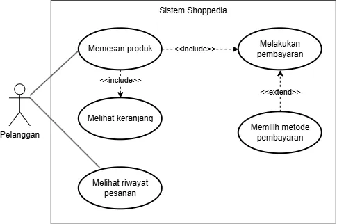

<h1>
IF2150 REKAYASA PERANGKAT LUNAK
 
TUGAS 4
 
CLASS DIAGRAM
</h1>
 

## *Mahasehat: Mental Health Monitoring App for Students*

### Untuk: *Stefani Angeline Oroh*

Dipersiapkan oleh:
| Informasi | Keterangan |
| --- | --- |
| Kelas | *03* |
| Kelompok | *04*  |

| NIM | Nama |
|---|---|
| *13525021* | *Haikal Muhammad Royyan* |
| *13525066* | *Cynthia Winda Wijaya* |
| *13525081* | *Rendy Salastra Putra* |
| *13525090* | *Sophia Imelda Rogate Marpaung* |
| *13525141* | *Christabelcyne Costan* |
---

## Daftar Perubahan

| Revisi | Deskripsi |
| :--- | :--- |
| *A* | *Deskripsikan perubahan yang dilakukan dari dokumen sebelumnya pada dokumen ini. Jika tidak terdapat perubahan, harap kosongkan tabel.* |
| *B* |  |
| *C* |  |
| ... |  |

 
 

# BAB 1: Deskripsi Perangkat Lunak

Mahasehat merupakan sistem pemantauan kesehatan mental berbasis web responsif yang dirancang untuk kalangan pelajar dan mahasiswa. Sistem ini dikembangkan untuk menjawab permasalahan nyata di lingkungan pendidikan, di mana banyak pelajar cenderung memendam stres akademik maupun masalah pribadi seorang diri. Di sisi lain, orang tua/wali sering terlambat menyadari penurunan kondisi psikologis anak karena minimnya komunikasi atau keterbatasan jarak, khususnya bagi mahasiswa rantau. Mahasehat memadukan pencatatan mandiri oleh pelajar, dasbor pemantauan bagi orang tua/wali, serta alur rujukan bantuan profesional ke dalam satu sistem yang tetap mengutamakan kerahasiaan data pribadi pengguna.

# BAB 2: Kebutuhan Fungsional

## 2.1 Kebutuhan Fungsional

Tabel 2.1. Daftar Kebutuhan Fungsional

| ID KF | ID Kebutuhan | Penjelasan |
| :--- | :--- | :--- |
| *KF01* | *R01* | *Ketika pengguna mengakses halaman registrasi, Perangkat Lunak harus menyediakan formulir untuk menerima masukan data diri, riwayat kesehatan mental, dan kontak orang tua/wali.* |
| *KF02* | *R03* | *Bila usia pengguna di bawah 18 tahun, maka Perangkat Lunak harus menahan aktivasi akun sampai konfirmasi persetujuan orang tua/wali.* |
| *KF03* | *R04 dan R05* | *Ketika pengguna belum check-in pada jam yang ditentukan, Perangkat Lunak harus mengirimkan pengingat agar pengguna tidak lupa melakukan pencatatan harian.* |
| *KF04* | *R06* | *Ketika pengguna mengirimkan catatan skala mood, pola tidur, pola makan, atau catatan harian, Perangkat lunak harus menyimpan data tersebut ke dalam sistem.* |
| *KF05* | *R08* | *Ketika pengguna mengirimkan catatan skala mood, pola tidur, pola makan, atau catatan harian, Perangkat Lunak harus memvalidasi kelengkapan data check-in sebelum disimpan.* |
| *KF06* | *R09* | *Perangkat Lunak harus mencatat dan menghitung jumlah hari pengguna tidak melakukan check-in dari selisih tanggal saat ini dengan tanggal check-in terakhir.* |
| *KF07* | *R10* | *Perangkat Lunak harus menyimpan seluruh riwayat check-in ke basis data secara terenkripsi.* |
| *KF08* | *R11 dan R12* | *Ketika pengguna mengakses halaman riwayat visualisasi, Perangkat Lunak harus menampilkan visualisasi grafik yang dapat dilihat pengguna dalam periode mingguan ataupun bulanan.* |
| *KF09* | *R13* | *Perangkat Lunak harus menampilkan laporan rangkuman kondisi kesehatan secara berkala ke pengguna dan orang tua/wali.* |
| *KF10* | *R15* | *Ketika menyusun laporan rangkuman kondisi kesehatan, Perangkat Lunak harus menerapkan aturan ambang batas untuk menandai pola tidak biasa pada data pengguna.* |
| *KF11* | *R16* | *Ketika pengguna menggunakan fitur pencarian, Perangkat Lunak harus menampilkan halaman daftar tenaga kesehatan serta lokasi dan estimasi biaya konsultasi.* |
| *KF12* | *R18* | *Ketika pengguna menggunakan fitur pencarian, Perangkat Lunak dapat mengakses lokasi pengguna melalui GPS dan mengkalkulasikan jarak ke fasilitas kesehatan terdekat.* |
| *KF13* | *R19* | *Ketika pengguna melihat profil tenaga kesehatan, Perangkat Lunak dapat menyediakan formulir pengajuan jadwal konsultasi dengan tenaga kesehatan.* |
| *KF14* | *R20* | *Selama pengguna membuka formulir penjadwalan, Perangkat Lunak harus aktif memperbarui dan menampilkan ketersediaan jadwal tenaga kesehatan.* |
| *KF15* | *R21* | *Ketika tenaga kesehatan membuka halaman jadwal, Perangkat Lunak harus menampilkan daftar pengajuan konsultasi yang masuk dan menyediakan tombol aksi untuk konfirmasi.* |
| *KF16* | *R23* | *Ketika tenaga kesehatan menyetujui permintaan konsultasi, Perangkat Lunak harus mengirimkan notifikasi kepada pengguna.* |
| *KF17* | *R24* | *Ketika periode pelaporan berakhir, Perangkat lunak harus membagikan laporan rangkuman kepada pengguna dan orang tua/wali sesuai hak akses masing-masing.* |
| *KF18* | *R26* | *Ketika pengguna tidak aktif check-in dan tren kondisinya memburuk melebihi ambang batas tertentu, Perangkat Lunak harus mengubah status pengguna menjadi darurat secara otomatis.* |
| *KF19* | *R27 dan R28* | *Ketika status pengguna ditandai darurat, Perangkat Lunak harus segera mengirimkan notifikasi darurat ke kontak orang tua/wali yang terdaftar.* |
| *KF20* | *R29* | *Ketika orang tua/wali menerima notifikasi darurat, Perangkat Lunak harus menerima konfirmasi bahwa notifikasi telah diterima dan sedang ditindaklanjuti.* |
| *KF21* | *R30* | *Ketika orang tua/wali mengonfirmasi bahwa notifikasi darurat sedang ditindaklanjuti, Perangkat Lunak harus mencatat status konfirmasi dan waktu tindak lanjut.* |
| *KF22* | *R31* | *Ketika pengguna mengakses log in, Perangkat Lunak harus menampilkan formulir untuk login.* |
| *KF23* | *R31* | *Ketika pengguna mengirimkan formulir login, Perangkat Lunak harus memvalidasi data masukan pengguna dan mengarahkan antarmuka ke dashboard utama sesuai dengan role mereka.* |
| *KF24* | *R32* | *Ketika pengguna memilih menu keluar akun, Perangkat Lunak harus mengakhiri sesi penggunaan akun tersebut dan mengalihkan antarmuka ke halaman login.* |

---

# BAB 3: Model Use Case

## 3.1 Identifikasi Aktor

| Aktor | Deskripsi |
| :--- | :--- |
| *Pelajar* | *Pengguna ini bertindak sebagai pihak yang bertanggung jawab untuk melakukan pencatatan kondisi kesehatan sehari-hari yang meliputi aktivitas diri, mood, pola makan, dan pola tidur. Karakteristik dari pengguna ini adalah mengutamakan kemudahan dan kecepatan dalam melakukan input, informasi yang mudah dipahami, serta keamanan dan privasi data pribadi. Pelajar yang dimaksud secara spesifik ialah yang berusia 10-24 tahun.* |
| *Orang Tua/Wali* | *Pengguna ini bertindak sebagai pihak yang bertanggung jawab untuk mendampingi dan memantau kondisi pelajar berdasarkan informasi yang dibagikan oleh pengguna. Karakteristik dari pengguna ini adalah mengutamakan kemudahan penggunaan, kemudahan memahami informasi kondisi pelajar, serta kecepatan menerima notifikasi.* |
| *Tenaga Kesehatan* | *Pengguna ini bertindak sebagai pihak yang bertanggung jawab untuk memberikan layanan konsultasi dan penanganan terkait kondisi kesehatan pelajar sesuai dengan ruang lingkup profesinya masing-masing. Karakteristik dari pengguna ini adalah mengutamakan kelengkapan informasi, kemudahan akses, serta keamanan dan kerahasiaan data pengguna. Tenaga kesehatan yang berkaitan adalah psikolog dan psikiater.* |

## 3.2 Identifikasi Use Case

Use case berfungsi untuk mendeskripsikan interaksi aktor-aktor yang terlibat dengan sistem. Isi daftar use case dan deskripsi singkatnya dalam tabel di bawah.

Pada bagian ini, Anda diperbolehkan untuk menyalin dari dokumen sebelumnya.

| ID UC | Nama Use Case | Deskripsi Singkat | Aktor | ID KF |
| :--- | :--- | :--- | :--- | :--- |
| ID UC | Nama Use Case | Deskripsi Singkat | Aktor Terlibat | ID KF Terkait |
| :--- | :--- | :--- | :--- | :--- |
| *UC01* | *Melakukan Registrasi Akun* | *Sebagai pengguna baru, pelajar mengisi identitas diri, riwayat kesehatan mental, dan kontak orang tua/wali.* | *Pelajar* | *KF01* |
| *UC02* | *Mengonfirmasi Registrasi Akun* | *Untuk pelajar di bawah 18 tahun, orang tua/wali memberi konfirmasi persetujuan pembuatan akun (misalnya melalui e-mail).* | *Orang Tua/Wali* | *KF02* |
| *UC03* | *Melakukan Daily Check-in* | *Pelajar menerima reminder check-in, mencatat skala mood, pola tidur, atau catatan harian.* | *Pelajar* | *KF03, KF04, KF05, KF07* |
| *UC04* | *Melihat Statistik dan Laporan Kondisi* | *Pelajar dan orang tua/wali melihat statistik tren dan laporan rangkuman kondisi kesehatan secara berkala sesuai hak akses masing-masing.* | *Pelajar, Orang Tua/Wali* | *KF06, KF08, KF09, KF10, KF17* |
| *UC05* | *Menentukan Tenaga Kesehatan* | *Pelajar memilih tenaga kesehatan dari daftar rekomendasi sesuai kondisi kesehatan, estimasi biaya konsultasi, dan lokasi fasilitas kesehatan. Pemilihan dapat diawasi atau dilakukan bersama orang tua/wali, khususnya pelajar di bawah umur.* | *Pelajar* | *KF11, KF12* |
| *UC06* | *Mengajukan Jadwal Konsultasi* | *Pelajar mengisi formulir pengajuan jadwal konsultasi dengan pengawasan orang tua/wali, khususnya pelajar di bawah umur.* | *Pelajar* | *KF13, KF14* |
| *UC07* | *Mengelola Pengajuan Konsultasi* | *Tenaga kesehatan meninjau pengajuan konsultasi yang masuk lalu mengonfirmasi persetujuan atau reschedule.* | *Tenaga Kesehatan* | *KF15, KF16* |
| *UC08* | *Menerima dan Menindaklanjuti Notifikasi Darurat* | *Jika sistem mendeteksi kondisi darurat, orang tua/wali akan menerima notifikasi, mengonfirmasi, lalu menindaklanjuti kondisi kritis tersebut.* | *Orang Tua/Wali* | *KF18, KF19, KF20, KF21* |
| *UC09* | *Masuk Akun Pengguna* | *Jika sudah mendaftarkan akun, pengguna dapat masuk atau melakukan login dengan username/e-mail dan password.* | *Pelajar, Orang Tua/Wali, Tenaga Kesehatan* | *KF22, KF23* |
| *UC10* | *Keluar Akun Pengguna* | *Jika sudah menyelesaikan segala aktivitasnya atau ingin berpindah akun, pengguna dapat memilih opsi keluar akun.* | *Pelajar, Orang Tua/Wali, Tenaga Kesehatan* | *KF24* |

*Keterangan Tambahan:* Pengawasan orang tua/wali yang dimaksud pada UC05 dan UC06 tidak dilakukan melalui sistem, tetapi melalui diskusi/komunikasi langsung, sehingga orang tua/wali tidak dimasukkan ke dalam aktor yang "menyentuh" sistem untuk kedua use case tersebut.

## 3.3 Use Case Diagram

 

<i>Gambar 1. Use Case Diagram</i>

 

## 3.4 Skenario Use Case

### 3.4.1 Skenario UC01
**Nama Use Case:** *Menerima dan Menindaklanjuti Notifikasi Darurat*

**Skenario Normal**

| No | Aksi Aktor | Reaksi Perangkat Lunak |
| :--- | :--- | :--- |
| 1 | *Orang tua/wali membuka notifikasi darurat yang diterima pada perangkat mereka* | *Sistem menampilkan detail notifikasi berisi ringkasan kondisi pelajar yang memicu status darurat* |
| 2 | *Orang tua/wali menekan tombol "Konfirmasi Diterima"* | *Sistem mencatat status notifikasi sebagai "Diterima" beserta waktu konfirmasi* |
| 3 | *Orang tua/wali melakukan tindak lanjut terhadap kondisi pelajar (misalnya menghubungi pelajar bersangkutan atau tenaga kesehatan), lalu menekan tombol "Tandai Sudah Ditindaklanjuti"* | *Sistem mencatat status tindak lanjut sebagai "Sudah Ditindaklanjuti" beserta waktu tindak lanjut tersebut* |

 

**Skenario Alternatif 1: Notifikasi Darurat Tidak Direspon**

| No | Aksi Aktor | Reaksi Perangkat Lunak |
| :--- | :--- | :--- |
| 1 | *Orang tua/wali menerima notifikasi darurat namun tidak membukanya dalam batas waktu tertentu* | *Sistem mengirimkan ulang notifikasi darurat (reminder) kepada orang tua/wali yang bersangkutan* |
| 2 | *Orang tua/wali tetap tidak merespon hingga batas waktu terlewati* | *Sistem meneruskan notifikasi darurat ke kontak darurat cadangan yang terdaftar (atau ke layanan darurat)* |

### 3.4.9 Skenario UC09

**Nama Use Case:** *Masuk Akun Pengguna*

**Skenario Normal**

| No | Aksi Aktor | Reaksi Perangkat Lunak |
| :--- | :--- | :--- |
| 1 | *Pengguna memilih menu masuk akun (log in)* | *Sistem menampilkan kolom masukan username/e-mail dan password* |
| 2 | *Pengguna memasukkan username/e-mail dan password yang terdaftar, lalu menekan tombol masuk* | *Sistem memvalidasi kecocokan kredensial dengan data akun, lalu mengarahkan pengguna ke halaman utama (dashboard)* |

 

**Skenario Alternatif 1: Kredensial Tidak Valid**

| No | Aksi Aktor | Reaksi Perangkat Lunak |
| :--- | :--- | :--- |
| 1 | *Pengguna memilih menu masuk akun (log in)* | *Sistem menampilkan kolom masukan username/e-mail dan password* |
| 2 | *Pengguna memasukkan username/e-mail dan password yang salah, lalu menekan tombol masuk* | *Sistem mendeteksi kredensial tidak cocok, menampilkan pesan kesalahan, dan meminta pengguna memasukkan kembali* |
| 3 | *Pengguna memasukkan ulang username/e-mail dan password yang benar* | *Sistem memvalidasi kecocokan kredensial dengan data akun, lalu mengarahkan pengguna ke halaman utama (dashboard)* |

 

**Skenario Alternatif 2: Akun Belum Terverifikasi**

| No | Aksi Aktor | Reaksi Perangkat Lunak |
| :--- | :--- | :--- |
| 1 | *Pelajar memilih menu masuk akun (log in)* | *Sistem menampilkan kolom masukan username/e-mail dan password* |
| 2 | *Pelajar memasukkan username/e-mail dan password yang terdaftar namun akunnya belum dikonfirmasi orang tua/wali, lalu menekan tombol masuk* | *Sistem mendeteksi status akun belum aktif, menampilkan pesan bahwa akun masih menunggu konfirmasi orang tua/wali, dan menolak akses masuk* |

 

**Skenario Alternatif 3: Lupa Password**

| No | Aksi Aktor | Reaksi Perangkat Lunak |
| :--- | :--- | :--- |
| 1 | *Pengguna memilih menu masuk akun (log in)* | *Sistem menampilkan kolom masukan username/e-mail dan password, beserta tautan "Lupa Password"* |
| 2 | *Pengguna menekan tautan "Lupa Password"* | *Sistem menampilkan kolom masukan e-mail untuk permintaan reset password* |
| 3 | *Pengguna memasukkan e-mail terdaftar, lalu menekan tombol kirim* | *Sistem memvalidasi keberadaan e-mail pada data akun, lalu mengirimkan tautan reset password ke e-mail tersebut dan menampilkan pesan konfirmasi bahwa tautan telah dikirim* |
| 4 | *Pengguna membuka tautan reset password dari e-mail, lalu memasukkan password baru beserta konfirmasinya* | *Sistem memvalidasi kesesuaian password baru dengan konfirmasi dan ketentuan keamanan, lalu memperbarui password akun dan menampilkan pesan bahwa password berhasil diubah* |
| 5 | *Pengguna kembali ke halaman masuk akun dan memasukkan username/e-mail beserta password baru* | *Sistem memvalidasi kecocokan kredensial dengan data akun, lalu mengarahkan pengguna ke halaman utama (dashboard)* |

### 3.4.10 Skenario UC10

**Nama Use Case:** *Keluar Akun Pengguna*

**Skenario Normal**

| No | Aksi Aktor | Reaksi Perangkat Lunak |
| :--- | :--- | :--- |
| 1 | *Pengguna memilih menu keluar akun (log out) pada halaman pengaturan/profil* | *Sistem menampilkan pop up konfirmasi keluar akun* |
| 2 | *Pengguna menekan tombol konfirmasi keluar* | *Sistem mengakhiri sesi login pelajar dan mengarahkan kembali ke halaman masuk* |

 

**Skenario Alternatif 1: Membatalkan Keluar Akun**

| No | Aksi Aktor | Reaksi Perangkat Lunak |
| :--- | :--- | :--- |
| 1 | *Pengguna memilih menu keluar akun (log out) pada menu pengaturan/profil* | *Sistem menampilkan pop up konfirmasi keluar akun* |
| 2 | *Pengguna menekan tombol batal* | *Sistem menutup konfirmasi dan mempertahankan sesi login pelajar, kembali pada halaman pengaturan/profil* |

---

# BAB 4: Diagram Kelas
Bagian ini berisi identifikasi kelas dan pemodelan struktur kelas yang diperlukan untuk merealisasikan use case pada BAB 3. Gunakan skenario use case (3.4) sebagai dasar untuk menentukan kelas, atribut, metode, dan hubungan antarkelas.

## 4.1 Identifikasi Kelas
Identifikasi seluruh kelas yang diperlukan berdasarkan use case dan skenarionya. Satu kelas boleh terkait dengan lebih dari satu use case.

| ID Kelas | Nama Kelas | Deskripsi Kelas | ID Use Case |
| :--- | :--- | :--- | :--- |
| *C01* | *Pelanggan* | *Menyimpan data akun pelanggan yang membuat pesanan.* | *UC01, UC05* |
| *C02* | *Pesanan* | *Menyimpan data pesanan beserta status pembayarannya.* | *UC01, UC03, UC05* |
| *C03* | *Keranjang* | *Menyimpan sementara item yang dipilih sebelum checkout.* | *UC01, UC02* |
| *C04* | *MetodePembayaran* | *Kelas abstrak yang merepresentasikan metode pembayaran yang dipilih pelanggan.* | *UC03, UC04* |
| *C05* | *Kartu* | *Merealisasikan pembayaran melalui kartu kredit/debit dengan mengirimkan permintaan ke payment gateway (dummy).* | *UC03, UC04* |
| *C06* | *EWallet* | *Merealisasikan pembayaran melalui e-wallet, termasuk pengecekan saldo, dengan mengirimkan permintaan ke payment gateway (dummy).* | *UC03, UC04* |
| *C07* | *RiwayatTransaksi* | *Menyimpan catatan transaksi beserta status yang dikembalikan payment gateway (dummy).* | *UC03, UC05* |
| *...* | *...* | *...* | *...* |

Pastikan setiap kelas memiliki tanggung jawab yang jelas dan memang diperlukan untuk merealisasikan fungsi yang dimodelkan. Hindari kelas yang tidak memiliki keterkaitan dengan KF atau use case manapun.

## 4.2 Diagram Kelas per Use Case
Buat diagram kelas untuk setiap use case pada 3.2.

### 4.2.1 Use Case UC01

**Nama Use Case:** *Memesan Produk*

#### Identifikasi Kelas

| ID Kelas | Nama Kelas | Deskripsi Kelas |
| :--- | :--- | :--- |
| *C01* | *Pelanggan* | *Menyimpan data akun pelanggan yang membuat pesanan.* |
| *C02* | *Pesanan* | *Menyimpan data pesanan yang dibuat dari isi keranjang.* |
| *C03* | *Keranjang* | *Menyimpan sementara item yang dipilih sebelum checkout.* |
| *...* | *...* | *...* |

#### Diagram Kelas

<i>Gambar 2. Diagram Kelas Use Case UC01</i>

 

Pada diagram kelas, cukup tampilkan nama kelas saja. Atribut dan metode/operasi milik setiap kelas dapat dituliskan pada tabel di bawah ini. Pastikan hubungan antarkelas menggunakan jenis relasi yang sesuai (asosiasi, agregasi, komposisi, generalisasi, atau dependensi).

| ID Kelas | Nama Kelas | Atribut | Metode/Operasi |
| :--- | :--- | :--- | :--- |
| *C02* | *Pesanan* | *idPesanan, total, status* | *buatPesanan(), hitungTotal()* |
| *C03* | *Keranjang* | *daftarItem* | *tambahItem(), checkout()* |
| *...* | *...* | *...* | *...* |

> Lanjutkan pola **4.2.x** untuk setiap use case pada 3.2.

## 4.3 Diagram Kelas Keseluruhan

Gabungkan seluruh kelas dan hubungan antarkelas dari diagram kelas setiap use case menjadi satu diagram kelas keseluruhan. Pastikan tidak ada kelas yang terduplikasi.

<i>Gambar X. Diagram Kelas Keseluruhan</i>

 

| ID Kelas | Nama Kelas | Atribut | Metode/Operasi |
| :--- | :--- | :--- | :--- |
| *C01* | *Pelanggan* | *idPelanggan, nama, email* | *lihatRiwayatPesanan()* |
| *C02* | *Pesanan* | *idPesanan, total, status* | *hitungTotal(), perbaruiStatus()* |
| *C03* | *Keranjang* | *daftarItem* | *tambahItem(), checkout()* |
| *C04* | *MetodePembayaran* | *-* | *kirimKePaymentGatewayDummy()* |
| *C05* | *Kartu* | *nomorKartu, masaBerlaku* | *kirimKePaymentGatewayDummy()* |
| *C06* | *EWallet* | *saldo, idAkun* | *cekSaldo(), kirimKePaymentGatewayDummy()* |
| *C07* | *RiwayatTransaksi* | *idTransaksi, waktu, status* | *catatTransaksi(), tampilkanNotifikasi()* |
| *...* | *...* | *...* | *...* |

---

# BAB 5: Traceability
Cocokkan setiap kebutuhan fungsional, use case, dengan diagram kelas yang mendukung atau mengimplementasikan kebutuhan tersebut.

| ID Kelas | ID Use Case | ID KF |
| :--- | :--- | :--- |
| *C01* | *UC01, UC05* | *KF01, KF06* |
| *C02* | *UC01, UC03, UC05* | *KF01, KF02, KF05, KF06* |
| *C03* | *UC01, UC02* | *KF01, KF02* |
| *C04* | *UC03, UC04* | *KF03* |
| *C05* | *UC03, UC04* | *KF03* |
| *C06* | *UC03, UC04* | *KF03, KF04* |
| *C07* | *UC03, UC05* | *KF04, KF05* |
| *...* | *...* | *...* |

---

# Referensi

- Diagram UML: [https://www.drawio.com/](https://www.drawio.com/), [https://staruml.io/](https://staruml.io/)
