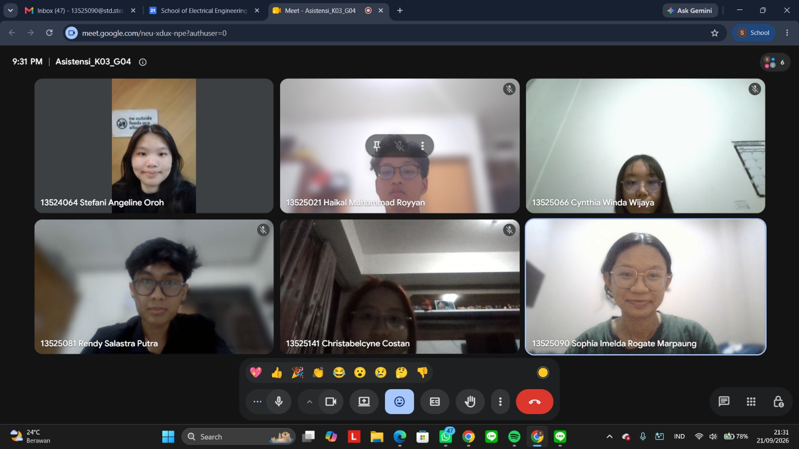

# Form Asistensi

## Tugas Besar IF2150 - Rekayasa Perangkat Lunak

| Informasi | Keterangan |
| --- | --- |
| **Hari** | *Senin* |
| **Tanggal** | *21/09/2026* |
| **Kelas** | *03* |
| **Nomor Kelompok** | *04*  |
| **Nama Kelompok** | *pakespinwheel*  |
| **Nama Perangkat Lunak** | *Mahasehat: Mental Health Monitoring App for Students*  |
| **Dokumen** | *K03_G04_CD.md*  |

### Anggota Kelompok

| NIM | Nama |
| --- | --- |
| *13525021* | *Haikal Muhammad Royyan* |
| *13525066* | *Cynthia Winda Wijaya* |
| *13525081* | *Rendy Salastra Putra* |
| *13525090* | *Sophia Imelda Rogate Marpaung* |
| *13525141* | *Christabelcyne Costan* |

### Catatan

| Catatan |
| --- |
| 1. *Lengkapin pakai entity, boundary, dan controller class untuk identifikasi kelas pada setiap use case. Misalnya, AuthController untuk mengatur, LoginPage untuk antarmuka.*  |
| 2. *Tambahin jenis kelas (entity, boundary, dan controller class) di deskripsi kelas.* |
| 3. *Sepakati apa saja yang perlu ada di diagram kelas agar seragam. Misalnya, pakai keterangan kelas.* |
| 4. *Sesuaikan kelas di identifikasi keseluruhan dan identifikasi per use case.* |
| 5. *Deskripsi kelas sesuaikan saja per use case, nanti dikumpulin semua di identifikasi keseluruhan.* |

## Dokumentasi

<!--  -->

  

  <i>Gambar 1. Dokumentasi kegiatan asistensi.</i>

