<h1>
IF2150 REKAYASA PERANGKAT LUNAK
 
TUGAS 5
 
SPESIFIKASI KEBUTUHAN PERANGKAT LUNAK (SKPL)
</h1>
 

## *Mahasehat: Mental Health Monitoring App for Students*

### Untuk: *Stefani Angeline Oroh*

Dipersiapkan oleh:
| Informasi | Keterangan |
| --- | --- |
| Kelas | *03* |
| Kelompok | *04*  |

| NIM | Nama |
|---|---|
| *13525021* | *Haikal Muhammad Royyan* |
| *13525066* | *Cynthia Winda Wijaya* |
| *13525081* | *Rendy Salastra Putra* |
| *13525090* | *Sophia Imelda Rogate Marpaung* |
| *13525141* | *Christabelcyne Costan* |
---

## Daftar Perubahan

| Revisi | Deskripsi |
| :--- | :--- |
| *A* | *Menyesuaikan tabel traceablity yang sebelumnya tidak sesuai dengan identifikasi kelas.* |
| *B* |  |
| *C* |  |
| ... |  |

 

# BAB 1: Pendahuluan

## 1.1 Tujuan Penulisan Dokumen
Dokumen Spesifikasi Kebutuhan Perangkat Lunak (SKPL) ini dibuat untuk menjelaskan kebutuhan, fungsi, dan batasan dari perangkat lunak yang akan dikembangkan. Dokumen ini menjadi acuan bagi tim pengembang dalam proses perancangan dan implementasi sistem, serta bagi pihak terkait untuk memahami fitur dan kebutuhan perangkat lunak yang telah ditentukan.

## 1.2 Lingkup Masalah
Mahasehat merupakan aplikasi terpadu untuk membantu pelajar dalam memantau kondisi kesehatan sehari-hari dan memperoleh akses layanan kesehatan mental. Aplikasi ini menyediakan fitur pencatatan kondisi seperti suasana hati, aktivitas fisik, pola makan, tidur, serta refleksi harian. Berdasarkan data tersebut aplikasi ini menyajikan perkembangan kondisi pelajar dalam bentuk statistik dan laporan. Selain itu, aplikasi ini menyediakan informasi dan akses untuk mencari tenaga kesehatan, melihat jadwal yang tersedia, serta mengajukan konsultasi. Aplikasi ini melibatkan orang tua/wali dalam pemantauan dan pengendalian kondisi pelajar.

## 1.3 Definisi, Istilah, dan Singkatan

Tabel 1.3. Definisi Istilah dan Singkatan

| Singkatan, Akronim, atau Istilah | Penjelasan |
| :--- | :--- |
| *P/L* | *Singkatan dari Perangkat Lunak, yaitu aplikasi yang memberikan perintah kepada komputer untuk menjalankan tugas tertentu.* |
| *SKPL* | *Singkatan dari Spesifikasi Kebutuhan Perangkat Lunak, yaitu dokumen yang merangkum kriteria-kriteria yang diperlukan untuk membangun aplikasi menjalankan tugasnya.* |
| *KF* | *Singkatan dari Kebutuhan Fungsional, yaitu layanan yang harus disediakan dan respon atas masukan, kadang termasuk yang tidak boleh dilakukan.* |
| *KNF* | *Singkatan dari Kebutuhan Non-Fungsional, yaitu batasan atas layanan yang harus disediakan, seberapa baik, dalam kondisi apa, dengan jaminan apa.* |
| *UC* | *Singkatan dari Use Case, yaitu pemodelan cara aktor berinteraksi dengan sistem.* |
| *EARS* | *Singkatan dari Easy Approach to Requirements Syntax, yaitu pola penulisan kebutuhan agar konsisten dan mudah diuji.* |
| *Aktor* | *Merepresentasikan entitas di luar batas sistem yang berinteraksi dengan sistem.* |
| *Skenario* | *Merepresentasikan satu penelusuran konkret melalui sebuah use case, menyatakan apa saja yang terjadi pada sistem.* |
| *Kelas* | *Merepresentasikan suatu jenis objek yang memiliki atribut dan metode/operasi untuk menjalankan tanggung jawabnya.* |
| *...* | *...* |

## 1.4 Aturan Penomoran

Tabel 1.4. Aturan Penomoran

| Hal/Bagian | Penomoran | Keterangan |
| :--- | :--- | :--- |
| *Kebutuhan Fungsional* | *KFXX* | *Mewakili singkatan kata "Kebutuhan Fungsional", diikuti dua digit unik untuk membedakan tiap KF.* |
| *Kebutuhan Non-Fungsional* | *KNFXX* | *Mewakili singkatan kata "Kebutuhan Non-Fungsional", diikuti dua digit unik untuk membedakan tiap KNF.* |
| *Aktor* | *AXX* | *Mewakili singkatan kata "Aktor", diikuti dua digit unik untuk membedakan tiap aktor.* |
| *Use Case* | *UCXX* | *Mewakili singkatan kata "Use Case", diikuti dua digit unik untuk membedakan tiap UC.* |
| *Kelas* | *CXX* | *Mewakili singkatan kata "Class", diikuti dua digit unik untuk membedakan tiap kelas.* |
| *...* | *...* | *...* |

## 1.5 Referensi
Dokumentasi P/L yang dirujuk oleh dokumen ini. Referensi dapat berupa buku, panduan, ataupun dokumentasi lain yang dipakai dalam pengembangan P/L ini.

## 1.6 Deskripsi Umum Dokumen (Ikhtisar)
BAB 1 membahas pendahuluan, yang berisi tujuan, lingkup masalah, definisi, istilah, serta singkatan, aturan penomoran, referensi, dan deskripsi umum dokumen. BAB 2 membahas deskripsi perangkat lunak yang mencakup deskripsi umum sistem dan P/L, pengguna dan kebutuhan pengguna P/L, batasan P/L, dan lingkungan operasi P/L. BAB 3 membahas deskripsi kebutuhan P/L, yaitu kebutuhan fungsional dan kebutuhan non-fungsional. BAB 4 membahas pemodelan use case, yaitu identifikasi aktor, use case, use case diagram, dan skenario use case. BAB 5 membahas pemodelan kelas yang berisi identifikasi kelas, diagram kelas per use case, diagram kelas keseluruhan. BAB 6 membahas traceability, yang menunjukkan keterkaitan antara kelas, use case, dan kebutuhan fungsional.

---

# BAB 2: Deskripsi Perangkat Lunak

## 2.1 Deskripsi Umum Sistem
Mahasehat merupakan sistem pemantauan kesehatan mental berbasis web responsif yang dirancang untuk kalangan pelajar dan mahasiswa. Sistem ini dikembangkan untuk menjawab permasalahan nyata di lingkungan pendidikan, di mana banyak pelajar cenderung memendam stres akademik maupun masalah pribadi seorang diri. Di sisi lain, orang tua/wali kerap terlambat menyadari penurunan kondisi psikologis anak karena minimnya komunikasi atau keterbatasan jarak bagi mahasiswa rantau. Mahasehat memadukan pencatatan mandiri oleh pelajar, dasbor pemantauan bagi orang tua/wali, serta alur rujukan bantuan profesional ke dalam satu sistem yang tetap mengutamakan kerahasiaan data pribadi pengguna.

### Ekspektasi Pengguna terhadap Sistem
Kebutuhan tiap kelompok pengguna terhadap sistem dirangkum sebagai berikut:
1. **Pelajar (Usia 10-24 tahun):** Membutuhkan sarana pencatatan kondisi harian (*daily check-in*) yang cepat diakses lewat peramban ponsel tanpa membebani rutinitas harian. Ekspektasi paling mendasar adalah adanya jaminan privasi penuh. Pelajar bersedia mengisi data secara jujur apabila catatan curahan hati atau jurnal bebas mereka terjamin tidak bisa dibaca oleh pihak lain, termasuk orang tua. Selain itu, pelajar mengharapkan solusi konkret yang langsung mengarahkan ke layanan bantuan ketika kondisi mereka memburuk.
2. **Orang Tua/Wali:** Menginginkan sarana untuk memantau stabilitas kondisi anak secara berkala tanpa terkesan mengintervensi ruang pribadi anak. Orang tua/wali mengharapkan visualisasi data yang sederhana dan mudah dipahami, serta notifikasi peringatan otomatis jika terdeteksi indikasi stres berkepanjangan atau anomali pengisian data.
3. **Tenaga Kesehatan (Psikolog/Psikiater):** Mengharapkan alur pendaftaran konsultasi awal yang terdata dengan rapi. Riwayat tren tidur dan catatan suasana hati yang dibagikan atas izin pengguna juga diharapkan dapat membantu proses asesmen awal saat konsultasi berlangsung.

### Alur Kerja Sistem yang Diinginkan
Alur interaksi sistem dirancang melalui tahapan fungsional berikut:
1. **Pencatatan Mandiri Berkala:** Pelajar menerima notifikasi pengingat harian dari peramban untuk memasukkan skala suasana hati (1–5), perkiraan durasi tidur, faktor pemicu stres (seperti beban tugas, perkuliahan, atau masalah relasi), serta tulisan refleksi diri opsional pada kolom jurnal.
2. **Pengolahan Data dan Dasbor Terpisah:** Data numerik yang dihimpun diolah menjadi grafik tren mingguan atau bulanan. Pelajar dapat melihat korelasi antara pola istirahat dengan perubahan suasana hatinya. Sedangkan akun orang tua/wali yang terhubung hanya bisa melihat grafik ringkasan, tanpa bisa membaca isi jurnal pelajar.
3. **Peringatan Otomatis dan Rujukan Bantuan:** Apabila tren suasana hati terus menurun, sistem akan memunculkan kuesioner evaluasi kejenuhan (burnout) kepada pelajar. Jika hasilnya mengindikasikan perlunya bantuan lebih lanjut, sistem langsung menampilkan rekomendasi klinik atau psikolog terdekat lengkap dengan perkiraan tarif dan formulir janji temu di akun pelajar. Di saat yang sama, sistem mengirimkan notifikasi perhatian ke dasbor orang tua/wali agar dapat memantau situasi. Tombol darurat menuju saluran bantuan resmi juga disediakan jika terjadi kondisi kritis.

### Harapan Penerapan Solusi
Pemisahan hak akses ini dirancang agar pelajar merasa aman saat berinteraksi dengan sistem. Selama ini, keengganan pelajar untuk mencatat kondisi emosionalnya secara rutin sering kali dipicu oleh rasa cemas bahwa tulisan pribadinya akan dihakimi atau diawasi berlebihan oleh orang tua. Dengan kepastian bahwa catatan jurnal bersifat privat dan orang tua/wali hanya menerima visualisasi grafik tren, pelajar diharapkan tidak ragu untuk mengisi data secara jujur dan konsisten. Data yang valid inilah yang menjadi dasar bagi sistem untuk mendeteksi indikasi penurunan kondisi psikologis secara tepat. Namun, Mahasehat tetap tidak diposisikan sebagai pengganti diagnosis klinis dari psikolog atau psikiater. Perangkat lunak ini murni berfungsi sebagai sarana deteksi awal sekaligus jembatan rujukan, sehingga pelajar yang mulai mengalami tekanan mental berat dapat menyadari kondisinya lebih dini dan segera terhubung dengan penanganan profesional.

Lengkapi dengan gambaran proses bisnis dalam bentuk *Activity Diagram* (boleh disalin dan diperbarui dari 3.3 *Model Proses Bisnis* pada dokumen *Topic Brainstorming*).

<i>Gambar 1. Contoh Activity Diagram Proses Bisnis</i>

## 2.2 Deskripsi Umum Perangkat Lunak
Mahasehat merupakan sistem pemantauan kesehatan mental berbasis web responsif yang dirancang untuk kalangan pelajar. Mahasehat berfungsi sebagai platform pencatatan mandiri kondisi psikologis pelajar serta dasbor pemantauan bagi orang tua/wali. Sistem ini berinteraksi dengan Layanan Mail Server untuk mengirimkan *daily check-in reminder* kepada mahasiswa serta mengirimkan email peringatan darurat kepada orang tua/wali jika sistem mendeteksi penurunan kondisi mental pelajar yang melewati ambang batas tertentu. Selain itu, sistem juga menggunakan Layanan Mail Server untuk manajemen akun. Sistem juga memanfaatkan Google Maps Platform untuk menangkap lokasi pengguna menggunakan Geolocation API dan kemudian menggunakannya untuk memberikan rekomendasi fasilitas kesehatan terdekat secara akurat. Sementara itu, sistem terhubung dengan Google Calendar API untuk mengelola penjadwalan konsultasi secara *real-time*.

## 2.3 Pengguna dan Kebutuhan Pengguna Perangkat Lunak
Tuliskan seluruh jenis pengguna (*role*/aktor) yang terlibat dalam perangkat lunak (P/L), beserta kebutuhannya secara umum. Bagian ini dapat disalin dari 1.2 *Deskripsi Pengguna Perangkat Lunak* (dokumen Requirement Gathering) atau 3.1 *Identifikasi Aktor* (dokumen Use Case), pastikan sudah konsisten dengan aktor final yang dipakai di BAB 4.

| Pengguna | Kebutuhan |
| :--- | :--- |
| *Pelajar* | *Pengguna ini bertindak sebagai pihak yang bertanggung jawab untuk melakukan pencatatan kondisi kesehatan sehari-hari yang meliputi aktivitas diri, mood, pola makan, dan pola tidur. Karakteristik dari pengguna ini adalah mengutamakan kemudahan dan kecepatan dalam melakukan input, informasi yang mudah dipahami, serta keamanan dan privasi data pribadi. Pelajar yang dimaksud secara spesifik ialah yang berusia 10-24 tahun.* |
| *Orang Tua/Wali* | *Pengguna ini bertindak sebagai pihak yang bertanggung jawab untuk mendampingi dan memantau kondisi pelajar berdasarkan informasi yang dibagikan oleh pengguna. Karakteristik dari pengguna ini adalah mengutamakan kemudahan penggunaan, kemudahan memahami informasi kondisi pelajar, serta kecepatan menerima notifikasi.* |
| *Tenaga Kesehatan* | *Pengguna ini bertindak sebagai pihak yang bertanggung jawab untuk memberikan layanan konsultasi dan penanganan terkait kondisi kesehatan pelajar sesuai dengan ruang lingkup profesinya masing-masing. Karakteristik dari pengguna ini adalah mengutamakan kelengkapan informasi, kemudahan akses, serta keamanan dan kerahasiaan data pengguna. Tenaga kesehatan yang berkaitan adalah psikolog dan psikiater.* |

## 2.4 Batasan Perangkat Lunak

Mahasehat memiliki beberapa batasan sebagai berikut:

1. Mahasehat merupakan aplikasi berbasis web yang dapat dibuka melalui *browser* pada ponsel atau komputer. Aplikasi memerlukan koneksi internet dan belum dapat digunakan secara *offline*.

2. Beberapa fitur Mahasehat menggunakan layanan dari luar sistem. Geolocation API dan Google Maps Platform digunakan untuk mengakses lokasi pengguna dan menghitung jarak ke fasilitas kesehatan. Google Calendar API digunakan untuk melihat ketersediaan jadwal, sedangkan *Mail Server* digunakan untuk mengirim pengingat, notifikasi darurat, dan informasi akun. Data yang dikirim dan diterima mengikuti format dari layanan yang digunakan.

3. Izin lokasi tidak wajib diberikan. Jika pengguna menolak izin tersebut, daftar tenaga kesehatan, alamat fasilitas, dan perkiraan biaya konsultasi tetap dapat dilihat, tetapi informasi jarak tidak ditampilkan.

4. Hak akses dibedakan berdasarkan peran pengguna. Orang tua/wali hanya dapat melihat rangkuman kondisi pelajar dan tidak dapat membaca isi jurnal pribadinya.

5. Pelajar yang berusia di bawah 18 tahun memerlukan persetujuan orang tua/wali untuk mengaktifkan akun. Pelajar yang sudah berusia 18 tahun atau lebih tidak memerlukan persetujuan tersebut.

6. Mahasehat hanya membantu pencatatan kondisi, pemantauan awal, pemberian informasi rujukan, dan penjadwalan konsultasi. Aplikasi tidak memberikan diagnosis atau resep obat. Status darurat yang ditampilkan merupakan hasil dari aturan pemantauan sistem, bukan diagnosis dari tenaga kesehatan. Ketersediaan aplikasi selama 24 jam tidak berarti tenaga medis atau operator selalu siaga, serta tidak menjamin waktu respons dari pihak luar.

7. Fitur konsultasi hanya mencakup pencarian tenaga kesehatan, pengajuan jadwal, dan pengecekan status pengajuan. Pembayaran konsultasi secara daring tidak tersedia di dalam aplikasi.

8. Data *daily check-in* diisi secara manual oleh pelajar. Mahasehat belum terhubung dengan jam tangan pintar atau perangkat sensor kesehatan lainnya.

9. Pada tahap awal, data fasilitas dan tenaga kesehatan hanya mencakup wilayah Bandung Raya dan sekitarnya.

## 2.5 Lingkungan Operasi Perangkat Lunak
Perangkat lunak Mahasehat dirancang untuk beroperasi pada arsitektur berbasis web responsif (client-server). Spesifikasi lingkungan operasi yang dibutuhkan untuk menjalankan sistem disajikan pada Tabel 2.5.

Tabel 2.5. Spesifikasi Lingkungan Operasi Perangkat Lunak
| Komponen | Spesifikasi |
| :--- | :--- |
| *Server Application* | Node.js v20.x LTS or Express.js |
| *Database Management System (DBMS)* | PostgreSQL 15+ |
| *Client Side (Perangkat Pengguna)* | Web browser modern |
| *External APIs & Services* | Geolocation API & Google Maps Platform |
| *External APIs & Services* | Google Calendar API |
| *External APIs & Services* | SMTP or Mail Service (Nodemailer/SendGrid) |
| *Operating System for Server* | Ubuntu Server 22.04 LTS or Linux Cloud Environment |
| *Protokol Keamanan* | HTTPS dengan sertifikat SSL/TLS & enkripsi AES-256 |

references:
- https://nodejs.org/docs/latest-v20.x/api/
- https://expressjs.com/
- https://www.postgresql.org/docs/15/
- https://developers.google.com/maps/documentation/geolocation/
- https://developers.google.com/calendar/api
---

# BAB 3: Deskripsi Kebutuhan Perangkat Lunak

## 3.1 Kebutuhan Fungsional (KF)

Tabel 3.1. Kebutuhan Fungsional

| ID KF | ID Kebutuhan | Penjelasan |
| :--- | :--- | :--- |
| *KF01* | *R01* | *Ketika pengguna mengakses halaman registrasi, Perangkat Lunak harus menyediakan formulir untuk menerima masukan data diri, riwayat kesehatan mental, dan kontak orang tua/wali.* |
| *KF02* | *R03* | *Bila usia pengguna di bawah 18 tahun, maka Perangkat Lunak harus menahan aktivasi akun sampai konfirmasi persetujuan orang tua/wali.* |
| *KF03* | *R04 dan R05* | *Ketika pengguna belum check-in pada jam yang ditentukan, Perangkat Lunak harus mengirimkan pengingat agar pengguna tidak lupa melakukan pencatatan harian.* |
| *KF04* | *R06* | *Ketika pengguna mengirimkan catatan skala mood, pola tidur, pola makan, atau catatan harian, Perangkat lunak harus menyimpan data tersebut ke dalam sistem.* |
| *KF05* | *R08* | *Ketika pengguna mengirimkan catatan skala mood, pola tidur, pola makan, atau catatan harian, Perangkat Lunak harus memvalidasi kelengkapan data check-in sebelum disimpan.* |
| *KF06* | *R09* | *Perangkat Lunak harus mencatat dan menghitung jumlah hari pengguna tidak melakukan check-in dari selisih tanggal saat ini dengan tanggal check-in terakhir.* |
| *KF07* | *R10* | *Perangkat Lunak harus menyimpan seluruh riwayat check-in ke basis data secara terenkripsi.* |
| *KF08* | *R11 dan R12* | *Ketika pengguna mengakses halaman riwayat visualisasi, Perangkat Lunak harus menampilkan visualisasi grafik yang dapat dilihat pengguna dalam periode mingguan ataupun bulanan.* |
| *KF09* | *R13* | *Perangkat Lunak harus menampilkan laporan rangkuman kondisi kesehatan secara berkala ke pengguna dan orang tua/wali.* |
| *KF10* | *R15* | *Ketika menyusun laporan rangkuman kondisi kesehatan, Perangkat Lunak harus menerapkan aturan ambang batas untuk menandai pola tidak biasa pada data pengguna.* |
| *KF11* | *R16* | *Ketika pengguna menggunakan fitur pencarian, Perangkat Lunak harus menampilkan halaman daftar tenaga kesehatan serta lokasi dan estimasi biaya konsultasi.* |
| *KF12* | *R18* | *Ketika pengguna menggunakan fitur pencarian, Perangkat Lunak dapat mengakses lokasi pengguna melalui GPS dan mengkalkulasikan jarak ke fasilitas kesehatan terdekat.* |
| *KF13* | *R19* | *Ketika pengguna melihat profil tenaga kesehatan, Perangkat Lunak dapat menyediakan formulir pengajuan jadwal konsultasi dengan tenaga kesehatan.* |
| *KF14* | *R20* | *Selama pengguna membuka formulir penjadwalan, Perangkat Lunak harus aktif memperbarui dan menampilkan ketersediaan jadwal tenaga kesehatan.* |
| *KF15* | *R21* | *Ketika tenaga kesehatan membuka halaman jadwal, Perangkat Lunak harus menampilkan daftar pengajuan konsultasi yang masuk dan menyediakan tombol aksi untuk konfirmasi.* |
| *KF16* | *R23* | *Ketika tenaga kesehatan menyetujui permintaan konsultasi, Perangkat Lunak harus mengirimkan notifikasi kepada pengguna.* |
| *KF17* | *R24* | *Ketika periode pelaporan berakhir, Perangkat lunak harus membagikan laporan rangkuman kepada pengguna dan orang tua/wali sesuai hak akses masing-masing.* |
| *KF18* | *R26* | *Ketika pengguna tidak aktif check-in dan tren kondisinya memburuk melebihi ambang batas tertentu, Perangkat Lunak harus mengubah status pengguna menjadi darurat secara otomatis.* |
| *KF19* | *R27 dan R28* | *Ketika status pengguna ditandai darurat, Perangkat Lunak harus segera mengirimkan notifikasi darurat ke kontak orang tua/wali yang terdaftar.* |
| *KF20* | *R29* | *Ketika orang tua/wali menerima notifikasi darurat, Perangkat Lunak harus menerima konfirmasi bahwa notifikasi telah diterima dan sedang ditindaklanjuti.* |
| *KF21* | *R30* | *Ketika orang tua/wali mengonfirmasi bahwa notifikasi darurat sedang ditindaklanjuti, Perangkat Lunak harus mencatat status konfirmasi dan waktu tindak lanjut.* |
| *KF22* | *R31* | *Ketika pengguna mengakses log in, Perangkat Lunak harus menampilkan formulir untuk login.* |
| *KF23* | *R31* | *Ketika pengguna mengirimkan formulir login, Perangkat Lunak harus memvalidasi data masukan pengguna dan mengarahkan antarmuka ke dashboard utama sesuai dengan role mereka.* |
| *KF24* | *R32* | *Ketika pengguna memilih menu keluar akun, Perangkat Lunak harus mengakhiri sesi penggunaan akun tersebut dan mengalihkan antarmuka ke halaman login.* |
## 3.2 Kebutuhan Non-Fungsional (KNF)

Tabel 3.2. Kebutuhan Non-Fungsional

| ID KNF | ID Kebutuhan | Parameter | Deskripsi Kebutuhan |
| :--- | :--- | :--- | :--- |
| *KNF01* | *R07, R10* | *_Security_* | *Perangkat Lunak harus mengenkripsi seluruh riwayat data kesehatan harian (_check-in_) dan catatan kesehatan pengguna di basis data menggunakan algoritma AES-256 untuk mencegah akses tanpa wewenang (_unauthorized access_).* |
| *KNF02* | *R13, R14* | *_Security_* | *Apabila sistem membagikan data ringkasan kepada akun orang tua/wali, maka Perangkat Lunak harus membatasi akses akun orang tua/wali hanya pada data yang telah ditentukan dan tidak memberikan akses terhadap teks jurnal pribadi pengguna.* |
| *KNF03* | *R16, R18* | *_Response Time_* | *Saat pengguna meminta rekomendasi tenaga kesehatan berdasarkan lokasi, Perangkat Lunak harus menampilkan hasil rekomendasi dalam waktu maksimal 2.000 ms.* |
| *KNF04* | *R12* | *_Response Time_* | *Saat pengguna mengakses halaman grafik perkembangan kesehatan, Perangkat Lunak harus menghasilkan dan menampilkan grafik statistik dalam waktu maksimal 1.500 ms.* |
| *KNF05* | *R05, R28* | *_Availability_* | *Perangkat Lunak harus beroperasi dan dapat diakses dengan tingkat ketersediaan minimal 99,5% selama 24 jam sehari dan 7 hari seminggu, dengan downtime maksimal 3,6 jam per bulan.* |
| *KNF06* | *R26, R28* | *_Reliability_* | *Apabila terjadi gangguan koneksi atau kegagalan transmisi notifikasi darurat, Perangkat Lunak harus melakukan percobaan pengiriman ulang (_retry attempt_) secara otomatis hingga 3 kali.* |
| *KNF07* | *R01, R06* | *_Ergonomy_* | *Saat pengguna berusia 10-24 tahun melakukan pengisian _daily check-in_, Perangkat Lunak harus memungkinkan proses pencatatan selesai dalam waktu maksimal 60 detik dengan tidak lebih dari 4 langkah navigasi antarmuka.* |
| *KNF08* | *R01, R16* | *_Portability_* | *Perangkat Lunak harus dapat diakses dan berjalan secara responsif melalui peramban web Google Chrome versi 100+, Safari versi 15+, dan Firefox versi 100+ pada perangkat Android versi 8.0+, iOS versi 14+, dan Windows 10/11.* |
| *KNF09* | *R10* | *_Memory_* | *Saat Perangkat Lunak dijalankan pada peramban perangkat pengguna, Perangkat Lunak harus membatasi penggunaan memori lokal (_client-side memory usage_) maksimal sebesar 150 MB.* |
| *KNF10* | *R26, R28* | *_Safety_* | *Apabila sistem mendeteksi kondisi yang memenuhi ambang batas darurat berdasarkan hasil pemantauan, maka Perangkat Lunak harus menampilkan pop-up tombol rujukan darurat resmi tanpa menghalangi pengguna untuk menutup tampilan atau mencari bantuan profesional.* |

 

---

# BAB 4: Pemodelan Use Case

## 4.1 Identifikasi Aktor

| ID Aktor | Aktor | Deskripsi |
| :--- | :--- | :--- |
| *A01* | *Pelajar* | *Pengguna ini bertindak sebagai pihak yang bertanggung jawab untuk melakukan pencatatan kondisi kesehatan sehari-hari yang meliputi aktivitas diri, mood, pola makan, dan pola tidur. Karakteristik dari pengguna ini adalah mengutamakan kemudahan dan kecepatan dalam melakukan input, informasi yang mudah dipahami, serta keamanan dan privasi data pribadi. Pelajar yang dimaksud secara spesifik ialah yang berusia 10-24 tahun.* |
| *A02* | *Orang Tua/Wali* | *Pengguna ini bertindak sebagai pihak yang bertanggung jawab untuk mendampingi dan memantau kondisi pelajar berdasarkan informasi yang dibagikan oleh pengguna. Karakteristik dari pengguna ini adalah mengutamakan kemudahan penggunaan, kemudahan memahami informasi kondisi pelajar, serta kecepatan menerima notifikasi.* |
| *A03* | *Tenaga Kesehatan* | *Pengguna ini bertindak sebagai pihak yang bertanggung jawab untuk memberikan layanan konsultasi dan penanganan terkait kondisi kesehatan pelajar sesuai dengan ruang lingkup profesinya masing-masing. Karakteristik dari pengguna ini adalah mengutamakan kelengkapan informasi, kemudahan akses, serta keamanan dan kerahasiaan data pengguna. Tenaga kesehatan yang berkaitan adalah psikolog dan psikiater.* |

## 4.2 Identifikasi Use Case

| ID UC | Nama Use Case | Deskripsi Singkat | Aktor | ID KF |
| :--- | :--- | :--- | :--- | :--- |
| *UC01* | *Melakukan Registrasi Akun* | *Pengguna baru mengisi identitas diri, riwayat kesehatan mental, dan kontak orang tua/wali bagi pelajar.* | *Pelajar, Orang Tua/Wali, Tenaga kesehatan* | *KF01* |
| *UC02* | *Mengonfirmasi Registrasi Akun* | *Untuk pelajar di bawah 18 tahun, orang tua/wali memberi konfirmasi persetujuan pembuatan akun (misalnya melalui e-mail).* | *Orang Tua/Wali* | *KF02* |
| *UC03* | *Melakukan Daily Check-in* | *Pelajar menerima reminder check-in, mencatat skala mood, pola tidur, atau catatan harian.* | *Pelajar* | *KF03, KF04, KF05, KF07* |
| *UC04* | *Melihat Statistik dan Laporan Kondisi* | *Pelajar dan orang tua/wali melihat statistik tren dan laporan rangkuman kondisi kesehatan secara berkala sesuai hak akses masing-masing.* | *Pelajar, Orang Tua/Wali* | *KF06, KF08, KF09, KF10, KF17* |
| *UC05* | *Menentukan Tenaga Kesehatan* | *Pelajar memilih tenaga kesehatan dari daftar rekomendasi sesuai kondisi kesehatan, estimasi biaya konsultasi, dan lokasi fasilitas kesehatan. Pemilihan dapat diawasi atau dilakukan bersama orang tua/wali, khususnya pelajar di bawah umur.* | *Pelajar* | *KF11, KF12* |
| *UC06* | *Mengajukan Jadwal Konsultasi* | *Pelajar mengisi formulir pengajuan jadwal konsultasi dengan pengawasan orang tua/wali, khususnya pelajar di bawah umur.* | *Pelajar* | *KF13, KF14* |
| *UC07* | *Mengelola Pengajuan Konsultasi* | *Tenaga kesehatan meninjau pengajuan konsultasi yang masuk lalu mengonfirmasi persetujuan atau reschedule.* | *Tenaga Kesehatan* | *KF15, KF16* |
| *UC08* | *Menerima dan Menindaklanjuti Notifikasi Darurat* | *Jika sistem mendeteksi kondisi darurat, orang tua/wali akan menerima notifikasi, mengonfirmasi, lalu menindaklanjuti kondisi kritis tersebut.* | *Orang Tua/Wali* | *KF18, KF19, KF20, KF21* |
| *UC09* | *Masuk Akun Pengguna* | *Jika sudah mendaftarkan akun, pengguna dapat masuk atau melakukan login dengan username/e-mail dan password.* | *Pelajar, Orang Tua/Wali, Tenaga Kesehatan* | *KF22, KF23* |
| *UC10* | *Keluar Akun Pengguna* | *Jika sudah menyelesaikan segala aktivitasnya atau ingin berpindah akun, pengguna dapat memilih opsi keluar akun.* | *Pelajar, Orang Tua/Wali, Tenaga Kesehatan* | *KF24* |

*Keterangan Tambahan:* Pengawasan orang tua/wali yang dimaksud pada UC05 dan UC06 tidak dilakukan melalui sistem, tetapi melalui diskusi/komunikasi langsung, sehingga orang tua/wali tidak dimasukkan ke dalam aktor yang "menyentuh" sistem untuk kedua use case tersebut.

## 4.3 Use Case Diagram

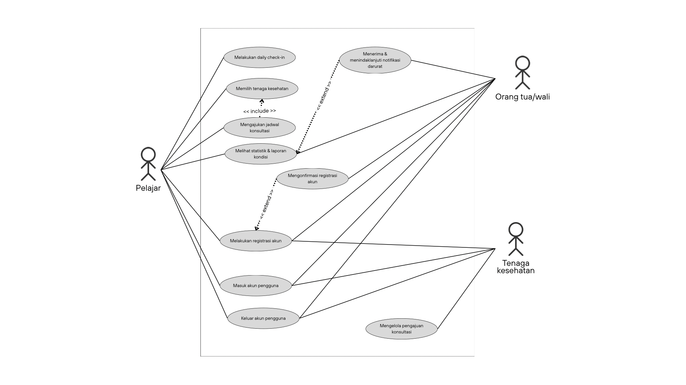

<i>Gambar 2. Use Case Diagram Mahasehat</i>

## 4.4 Skenario Use Case
Salin ulang skenario **setiap** use case (skenario normal dan alternatif) dari BAB 3.4 dokumen *Use Case & Scenario Use Case*, sesuaikan dengan daftar UC final pada 4.2. Jika use case melibatkan lebih dari satu aktor manusia yang benar-benar berinteraksi langsung (misalnya *Kasir* yang memverifikasi transaksi setelah *Pelanggan* membayar), tambahkan kolom aksi tersendiri untuk aktor tersebut di samping kolom "Reaksi Perangkat Lunak". Sistem eksternal otomatis seperti *payment gateway* **bukan aktor**, sehingga interaksinya cukup dituliskan sebagai bagian dari "Reaksi Perangkat Lunak", bukan kolom aktor terpisah.

### 4.4.1 Skenario UC01

**Nama Use Case:** *Memesan Produk*

**Nama Use Case:** *Melakukan Registrasi Akun*

**Skenario Normal**

| No | Aksi Aktor | Reaksi Perangkat Lunak |
| :--- | :--- | :--- |
| 1 | *Pelajar memilih menu registrasi* | *Sistem menampilkan antarmuka formulir registrasi* |
| 2 | *Pelajar memasukkan identitas diri, riwayat kesehatan mental, dan kontak orang tua/wali dan menekan tombol daftar* | *Sistem memeriksa kelengkapan data dan format masukan pengguna dan mengirimkan kode verifikasi (misalnya melalui e-mail) jika sudah valid* |
| 4 | *Pelajar melakukan verifikasi* | *Sistem mengaktifkan akun baru dan menyimpan data ke database* |

 

**Skenario Alternatif 1: Masukan pengguna tidak valid**

| No | Aksi Aktor | Reaksi Perangkat Lunak |
| :--- | :--- | :--- |
| 1 | *Pelajar memilih menu registrasi* | *Sistem menampilkan antarmuka formulir registrasi* |
| 2 | *Pelajar memasukkan identitas diri, riwayat kesehatan mental, dan kontak orang tua/wali dengan tidak lengkap ataupun kesalahan format dan menekan tombol daftar* | *Sistem mendeteksi data tidak valid, mengirim pesan kesalahan dan meminta masukan kembali* |
| 3 | *Pelajar melengkapi data atau memasukkan data kembali dengan format yang benar dan menekan tombol daftar* | *Sistem kembali ke langkah 2 skenario normal* |

### 4.4.2 Skenario UC02

**Nama Use Case:** *Mengonfirmasi Registrasi Akun*

**Skenario Normal**

| No | Aksi Aktor | Reaksi Perangkat Lunak |
| :--- | :--- | :--- |
| 1 | *Orang tua/wali menerima dan membuka tautan konfirmasi registrasi akun* | *Sistem menampilkan halaman konfirmasi registrasi akun* |
| 2 | *Orang tua/wali menekan tombol persetujuan* | *Sistem mengaktifkan akun pelajar dan mengirimkan pesan keberhasilan* |

 

**Skenario Alternatif 1: Orang tua/wali tidak mengonfirmasi registrasi akun**

| No | Aksi Aktor | Reaksi Perangkat Lunak |
| :--- | :--- | :--- |
| 1 | *Orang tua/wali menerima dan membuka tautan konfirmasi registrasi akun melewati batas waktu tertentu* | *Sistem memeriksa kevalidan tautan* |
| 2 | *Orang tua/wali tidak segera menekan tombol persetujuan dalam batas waktu tertentu* | *Sistem mendapati tautan telah kadaluwarsa dan menandai akun pelajar gagal terverifikasi* |

### 4.4.3 Skenario UC03

**Nama Use Case:** *Melakukan Daily Check-in*

**Skenario Normal**

| No | Aksi Aktor | Reaksi Perangkat Lunak |
| :--- | :--- | :--- |
| 1 | *Pelajar mengetuk tombol untuk memulai daily check-in* | *Sistem memulai proses daily check-in dan menampilkan form suasana hati* |
| 2 | *Pelajar memasukkan nilai suasana hati dalam skala 1-5* | *Sistem mencatat nilai suasana hati yang dimasukkan dan menampilkan form pola tidur* |
| 3 | *Pelajar memasukkan waktu tidur dan waktu bangun* | *Sistem mencatat waktu tidur dan waktu bangun yang dimasukkan dan menampilkan form pola makan* |
| 4 | *Pelajar memasukkan waktu makan dan jenis makanan yang dikonsumsi* | *Sistem mencatat waktu makan dan jenis makanan yang dimasukkan dan menampilkan form refleksi harian* |
| 5 | *Pelajar memasukkan catatan refleksi harian* | *Sistem mencatat refleksi dan menampilkan rangkuman data daily check-in.* |
| 6 | *Pelajar memeriksa dan mengonfirmasi data daily check-in.* | *Sistem menyimpan seluruh data daily check-in dan menampilkan pemberitahuan bahwa daily check-in berhasil dilakukan* |

 

**Skenario Alternatif 1: Pelajar tidak mengisi catatan refleksi harian**

| No | Aksi Aktor | Reaksi Perangkat Lunak |
| :--- | :--- | :--- |
| 1 | *Pelajar mengetuk tombol untuk memulai daily check-in* | *Sistem memulai proses daily check-in dan menampilkan form suasana hati* |
| 2 | *Pelajar memasukkan nilai suasana hati dalam skala 1-5* | *Sistem mencatat nilai suasana hati yang dimasukkan dan menampilkan form pola tidur* |
| 3 | *Pelajar memasukkan waktu tidur dan waktu bangun* | *Sistem mencatat waktu tidur dan waktu bangun yang dimasukkan dan menampilkan form pola makan* |
| 4 | *Pelajar memasukkan waktu makan dan jenis makanan yang dikonsumsi* | *Sistem mencatat waktu makan dan jenis makanan yang dimasukkan dan menampilkan form refleksi harian* |
| 5 | *Pelajar tidak memasukkan catatan refleksi harian* | *Sistem menampilkan pop-up konfirmasi untuk memastikan apakah pelajar ingin melanjutkan tanpa membuat catatan refleksi* |
| 6 | *Pelajar mengonfirmasi untuk tidak membuat catatan refleksi* | *Sistem menampilkan rangkuman data daily check-in* |
| 7 | *Pelajar memeriksa dan mengonfirmasi data daily check-in.* | *Sistem menyimpan seluruh data daily check-in dan menampilkan pemberitahuan bahwa daily check-in berhasil dilakukan* |

### 4.4.4 Skenario UC04

**Nama Use Case:** *Melihat Statistik dan Laporan Kondisi*

**Skenario Normal**

| No | Aksi Aktor | Reaksi Perangkat Lunak |
| :--- | :--- | :--- |
| 1 | *Pelajar/Wali mengetuk tombol untuk melihat kondisi kesehatan Pelajar* | *Sistem memeriksa ketersediaan data daily check-in dan menampilkan statistik kondisi berdasarkan data daily check-in yang telah dicatat* |
| 2 | *Pelajar/Wali memilih periode statistik yang ingin dilihat* | *Sistem menampilkan statistik kondisi yang sesuai periode yang dipilih* |
| 3 | *Pelajar/Wali memilih suatu pola kondisi atau catatan refleksi yang ingin dilihat* | *Sistem menampilkan visualisasi dan informasi mengenai data yang dipilih* |
| 4 | *Pelajar/Wali memilih untuk melihat laporan kondisi* | *Sistem menampilkan rangkuman kondisi kesehatan serta rekomendasi kesehatan berdasarkan data pada periode yang dipilih* |

 

**Skenario Alternatif 1: Data check-in belum dapat divisualisasikan**

| No | Aksi Aktor | Reaksi Perangkat Lunak |
| :--- | :--- | :--- |
| 1 | *Pelajar/Wali mengetuk tombol untuk melihat kondisi kesehatan Pelajar* | *Sistem memeriksa ketersediaan data daily check-in dan menampilkan pemberitahuan bahwa data daily check-in belum mencukupi untuk menampilkan statistik* |
| 2 | *Pelajar/Wali mengetuk tombol untuk kembali ke halaman sebelumnya* | *Sistem kembali ke halaman sebelumnya* |

### 4.4.5 Skenario UC05

**Nama Use Case:** *Menentukan Tenaga Kesehatan*

**Skenario Normal**

| No | Aksi Aktor | Reaksi Perangkat Lunak |
| :--- | :--- | :--- |
| 1 | *Pelajar membuka fitur pencarian tenaga kesehatan* | *Sistem menampilkan daftar tenaga kesehatan beserta lokasi dan estimasi biaya konsultasi serta meminta izin akses lokasi perangkat* |
| 2 | *Pelajar memberikan izin akses lokasi perangkat* | *Sistem mengakses lokasi pelajar, menghitung jarak, dan menampilkan jarak ke setiap fasilitas kesehatan yang tersedia* |
| 3 | *Pelajar memilih salah satu tenaga kesehatan* | *Sistem menampilkan profil tenaga kesehatan yang dipilih* |

 

**Skenario Alternatif 1: Akses Lokasi Tidak Diberikan**

| No | Aksi Aktor | Reaksi Perangkat Lunak |
| :--- | :--- | :--- |
| 1 | *Pelajar membuka fitur pencarian tenaga kesehatan* | *Sistem menampilkan daftar tenaga kesehatan beserta lokasi dan estimasi biaya konsultasi serta meminta izin akses lokasi perangkat* |
| 2 | *Pelajar tidak memberikan izin akses lokasi perangkat* | *Sistem tidak mengakses lokasi pelajar dan tetap menampilkan daftar tenaga kesehatan tanpa informasi jarak* |
| 3 | *Pelajar memilih salah satu tenaga kesehatan* | *Sistem menampilkan profil tenaga kesehatan yang dipilih* |

### 4.4.6 Skenario UC06

**Nama Use Case:** *Mengajukan Jadwal Konsultasi*

**Skenario Normal**

| No | Aksi Aktor | Reaksi Perangkat Lunak |
| :--- | :--- | :--- |
| 1 | *Pelajar membuka profil tenaga kesehatan yang telah dipilih* | *Sistem menampilkan profil tenaga kesehatan dan formulir pengajuan konsultasi beserta jadwal yang tersedia* |
| 2 | *Pelajar memilih jadwal konsultasi* | *Sistem memeriksa ketersediaan jadwal dan menampilkan jadwal yang dipilih pada formulir pengajuan konsultasi* |
| 3 | *Pelajar mengisi formulir pengajuan konsultasi* | *Sistem memperbarui dan menampilkan ketersediaan jadwal terbaru selama formulir dibuka* |
| 4 | *Pelajar mengirimkan pengajuan jadwal konsultasi* | *Sistem menyimpan pengajuan untuk ditinjau oleh tenaga kesehatan* |

 

**Skenario Alternatif 1: Jadwal Konsultasi Tidak Lagi Tersedia**

| No | Aksi Aktor | Reaksi Perangkat Lunak |
| :--- | :--- | :--- |
| 1 | *Pelajar membuka profil tenaga kesehatan yang telah dipilih* | *Sistem menampilkan profil tenaga kesehatan dan formulir pengajuan konsultasi beserta jadwal yang tersedia* |
| 2 | *Pelajar memilih jadwal konsultasi* | *Sistem memeriksa ketersediaan jadwal dan menampilkan pemberitahuan bahwa jadwal yang dipilih sudah tidak tersedia, lalu menampilkan pilihan jadwal lain* |
| 3 | *Pelajar memilih jadwal lain yang masih tersedia* | *Sistem memeriksa ketersediaan jadwal baru dan menampilkannya pada formulir pengajuan konsultasi* |
| 4 | *Pelajar mengisi formulir pengajuan konsultasi* | *Sistem memperbarui dan menampilkan ketersediaan jadwal terbaru selama formulir dibuka* |
| 5 | *Pelajar mengirimkan pengajuan jadwal konsultasi* | *Sistem menyimpan pengajuan untuk ditinjau oleh tenaga kesehatan* |

### 4.4.7 Skenario UC07

**Nama Use Case:** *Mengelola Pengajuan Konsultasi*

**Skenario Normal**

| No | Aksi Aktor | Reaksi Perangkat Lunak |
| :--- | :--- | :--- |
| 1 | *Tenaga kesehatan membuka halaman jadwal konsultasi* | *Sistem menampilkan daftar pengajuan konsultasi yang masuk beserta detail dan tombol aksi (Setuju/Reschedule)* |
| 2 | *Tenaga kesehatan meninjau detail pengajuan dan menekan tombol "Setuju"* | *Sistem memperbarui status pengajuan menjadi "Disetujui" dan mengirimkan notifikasi persetujuan kepada pelajar* |

 

**Skenario Alternatif 1: Reschedule Jadwal Konsultasi**

| No | Aksi Aktor | Reaksi Perangkat Lunak |
| :--- | :--- | :--- |
| 1 | *Tenaga kesehatan membuka halaman jadwal konsultasi* | *Sistem menampilkan daftar pengajuan konsultasi yang masuk beserta detail dan tombol aksi (Setuju/Reschedule)* |
| 2 | *Tenaga kesehatan meninjau detail pengajuan dan menekan tombol "Reschedule"* | *Sistem menampilkan formulir untuk memilih slot jadwal alternatif yang tersedia* |
| 3 | *Tenaga kesehatan memilih jadwal alternatif dan mengirimkan tawaran tersebut* | *Sistem memperbarui status pengajuan menjadi "Menunggu Konfirmasi Ulang" dan mengirimkan notifikasi tawaran jadwal baru kepada pelajar* |

### 4.4.8 Skenario UC08

**Nama Use Case:** *Menerima dan Menindaklanjuti Notifikasi Darurat*

**Skenario Normal**

| No | Aksi Aktor | Reaksi Perangkat Lunak |
| :--- | :--- | :--- |
| 1 | *Orang tua/wali membuka notifikasi darurat yang diterima pada perangkat mereka* | *Sistem menampilkan pop-up notifikasi darurat berisi ringkasan kondisi pelajar yang memicu status darurat* |
| 2 | *Orang tua/wali menekan tombol "Konfirmasi Diterima" pada pop-up notifikasi* | *Sistem mencatat status notifikasi sebagai "Diterima" beserta waktu konfirmasi* |
| 3 | *Orang tua/wali melakukan tindak lanjut terhadap kondisi pelajar (misalnya menghubungi pelajar bersangkutan atau tenaga kesehatan), lalu menekan tombol "Tandai Sudah Ditindaklanjuti"* | *Sistem mencatat status tindak lanjut sebagai "Sudah Ditindaklanjuti" beserta waktu tindak lanjut tersebut* |

 

**Skenario Alternatif 1: Notifikasi Darurat Tidak Direspon**

| No | Aksi Aktor | Reaksi Perangkat Lunak |
| :--- | :--- | :--- |
| 1 | *Orang tua/wali menerima notifikasi darurat namun tidak membukanya dalam batas waktu tertentu* | *Sistem mengirimkan ulang notifikasi darurat (reminder) kepada orang tua/wali yang bersangkutan* |
| 2 | *Orang tua/wali tetap tidak merespon hingga batas waktu terlewati* | *Sistem meneruskan notifikasi darurat ke kontak darurat cadangan yang terdaftar (atau ke layanan darurat)* |

### 4.4.9 Skenario UC09

**Nama Use Case:** *Masuk Akun Pengguna*

**Skenario Normal**

| No | Aksi Aktor | Reaksi Perangkat Lunak |
| :--- | :--- | :--- |
| 1 | *Pengguna memilih menu masuk akun (log in)* | *Sistem menampilkan kolom masukan username/e-mail dan password* |
| 2 | *Pengguna memasukkan username/e-mail dan password yang terdaftar, lalu menekan tombol masuk* | *Sistem memvalidasi kecocokan kredensial dengan data akun, memulai sesi login pengguna, lalu mengarahkan pengguna ke halaman utama (dashboard)* |

 

**Skenario Alternatif 1: Kredensial Tidak Valid**

| No | Aksi Aktor | Reaksi Perangkat Lunak |
| :--- | :--- | :--- |
| 1 | *Pengguna memilih menu masuk akun (log in)* | *Sistem menampilkan kolom masukan username/e-mail dan password* |
| 2 | *Pengguna memasukkan username/e-mail dan password yang salah, lalu menekan tombol masuk* | *Sistem mendeteksi kredensial tidak cocok, menampilkan pesan kesalahan, dan meminta pengguna memasukkan kembali* |
| 3 | *Pengguna memasukkan ulang username/e-mail dan password yang benar* | *Sistem memvalidasi kecocokan kredensial dengan data akun, memulai sesi login pengguna, lalu mengarahkan pengguna ke halaman utama (dashboard)* |

 

**Skenario Alternatif 2: Akun Belum Terverifikasi**

| No | Aksi Aktor | Reaksi Perangkat Lunak |
| :--- | :--- | :--- |
| 1 | *Pelajar memilih menu masuk akun (log in)* | *Sistem menampilkan kolom masukan username/e-mail dan password* |
| 2 | *Pelajar memasukkan username/e-mail dan password yang terdaftar namun akunnya belum dikonfirmasi orang tua/wali, lalu menekan tombol masuk* | *Sistem mendeteksi status akun belum aktif, menampilkan pesan bahwa akun masih menunggu konfirmasi orang tua/wali, dan menolak akses masuk* |

 

**Skenario Alternatif 3: Lupa Password**

| No | Aksi Aktor | Reaksi Perangkat Lunak |
| :--- | :--- | :--- |
| 1 | *Pengguna memilih menu masuk akun (log in)* | *Sistem menampilkan kolom masukan username/e-mail dan password, beserta tautan "Lupa Password"* |
| 2 | *Pengguna menekan tautan "Lupa Password"* | *Sistem menampilkan kolom masukan e-mail untuk permintaan reset password* |
| 3 | *Pengguna memasukkan e-mail terdaftar, lalu menekan tombol kirim* | *Sistem memvalidasi keberadaan e-mail pada data akun, lalu mengirimkan tautan reset password ke e-mail tersebut dan menampilkan pesan konfirmasi bahwa tautan telah dikirim* |
| 4 | *Pengguna membuka tautan reset password dari e-mail, lalu memasukkan password baru beserta konfirmasinya* | *Sistem memvalidasi kesesuaian password baru dengan konfirmasi dan ketentuan keamanan, lalu memperbarui password akun dan menampilkan pesan bahwa password berhasil diubah* |
| 5 | *Pengguna kembali ke halaman masuk akun dan memasukkan username/e-mail beserta password baru* | *Sistem memvalidasi kecocokan kredensial dengan data akun, memulai sesi login pengguna, lalu mengarahkan pengguna ke halaman utama (dashboard)* |

### 4.4.10 Skenario UC10

**Nama Use Case:** *Keluar Akun Pengguna*

**Skenario Normal**

| No | Aksi Aktor | Reaksi Perangkat Lunak |
| :--- | :--- | :--- |
| 1 | *Pengguna memilih menu keluar akun (log out) pada halaman pengaturan/profil* | *Sistem menampilkan pop up konfirmasi keluar akun* |
| 2 | *Pengguna menekan tombol konfirmasi keluar* | *Sistem mengakhiri sesi login pengguna dan mengarahkan kembali ke halaman masuk* |

 

**Skenario Alternatif 1: Membatalkan Keluar Akun**

| No | Aksi Aktor | Reaksi Perangkat Lunak |
| :--- | :--- | :--- |
| 1 | *Pengguna memilih menu keluar akun (log out) pada menu pengaturan/profil* | *Sistem menampilkan pop up konfirmasi keluar akun* |
| 2 | *Pengguna menekan tombol batal* | *Sistem menutup konfirmasi dan mempertahankan sesi login pengguna, kembali pada halaman pengaturan/profil* |

---

# BAB 5: Pemodelan Kelas

## 5.1 Identifikasi Kelas

| ID Kelas | Nama Kelas | Deskripsi Kelas | ID Use Case |
| :--- | :--- | :--- | :--- |
| *C01* | *Pengguna* | *Kelas abstrak yang menyimpan data akun (identitas diri, email, password) yang dimiliki oleh ketiga aktor (Entity Class).* | *UC01, UC09, UC10* |
| *C02* | *Pelajar* | *Merepresentasikan pengguna pelajar yang melakukan registrasi, check-in harian, melihat statistik kondisi kesehatannya, serta menentukan jadwal konsultasi dengan tenaga kesehatan (Entity Class).* | *UC01, UC02, UC03, UC04, UC05, UC06, UC08, UC09, UC10* |
| *C03* | *OrangTuaWali* | *Merepresentasikan pengguna orang tua/wali yang mengonfirmasi registrasi akun pelajar di bawah umur, memantau laporan kondisi pelajar, serta menerima dan menindaklanjuti notifikasi darurat (Entity Class).* | *UC02, UC04, UC08, UC09, UC10* |
| *C04* | *TenagaKesehatan* | *Merepresentasikan pengguna psikolog/psikiater yang dapat dipilih pelajar dari daftar rekomendasi, serta meninjau pengajuan jadwal konsultasi yang masuk (Entity Class).* | *UC05, UC07, UC09, UC10* |
| *C05* | *RiwayatKesehatan* | *Menyimpan data riwayat kesehatan mental dan kontak orang tua/wali yang diisi pelajar saat proses registrasi akun (Entity Class).* | *UC01* |
| *C06* | *CheckIn* | *Menyimpan data hasil daily check-in pelajar (skala mood, durasi tidur, pola makan, faktor pemicu stres, catatan jurnal, dan tanggal pencatatannya) (Entity Class).* | *UC03, UC04* |
| *C07* | *LaporanKesehatan* | *Mengolah data check-in menjadi grafik tren mingguan/bulanan serta rangkuman kondisi kesehatan, dan menerapkan ambang batas untuk mendeteksi kondisi darurat pada data pelajar (Entity Class).* | *UC04, UC08* |
| *C08* | *FasilitasKesehatan* | *Menyimpan data fasilitas kesehatan atau klinik yang direkomendasikan pada fitur pencarian, termasuk lokasi dan estimasi biaya konsultasi (Entity Class).* | *UC05* |
| *C09* | *JadwalKonsultasi* | *Menyimpan data pengajuan jadwal konsultasi antara pelajar dan tenaga kesehatan beserta statusnya (diajukan, disetujui, atau reschedule) (Entity Class).* | *UC06, UC07* |
| *C10* | *RegistrationPage* | *Merepresentasikan antarmuka formulir registrasi akun bagi pelajar (Boundary Class).* | *UC01* |
| *C11* | *AuthController* | *Mengatur proses registrasi,login, dan logout, memvalidasi data akun pengguna, mengatur proses konfirmasi, perubahan status registrasi akun, sesi login, dan mengakhiri sesi login pengguna (Control Class).* | *UC01, UC09, UC10* |
| *C12* | *KonfirmasiRegistrasiPage* | *Merepresentasikan antarmuka formulir registrasi akun bagi orang tua/wali (Boundary Class).* | *UC02* |
| *C13* | *CheckInPage* | *Merepresentasikan antarmuka formulir pengisian daily check-in bagi pelajar (Boundary Class).* | *UC03* |
| *C14* | *CheckInController* | *Mengatur proses penerimaan masukan, validasi format masukan, dan penyimpanan data check-in (Controller Class).* | *UC03* |
| *C15* | *NotificationPengingatController* | *Mengatur penjadwalan dan pengiriman notifikasi pengingat harian ke peramban pengguna (Controller Class).* | *UC03* |
| *C16* | *ReportPage* | *Merepresentasikan antarmuka visualisasi grafik statistik, tren mingguan/bulanan, dan rangkuman kondisi (Boundary Class).* | *UC04* |
| *C17* | *ReportController* | *Mengatur kalkulasi data statistik, pembuatan grafik, pembatasan filter privasi wali, serta evaluasi ambang batas (Controller Class).* | *UC04* |
| *C18* | *CariTenagaKesehatanPage* | *Merepresentasikan antarmuka pencarian tenaga kesehatan yang menampilkan daftar tenaga kesehatan, lokasi fasilitas kesehatan, estimasi biaya konsultasi, dan informasi jarak (Boundary Class).* | *UC05* |
| *C19* | *ProfilTenagaKesehatanPage* | *Merepresentasikan antarmuka untuk menampilkan profil tenaga kesehatan yang dipilih pelajar (Boundary Class).* | *UC05, UC06* |
| *C20* | *TenagaKesehatanController* | *Mengatur proses pencarian tenaga kesehatan, pemrosesan izin akses lokasi, perhitungan jarak ke fasilitas kesehatan, dan pemilihan tenaga kesehatan (Controller Class).* | *UC05* |
| *C21* | *PengajuanKonsultasiPage* | *Merepresentasikan antarmuka formulir pengajuan konsultasi serta jadwal yang dipilih oleh pelajar (Boundary Class).* | *UC06, UC07* |
| *C22* | *JadwalKonsultasiController* | *Mengatur proses pemuatan jadwal, pengecekan dan pembaruan ketersediaan, pemilihan jadwal, serta pengiriman pengajuan konsultasi (Controller Class).* | *UC06* |
| *C23* | *KonsultasiController* | *Mengatur proses pengelolaan pengajuan konsultasi, termasuk persetujuan dan perubahan jadwal (Controller Class).* | *UC07* |
| *C24* | *NotifikasiDaruratController* | *Mengatur pengiriman notifikasi darurat, pengambilan detail kondisi darurat, pencatatan konfirmasi penerimaan, dan pencatatan tindak lanjut (Controller Class).* | *UC08* |
| *C25* | *LoginPage* | *Merepresentasikan antarmuka login untuk pengguna serta fitur lupa password (Boundary Class).* | *UC09, UC10* |
| *C26* | *ResetPasswordPage* | *Merepresentasikan antarmuka untuk memasukkan e-mail serta password baru (Boundary Class).* | *UC09* |
| *C27* | *PasswordController* | *Mengatur reset password, termasuk pengiriman tautan reset (Controller Class).* | *UC09* |
| *C28* | *DashboardPage* | *Merepresentasikan antarmuka halaman utama setelah pengguna berhasil masuk akun (Boundary Class).* | *UC09* |
| *C29* | *SettingPage* | *Merepresentasikan antarmuka halaman pengaturan/profil yang menyediakan opsi keluar akun (Boundary Class).* | *UC10* |

## 5.2 Diagram Kelas per Use Case

### 5.2.1 Use Case UC01

**Nama Use Case:** *Melakukan Registrasi Akun*

#### Identifikasi Kelas

| ID Kelas | Nama Kelas | Deskripsi Kelas |
| :--- | :--- | :--- |
| *C10* | *RegistrationPage* | *Antarmuka registrasi akun bagi pelajar (Boundary Class)* |
| *C11* | *AuthController* | *Mengatur proses registrasi dan validasi data akun (Control Class)* |
| *C01* | *Pengguna* | *Menyimpan data akun pengguna seperti email, password, dan role (Entity Class)* |
| *C02* | *Pelajar* | *Menyimpan data pelajar yang melakukan registrasi (Entity Class)* |
| *C03* | *OrangTuaWali* | *Menyimpan data orang tua/wali yang terhubung dengan akun pelajar (Entity Class)* |
| *C04* | *TenagaKesehatan* | *Menyimpan data tenaga kesehatan yang terhubung dengan akun pelajar (Entity Class)* |
| *C05* | *RiwayatKesehatan* | *Menyimpan data riwayat kesehatan yang diisi saat registrasi (Entity Class)* |

#### Diagram Kelas

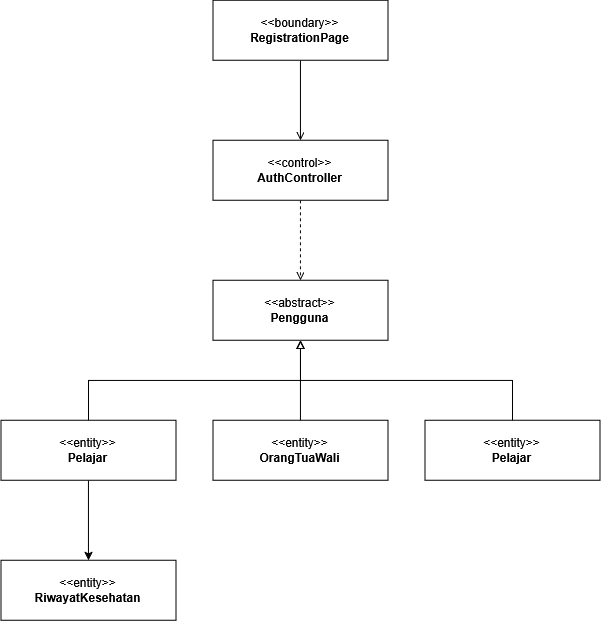

<i>Gambar 2. Diagram Kelas Use Case UC01</i>

 

| ID Kelas | Nama Kelas | Atribut | Metode/Operasi |
| :--- | :--- | :--- | :--- |
| *C10* | *RegistrasiPage* | *inputDataPelajar, inputDataWali* | *displayFormRegistrasi(), inputDataPelajar(), inputDataWali(), submitRegistrasi()* |
| *C11* | *AuthController* | *-* | *validateData(), registerAccount()* |
| *C01* | *Pengguna* | *idPengguna, email, password* | *-* |
| *C02* | *Pelajar* | *nama, tanggalLahir, nomorTelepon* | *-* |
| *C03* | *OrangTuaWali* | *idWali, nama, email, nomorTelepon* | *-* |
| *C04* | *TenagaKesehatan* | *nama, email, nomorTelepon, jenisTenagaKesehatan, lokasi* | *-* |
| *C05* | *RiwayatKesehatan* | *riwayatKesehatan* | *-* |

### 5.2.2 Use Case UC02

**Nama Use Case:** *Mengonfirmasi Registrasi Akun*

#### Identifikasi Kelas

| ID Kelas | Nama Kelas | Deskripsi Kelas |
| :--- | :--- | :--- |
| *C12* | *KonfirmasiRegistrasiPage* | *Antarmuka konfirmasi registrasi akun bagi pengguna (Boundary Class)* |
| *C11* | *AuthController* | *Mengatur proses konfirmasi dan perubahan status registrasi akun (Control Class)* |
| *C02* | *Pelajar* | *Menyimpan data pelajar yang akun registrasinya akan dikonfirmasi (Entity Class)* |
| *C03* | *OrangTuaWali* | *Menyimpan data orang tua/wali yang melakukan konfirmasi registrasi (Entity Class)* |
| *C04* | *TenagaKesehatan* | *Menyimpan data tenaga kesehatan yang melakukan konfirmasi registrasi (Entity Class)* |
| *C01* | *Pengguna* | *Menyimpan data umum akun dan status registrasi pengguna (Entity Class)* |

#### Diagram Kelas

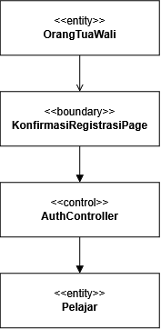

<i>Gambar 3. Diagram Kelas Use Case UC02</i>

 

| ID Kelas | Nama Kelas | Atribut | Metode/Operasi |
| :--- | :--- | :--- | :--- |
| *C12* | *KonfirmasiRegistrasiPage* | *dataRegistrasi, statusKonfirmasi* | *displayDataRegistrasi(), confirmRegistrasi()* |
| *C11* | *AuthController* | *-* | *validateConfirmation(), confirmAccount()* |
| *C02* | *Pelajar* | *-* | *-* |
| *C03* | *OrangTuaWali* | *-* | *-* |
| *C04* | *TenagaKesehatan* | *-* | *-* | 
| *C01* | *Pengguna* | *-* | *-* |

### 5.5.3 Use Case UC03

**Nama Use Case:** *Melakukan Daily Check-in*

#### Identifikasi Kelas

| ID Kelas | Nama Kelas | Deskripsi Kelas |
| :--- | :--- | :--- |
| *C02* | *Pelajar* | *Subkelas dari Pengguna, menyimpan data spesifik pelajar yang melakukan pencatatan harian (_Entity Class_).* |
| *C06* | *CheckIn* | *Menyimpan data hasil _daily check-in_ harian (skala _mood_, durasi tidur, pola makan, pemicu stres, dan catatan refleksi) (_Entity Class_)* |
| *C13* | *CheckInPage* | *Antarmuka formulir pengisian _daily check-in_ bagi pelajar (_Boundary Class_).* |
| *C14* | *CheckInController* | *Mengatur proses penerimaan masukan, validasi format, dan penyimpanan data _check-in_ (_Controller Class_).* |
| *C15* | *NotificationPengingatController* | *Mengatur penjadwalan dan pengiriman notifikasi pengingat harian ke peramban pengguna (_Controller Class_).* |

#### Diagram Kelas

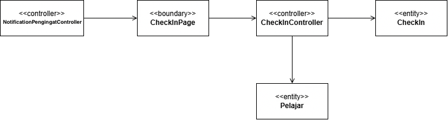

<i>Gambar 4. Diagram Kelas Use Case UC03</i>

 

| ID Kelas | Nama Kelas | Atribut | Metode/Operasi |
| :--- | :--- | :--- | :--- |
| *C02* | *Pelajar* | *idPelajar, nama* | *getCheckInHistory(), setCheckIn()* |
| *C06* | *CheckIn* | *idCheckIn, tanggalCheckIn, skalaMood, jamTidur, jamBangun, polaMakan, pemicuStres, catatanRefleksi* | *createCheckIn(), getCheckInData(), validateData()* |
| *C13* | *CheckInPage* | *moodInput, sleepDurationInput, dietInput, triggerInput, reflectionInput* | *showPage(), getInput(), showError(), showSuccessMessage()* |
| *C13* | *CheckInController* | *currentCheckIn* | *submitCheckIn(), validateCheckInFormat(), encryptJournal()* |
| *C15* | *NotificationPengingatController* | *reminderSchedule, status* | *sendDailyReminder(), checkPendingCheckIn()* |

### 5.5.4 Use Case UC04

**Nama Use Case:** *Melihat Statistik dan Laporan Kondisi*

#### Identifikasi Kelas

| ID Kelas | Nama Kelas | Deskripsi Kelas |
| :--- | :--- | :--- |
| *C02* | *Pelajar* | *Subkelas dari Pengguna, pemilik utama data statistik dan laporan personal (_Entity Class_).* |
| *C03* | *OrangTuaWali* | *Subkelas dari Pengguna, pihak pendamping yang memiliki hak akses terbatas untuk melihat grafik tren (_Entity Class_).* |
| *C06* | *CheckIn* | *Menyimpan histori kumpulan data masukan harian yang menjadi sumber kalkulasi grafik (_Entity Class_).* |
| *C07* | *LaporanKesehatan* | *Mengolah himpunan data _check-in_ menjadi ringkasan statistik, tren emosi, dan penilaian ambang batas risiko (_Entity Class_).* |
| *C16* | *ReportPage* | *Antarmuka visualisasi grafik statistik, tren mingguan/bulanan, dan rangkuman kondisi (_Boundary Class_).* |
| *C17* | *ReportController* | *Mengatur kalkulasi data statistik, pembuatan grafik, pembatasan filter privasi wali, serta evaluasi ambang batas (_Controller Class_).* |

#### Diagram Kelas

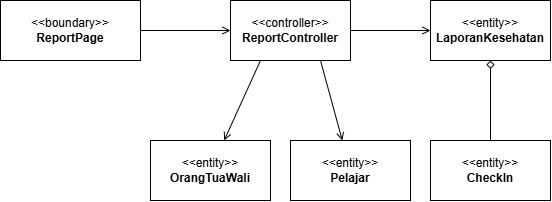

<i>Gambar 5. Diagram Kelas Use Case UC04</i>

 

| ID Kelas | Nama Kelas | Atribut | Metode/Operasi |
| :--- | :--- | :--- | :--- |
| *C02* | *Pelajar* | *idPelajar, nama* | *getPersonalReport()* |
| *C03* | *OrangTuaWali* | *idWali, nama* | *getSummaryReport()* |
| *C06* | *CheckIn* | *idCheckIn, tanggalCheckIn, skalaMood, jamTidur* | *getMoodScore(), getSleepData()* |
| *C07* | *LaporanKesehatan* | *idLaporan, periode, rataRataMood, rataRataTidur, indikatorRisiko* | *generateReport(), evaluateThreshold()* |
| *C16* | *ReportPage* | *selectedPeriod, displayedChart, displayedSummary* | *showPage(), displayChart(), filterViewByRole()* |
| *C17* | *ReportController* | *currentReport* | *calculateStatistics(), buildTrendChart(), applyPrivacyRestriction()* |

### 5.5.5 Use Case UC05

**Nama Use Case:** *Menentukan Tenaga Kesehatan*

#### Identifikasi Kelas

| ID Kelas | Nama Kelas | Deskripsi Kelas |
| :--- | :--- | :--- |
| *C02* | *Pelajar* | *Merepresentasikan pelajar yang mencari dan memilih tenaga kesehatan serta memberikan izin akses lokasi perangkat (Entity Class).* |
| *C04* | *TenagaKesehatan* | *Merepresentasikan psikolog atau psikiater yang dapat dipilih oleh pelajar berdasarkan profil dan informasi layanan yang tersedia (Entity Class).* |
| *C08* | *FasilitasKesehatan* | *Menyimpan informasi fasilitas kesehatan tempat tenaga kesehatan memberikan layanan, meliputi lokasi dan estimasi biaya konsultasi (Entity Class).* |
| *C18* | *CariTenagaKesehatanPage* | *Merepresentasikan antarmuka pencarian tenaga kesehatan yang menampilkan daftar tenaga kesehatan, lokasi fasilitas kesehatan, estimasi biaya konsultasi, dan informasi jarak (Boundary Class).* |
| *C19* | *ProfilTenagaKesehatanPage* | *Merepresentasikan antarmuka untuk menampilkan profil tenaga kesehatan yang dipilih pelajar (Boundary Class).* |
| *C20* | *TenagaKesehatanController* | *Mengatur proses pencarian tenaga kesehatan, pemrosesan izin akses lokasi, perhitungan jarak ke fasilitas kesehatan, dan pemilihan tenaga kesehatan (Controller Class).* |

#### Diagram Kelas

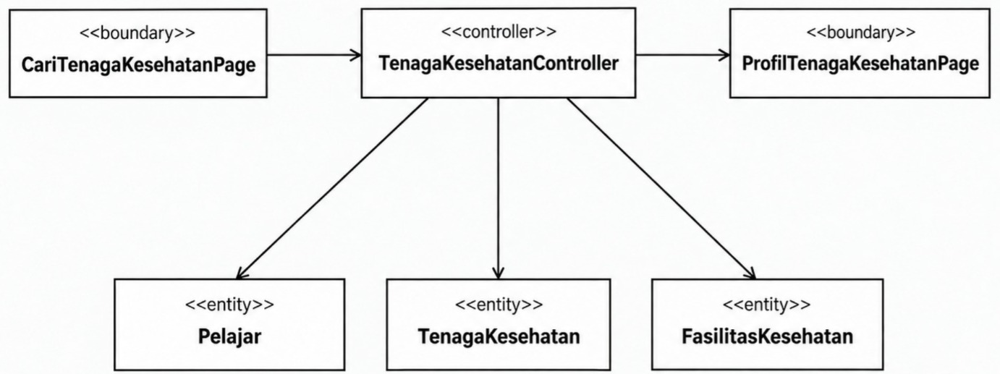

<i>Gambar 6. Diagram Kelas Use Case UC05</i>

 

| ID Kelas | Nama Kelas | Atribut | Metode/Operasi |
| :--- | :--- | :--- | :--- |
| *C02* | *Pelajar* | *lokasiSaatIni* | *getLokasiSaatIni()* |
| *C04* | *TenagaKesehatan* | *idTenagaKesehatan, nama, profesi* | *getProfil()* |
| *C08* | *FasilitasKesehatan* | *idFasilitas, namaFasilitas, lokasi, estimasiBiaya* | *getLokasi(), getEstimasiBiaya()* |
| *C18* | *CariTenagaKesehatanPage* | *-* | *showPage(), requestLocationPermission(), displayResults()* |
| *C19* | *ProfilTenagaKesehatanPage* | *tenagaKesehatanDipilih* | *displayProfile()* |
| *C20* | *TenagaKesehatanController* | *-* | *loadTenagaKesehatan(), processLocationPermission(), calculateDistances(), selectTenagaKesehatan()* |

### 5.5.6 Use Case UC06

**Nama Use Case:** *Mengajukan Jadwal Konsultasi*

#### Identifikasi Kelas

| ID Kelas | Nama Kelas | Deskripsi Kelas |
| :--- | :--- | :--- |
| *C02* | *Pelajar* | *Merepresentasikan pelajar yang memilih jadwal dan mengajukan konsultasi kepada tenaga kesehatan (Entity Class).* |
| *C04* | *TenagaKesehatan* | *Merepresentasikan tenaga kesehatan yang menjadi tujuan pengajuan konsultasi oleh pelajar (Entity Class).* |
| *C09* | *JadwalKonsultasi* | *Menyimpan informasi jadwal konsultasi antara pelajar dan tenaga kesehatan, meliputi waktu, ketersediaan jadwal, dan status pengajuan (Entity Class).* |
| *C19* | *ProfilTenagaKesehatanPage* | *Merepresentasikan antarmuka profil tenaga kesehatan yang menampilkan jadwal konsultasi yang tersedia (Boundary Class).* |
| *C21* | *PengajuanKonsultasiPage* | *Merepresentasikan antarmuka formulir pengajuan konsultasi serta jadwal yang dipilih oleh pelajar (Boundary Class).* |
| *C22* | *JadwalKonsultasiController* | *Mengatur proses pemuatan jadwal, pengecekan dan pembaruan ketersediaan, pemilihan jadwal, serta pengiriman pengajuan konsultasi (Controller Class).* |

#### Diagram Kelas

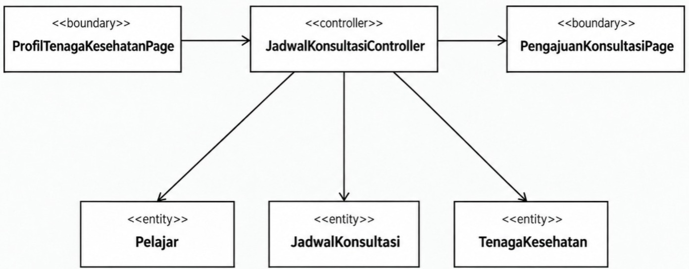

<i>Gambar 7. Diagram Kelas Use Case UC06</i>

 

| ID Kelas | Nama Kelas | Atribut | Metode/Operasi |
| :--- | :--- | :--- | :--- |
| *C02* | *Pelajar* | *idPelajar* | *-* |
| *C04* | *TenagaKesehatan* | *idTenagaKesehatan, nama, profesi* | *getProfil()* |
| *C09* | *JadwalKonsultasi* | *idJadwal, tanggal, waktu, statusKetersediaan, statusPengajuan* | *isAvailable(), updateAvailability(), updateStatus()* |
| *C19* | *ProfilTenagaKesehatanPage* | *tenagaKesehatanDipilih* | *displayProfile(), displayAvailableSchedules()* |
| *C21* | *PengajuanKonsultasiPage* | *jadwalDipilih, dataPengajuan* | *displayForm(), displaySelectedSchedule(), showUnavailableWarning(), getFormData()* |
| *C22* | *JadwalKonsultasiController* | *-* | *loadAvailableSchedules(), checkAvailability(), selectSchedule(), submitRequest()* |

### 5.5.7 Use Case UC07

**Nama Use Case:** *Mengelola Pengajuan Konsultasi*

#### Identifikasi Kelas

| ID Kelas | Nama Kelas | Deskripsi Kelas |
| :--- | :--- | :--- |
| *C21* | *PengajuanKonsultasiPage* | *Antarmuka bagi tenaga kesehatan untuk melihat dan mengelola pengajuan konsultasi (Boundary)* |
| *C23* | *KonsultasiController* | *Mengatur proses pengelolaan pengajuan konsultasi, termasuk persetujuan dan perubahan jadwal (Control)* |
| *C09* | *JadwalKonsultasi* | *Menyimpan data pengajuan jadwal konsultasi beserta statusnya (Entity)* |
| *C02* | *Pelajar* | *Menyimpan data pelajar yang mengajukan konsultasi (Entity)* |
| *C04* | *TenagaKesehatan* | *Menyimpan data tenaga kesehatan yang menerima dan meninjau pengajuan konsultasi (Entity)* |

#### Diagram Kelas

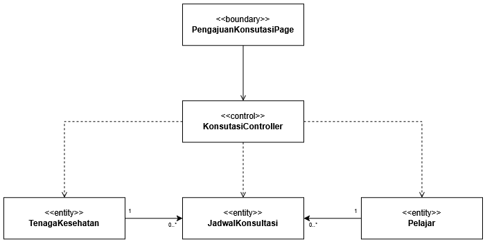

<i>Gambar 8. Diagram Kelas Use Case UC07</i>

 

| ID Kelas | Nama Kelas | Atribut | Metode/Operasi |
| :--- | :--- | :--- | :--- |
| *C21* | *PengajuanKonsultasiPage* | *selectedTenagaKesehatan, filteredDate, displayedTenagaKesehatan, displayedSchedule* | *displayTenagaKesehatan(), selectTenagaKesehatan(), filterJenisTenagaKesehatan(), filterDate(), displayAvailableSchedule()* | 
| *C23* | *KonsultasiController* | *-* | *submitPengajuan(), cancelPengajuan(), approvePengajuan(), reschedule()* |
| *C09* | *JadwalKonsultasi* | *idJadwal, tanggal, waktu, status* | *getDate(), getTime(), getStatus(), updateStatus(), updateSchedule()* |
| *C02* | *Pelajar* | *idPelajar, nama* | *-* |
| *C04* | *TenagaKesehatan* | *idTenagaKesehatan, nama, jenisTenagaKesehatan, lokasi* | *-* | 

### 5.5.8 Use Case UC08

**Nama Use Case:** *Menerima dan Menindaklanjuti Notifikasi Darurat*

#### Identifikasi Kelas

| ID Kelas | Nama Kelas | Deskripsi Kelas |
| :--- | :--- | :--- |
| *C02* | *Pelajar* | *Merepresentasikan pelajar yang kondisi kesehatannya dipantau dan dapat ditandai dalam status darurat ketika memenuhi aturan ambang batas (Entity Class).* |
| *C03* | *OrangTuaWali* | *Merepresentasikan orang tua/wali yang menerima notifikasi darurat serta melakukan konfirmasi dan tindak lanjut terhadap kondisi pelajar (Entity Class).* |
| *C07* | *LaporanKesehatan* | *Menyimpan rangkuman kondisi kesehatan pelajar dan hasil evaluasi ambang batas yang digunakan untuk mendeteksi kondisi darurat (Entity Class).* |
| *C24* | *NotifikasiDaruratController* | *Mengatur pengiriman notifikasi darurat, pengambilan detail kondisi darurat, pencatatan konfirmasi penerimaan, dan pencatatan tindak lanjut (Controller Class).* |

#### Diagram Kelas

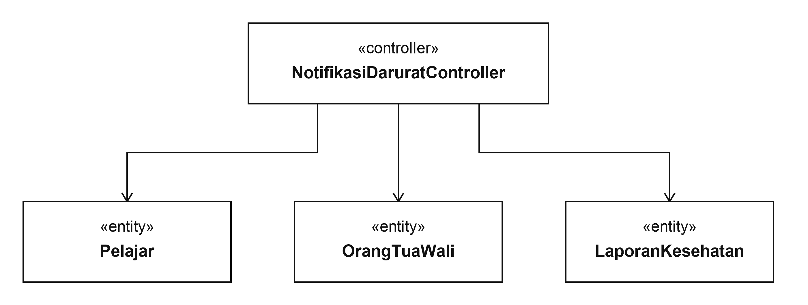

<i>Gambar 9. Diagram Kelas Use Case UC08</i>

 

| ID Kelas | Nama Kelas | Atribut | Metode/Operasi |
| :--- | :--- | :--- | :--- |
| *C02* | *Pelajar* | *statusDarurat* | *updateEmergencyStatus()* |
| *C03* | *OrangTuaWali* | *idWali, nama, kontak* | *-* |
| *C07* | *LaporanKesehatan* | *periode, ringkasanKondisi, indikatorRisiko, jumlahHariTidakCheckIn* | *evaluateThreshold(), detectEmergency()* |
| *C24* | *NotifikasiDaruratController* | *-* | *sendEmergencyNotification(), loadEmergencyDetail(), confirmReceived(), markFollowUp()* |

### 5.5.9 Use Case UC09

**Nama Use Case:** *Masuk Akun Pengguna*

#### Identifikasi Kelas

| ID Kelas | Nama Kelas | Deskripsi Kelas |
| :--- | :--- | :--- |
| *C01* | *Pengguna* | *Menyimpan data akun (identitas diri, email, password) yang dimiliki oleh pelajar, orang tua/wali, dan tenaga kesehatan (Entity Class)* |
| *C25* | *LoginPage* | *Merepresentasikan antarmuka login untuk pengguna serta fitur lupa password (Boundary Class)* |
| *C11* | *AuthController* | *Mengatur autentikasi pengguna, validasi kredensial, status verifikasi, dan sesi login (Controller Class)* |
| *C26* | *ResetPasswordPage* | *Merepresentasikan antarmuka untuk memasukkan e-mail dan password baru (Boundary Class)* |
| *C27* | *PasswordController* | *Mengatur reset password, termasuk pengiriman tautan reset (Controller Class)* |
| *C28* | *DashboardPage* | *Merepresentasikan antarmuka halaman utama setelah pengguna berhasil masuk akun (Boundary Class)* |

#### Diagram Kelas

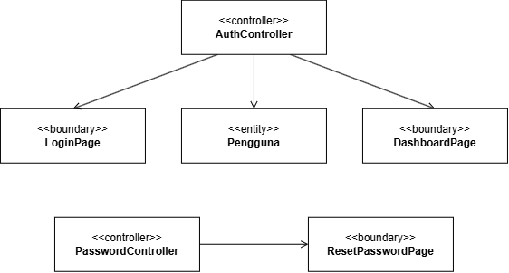

<i>Gambar 10. Diagram Kelas Use Case UC09</i>

 

| ID Kelas | Nama Kelas | Atribut | Metode/Operasi |
| :--- | :--- | :--- | :--- |
| *C01* | *Pengguna* | *idPengguna, username, email, password, role, statusAkun* | *getUsername(), getEmail(), getPassword(), setPassword(), getRole(), getStatusAkun()* |
| *C25* | *LoginPage* | *usernameOrEmailInput, passwordInput* | *showPage(), getInput(), showError()* |
| *C11* | *AuthController* | *currentUser* | *login()* |
| *C26* | *ResetPasswordPage* | *emailInput, newPasswordInput, confirmPasswordInput* | *showPage(), getInput(), showError()* |
| *C27* | *PasswordController* | *-* | *sendResetLink(), resetPassword()* |
| *C28* | *DashboardPage* | *currentUser* | *displayDashboard(), displayUserInfo()* |

### 5.5.10 Use Case UC10

**Nama Use Case:** *Keluar Akun Pengguna*

#### Identifikasi Kelas

| ID Kelas | Nama Kelas | Deskripsi Kelas |
| :--- | :--- | :--- |
| *C01* | *Pengguna* | *Menyimpan data pengguna yang sedang memiliki sesi login (Entity Class)* |
| *C29* | *SettingPage* | *Merepresentasikan antarmuka halaman pengaturan/profil yang menyediakan opsi keluar akun (Boundary Class)* |
| *C11* | *AuthController* | *Mengatur proses keluar akun dan mengakhiri sesi login pengguna (Controller Class)* |
| *C25* | *LoginPage* | *Merepresentasikan antarmuka login kembali untuk pengguna setelah berhasil keluar akun (Boundary Class)* |

#### Diagram Kelas

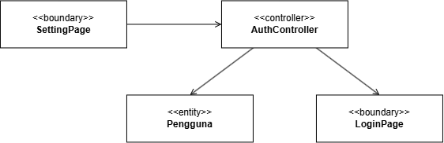

<i>Gambar 11. Diagram Kelas Use Case UC10</i>

 

| ID Kelas | Nama Kelas | Atribut | Metode/Operasi |
| :--- | :--- | :--- | :--- |
| *C01* | *Pengguna* | *idPengguna, username, email, password, role, statusAkun* | *-* |
| *C29* | *SettingPage* | *currentUser* | *showPage(), selectLogout()* |
| *C11* | *AuthController* | *currentUser* | *logout()* |
| *C25* | *LoginPage* | *usernameOrEmailInput, passwordInput* | *showPage()* |

## 5.3 Diagram Kelas Keseluruhan

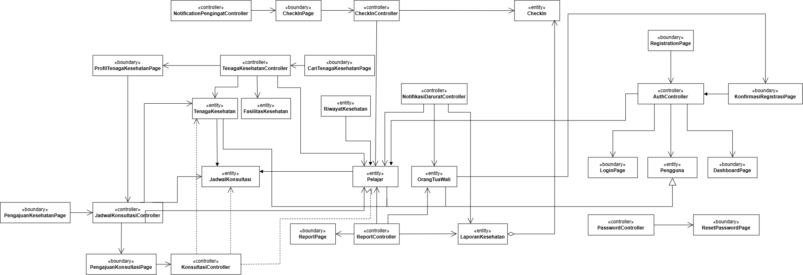

<i>Gambar 4. Contoh Diagram Kelas Keseluruhan</i>

| ID Kelas | Nama Kelas | Atribut | Metode/Operasi |
| :--- | :--- | :--- | :--- |
| *C01* | *Pengguna* | *idPengguna, username, email, password, role, statusAkun* | *getUsername(), getEmail(), getPassword(), setPassword(), getRole(), getStatusAkun()* |
| *C02* | *Pelajar* | *idPelajar, nama, lokasiSaatIni, statusDarurat, tanggalLahir, nomorTelepon* | *getCheckInHistory(), setCheckIn(), getLokasiSaatIni(), updateEmergencyStatus()* |
| *C03* | *OrangTuaWali* | *idWali, nama, email, nomorTelepon* | *-* |
| *C04* | *TenagaKesehatan* | *idTenagaKesehatan, nama, email, nomorTelepon, jenisTenagaKesehatan, lokasi* | *getProfil()* |
| *C05* | *RiwayatKesehatan* | *riwayatKesehatan* | *-* |
| *C06* | *CheckIn* | *idCheckIn, tanggalCheckIn, skalaMood, jamTidur, jamBangun, polaMakan, pemicuStres, catatanRefleksi* | *createCheckIn(), getCheckInData(), validateData()* |
| *C07* | *LaporanKesehatan* | *periode, ringkasanKondisi, indikatorRisiko, jumlahHariTidakCheckIn* | *evaluateThreshold(), detectEmergency()* |
| *C08* | *FasilitasKesehatan* | *idFasilitas, namaFasilitas, lokasi, estimasiBiaya* | *getLokasi(), getEstimasiBiaya()* |
| *C09* | *JadwalKonsultasi* | *idJadwal, tanggal, waktu, statusKetersediaan, statusPengajuan* | *, getDate(), getTime(), getStatus(), updateAvailability(), updateStatus()* |
| *C10* | *RegistrationPage* | *inputDataPelajar, inputDataWali* | *displayFormRegistrasi(), inputDataPelajar(), inputDataWali(), submitRegistrasi()* |
| *C11* | *AuthController* | *currentUser* | *validateData(), registerAccount(), login(), Logout(), validateConfirmation(), confirmAccount()* |
| *C12* | *KonfirmasiRegistrasiPage* | *dataRegistrasi, statusKonfirmasi* | *displayDataRegistrasi(), confirmRegistrasi()* |
| *C13* | *CheckInPage* | *moodInput, sleepDurationInput, dietInput, triggerInput, reflectionInput* | *showPage(), getInput(), showError(), showSuccessMessage()* |
| *C14* | *CheckInController* | *currentCheckIn* | *submitCheckIn(), validateCheckInFormat(), encryptJournal()* |
| *C15* | *NotificationPengingatController* | *reminderSchedule, status* | *sendDailyReminder(), checkPendingCheckIn()* |
| *C16* | *ReportPage* | *selectedPeriod, displayedChart, displayedSummary* | *showPage(), displayChart(), filterViewByRole()* |
| *C17* | *ReportController* | *currentReport* | *calculateStatistics(), buildTrendChart(), applyPrivacyRestriction()* |
| *C17* | *CariTenagaKesehatanPage* | *-* | *showPage(), requestLocationPermission(), displayResults()* |
| *C18* | *ProfilTenagaKesehatanPage* | *tenagaKesehatanDipilih* | *displayProfile(), displayAvailableSchedules()* |
| *C19* | *TenagaKesehatanController* | *-* | *loadTenagaKesehatan(), processLocationPermission(), calculateDistances(), selectTenagaKesehatan()* |
| *C20* | *PengajuanKonsultasiPage* | *selectedTenagaKesehatan, filteredDate, displayedTenagaKesehatan, displayedSchedule, jadwalDipilih, dataPengajuan* | *displayForm(), displaySelectedSchedule(), showUnavailableWarning(), getFormData(), displayTenagaKesehatan(), filterDate(), displayAvailableSchedule(), selectTenagaKesehatan(), filterJenisTenagaKesehatan()* |
| *C21* | *JadwalKonsultasiController* | *-* | *loadAvailableSchedules(), checkAvailability(), selectSchedule(), submitRequest()* |
| *C22* | *KonsultasiController* | *-* | *submitPengajuan(), cancelPengajuan(), approvePengajuan(), reschedule()* |
| *C23* | *NotifikasiDaruratController* | *-* | *sendEmergencyNotification(), loadEmergencyDetail(), confirmReceived(), markFollowUp()* |
| *C24* | *LoginPage* | *usernameOrEmailInput, passwordInput* | *showPage(), getInput(), showError()* |
| *C25* | *ResetPasswordPage* | *emailInput, newPasswordInput, confirmPasswordInput* | *showPage(), getInput(), showError()* |
| *C26* | *PasswordController* | *-* | *sendResetLink(), resetPassword()* |
| *C27* | *DashboardPage* | *currentUser* | *displayDashboard(), displayUserInfo()* |
| *C28* | *SettingPage* | *currentUser* | *showPage(), selectLogout()* |
| *C29* | *NotifikasiDaruratPopup* | *notifikasiAktif* | *showPopup(), displayDetail(), displayStatus()* |

---

# BAB 6: Traceability

| ID Kelas | ID Use Case | ID KF |
| :--- | :--- | :--- |
| *C01* | *UC01, UC09, UC10* | *KF01, KF22, KF23, KF24* |
| *C02* | *UC01, UC02, UC03, UC04, UC05, UC06, UC08, UC09, UC10* | *KF01, KF02, KF03, KF04, KF05, KF07, KF11, KF12, KF13, KF14, KF18, KF19, KF20, KF21, KF22, KF23, KF24* |
| *C03* | *UC02, UC04, UC08, UC09, UC10* | *KF02, KF06, KF08, KF09, KF10, KF17, KF18, KF19, KF20, KF21, KF22, KF23, KF24* |
| *C04* | *UC05, UC07, UC09, UC10* | *KF11, KF12, KF15, KF16, KF22, KF23, KF24* |
| *C05* | *UC01* | *KF01* |
| *C06* | *UC03, UC04* | *KF03, KF04, KF05, KF07, KF06, KF08, KF09, KF10, KF17* |
| *C07* | *UC04, UC08* | *KF06, KF08, KF09, KF10, KF17, KF18, KF19, KF20, KF21* |
| *C08* | *UC05* | *KF11, KF12* |
| *C09* | *UC06, UC07* | *KF13, KF14, KF15, KF16* |
| *C10* | *UC01* | *KF01* |
| *C11* | *UC01, UC09, UC10* | *KF01, KF22, KF23, KF24* |
| *C12* | *UC02* | *KF02* |
| *C13* | *UC03* | *KF03, KF04, KF05, KF07* |
| *C14* | *UC03* | *KF03, KF04, KF05, KF07* |
| *C15* | *UC03* | *KF03, KF04, KF05, KF07* |
| *C16* | *UC04* | *KF06, KF08, KF09, KF10, KF17* |
| *C17* | *UC04* | *KF06, KF08, KF09, KF10, KF17* |
| *C18* | *UC05* | *KF11, KF12* |
| *C19* | *UC05, UC06* | *KF11, KF12, KF13, KF14* |
| *C20* | *UC05* | *KF11, KF12* |
| *C21* | *UC06, UC07* | *KF13, KF14, KF15, KF16* |
| *C22* | *UC06* | *KF13, KF14* |
| *C23* | *UC07* | *KF15, KF16* |
| *C24* | *UC08* | *KF18, KF19, KF20, KF21* |
| *C25* | *UC09, UC10* | *KF22, KF23* |
| *C26* | *UC09* | *KF22, KF23* |
| *C27* | *UC09* | *KF22, KF23* |
| *C28* | *UC09* | *KF22, KF23* |
| *C29* | *UC10* | *KF24* |

---

# Referensi
- Diagram UML: [https://www.drawio.com/](https://www.drawio.com/), [https://staruml.io/](https://staruml.io/)
