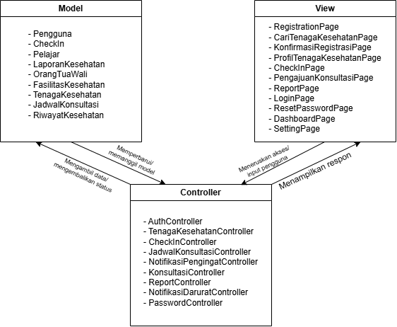

<h1>
IF2150 REKAYASA PERANGKAT LUNAK
 
TUGAS 6
 
ARSITEKTUR PERANGKAT LUNAK (APL)
</h1>
 

## *Mahasehat: Mental Health Monitoring App for Students*

### Untuk: *Stefani Angeline Oroh*

Dipersiapkan oleh:

| Informasi | Keterangan |
| --- | --- |
| Kelas | *03* |
| Kelompok | *04*  |
| Nama Kelompok | *pakespinwheel*  |

| NIM       | Nama               |
| --------- | ------------------ |
| *13525021* | *Haikal Muhammad Royyan* |
| *13525066* | *Cynthia Winda Wijaya* |
| *13525081* | *Rendy Salastra Putra* |
| *13525090* | *Sophia Imelda Rogate Marpaung* |
| *13525141* | *Christabelcyne Costan* |

---
 

# BAB 1: Style/Pattern Arsitektur Acuan

Arsitektur acuan yang dipilih untuk pengembangan perangkat lunak Mahasehat adalah **MVC (_Model-View-Controller_)**. Pola ini memisahkan logika aplikasi ke dalam tiga komponen utama yang saling terhubung, yaitu _Model_, _View_, dan _Controller_.
1. _Model (`<<entity>>`)_
Bertanggung jawab dalam merepresentasikan dan mengelola data serta logika yang berkaitan dengan entitas pada sistem. Model menangani data yang digunakan dalam proses bisnis dan menyediakan akses terhadap data tanpa bergantung pada bagaimana data tersebut ditampilkan kepada pengguna.
2. _View (`<<boundary>>`)_
Bertanggung jawab dalam menyajikan antarmuka pengguna (_User Interface_) berbasis web responsif kepada aktor, yaitu Pelajar, Orang Tua/Wali, dan Tenaga Kesehatan. View menerima masukan dari pengguna, meneruskannya kepada _Controller_, serta menampilkan hasil pemrosesan dalam bentuk formulir, grafik, informasi, maupun notifikasi.
3. _Controller (`<<control>>`)_
Bertanggung jawab sebagai perantara antara _View_ dan _Model_. _Controller_ menerima request atau aksi dari pengguna melalui _View_, mengatur alur pemrosesan, melakukan validasi yang diperlukan, memanggil _Model_ untuk mengakses atau mengolah data, serta mengembalikan hasil pemrosesan kepada _View_.

  
Pemilihan pola MVC didasarkan pada karakteristik sistem Mahasehat, terutama keberagaman aktor, pemisahan hak akses, pengolahan data kesehatan, serta kebutuhan keamanan dan responsivitas sistem yang telah didefinisikan pada SKPL:
1. Pemisahan antarmuka dan hak akses pengguna
Mahasehat memiliki tiga jenis aktor, yaitu Pelajar, Orang Tua/Wali, dan Tenaga Kesehatan, yang memiliki kebutuhan serta hak akses berbeda. MVC memungkinkan antarmuka pengguna dipisahkan dari proses pengolahan data sehingga setiap kebutuhan pengguna dapat ditangani melalui _View_ dan _Controller_ yang sesuai. Contohnya pada UC04 (Melihat Statistik dan Laporan Kondisi), Pelajar dapat melihat laporan kondisi personal, sedangkan Orang Tua/Wali hanya memperoleh data ringkasan sesuai hak aksesnya. Pemisahan ini didukung oleh ReportPage sebagai View dan ReportController sebagai Controller yang mengatur kalkulasi statistik serta pembatasan akses data berdasarkan peran pengguna. Hal ini juga selaras dengan KNF02 yang mengharuskan data yang diberikan kepada Orang Tua/Wali tidak mencakup teks jurnal pribadi Pelajar.
2. Pemisahan pengolahan data dan antarmuka
Mahasehat mengolah berbagai data dari _daily check-in_, seperti skala mood dan pola tidur, menjadi grafik tren, rangkuman kondisi, serta indikator risiko. Pemisahan antara _Model_, _View_, dan _Controller_ memungkinkan proses pengolahan data tersebut dilakukan tanpa mencampurkannya dengan kode antarmuka pengguna. Sebagai contoh, LaporanKesehatan berperan dalam merepresentasikan hasil pengolahan laporan, sedangkan ReportController mengatur kalkulasi statistik, pembuatan grafik, serta evaluasi ambang batas. Sementara itu, ReportPage bertanggung jawab menampilkan hasil tersebut kepada pengguna.
3. Mendukung keamanan dan kebutuhan non-fungsional
Mahasehat menangani data kesehatan dan catatan _daily check-in_ yang bersifat sensitif. Pemisahan tanggung jawab dalam MVC memudahkan pengelolaan akses dan pemrosesan data secara terstruktur sehingga logika keamanan tidak perlu ditempatkan langsung pada antarmuka pengguna. Hal ini mendukung KNF01 mengenai enkripsi data kesehatan dan check-in menggunakan AES-256 serta KNF02 mengenai pembatasan akses data berdasarkan hak pengguna.
4. Mendukung aplikasi _web_ responsif
Mahasehat dirancang sebagai aplikasi web responsif yang digunakan oleh pengguna melalui peramban pada berbagai perangkat. Pemisahan View dari proses bisnis memungkinkan antarmuka dikembangkan secara responsif tanpa mengubah logika pengolahan data pada _Controller_ dan _Model_. Hal ini sesuai dengan KNF07 dan KNF08 yang menekankan kemudahan dan kecepatan proses _daily check-in_ serta kompatibilitas pada berbagai peramban dan perangkat.

  

<i>Gambar 1. Arsitektur MVC</i>

  

Tabel 1.1. Spesifikasi Lingkungan Operasi Perangkat Lunak
| Komponen | Spesifikasi |
| :--- | :--- |
| *Server Application* | Node.js v20.x LTS or Express.js |
| *Database Management System (DBMS)* | PostgreSQL 15+ |
| *Client Side (Perangkat Pengguna)* | Web browser modern |
| *External APIs & Services* | Geolocation API & Google Maps Platform |
| *External APIs & Services* | Google Calendar API |
| *External APIs & Services* | SMTP or Mail Service (Nodemailer/SendGrid) |
| *Operating System for Server* | Ubuntu Server 22.04 LTS or Linux Cloud Environment |
| *Protokol Keamanan* | HTTPS dengan sertifikat SSL/TLS & enkripsi AES-256 |

Kaitan teknologi dengan pola MVC yang dipilih:
1. Node.js dan Express.js sebagai lingkungan _Controller_
Node.js dan Express.js digunakan sebagai lingkungan _server-side_ untuk menjalankan logika aplikasi. Pada implementasi MVC, _route handler_ dan komponen _Controller_ yang dibangun menggunakan Express.js menangani _request_ dari _View_, mengatur alur pemrosesan, serta menghubungkan _View_ dengan _Model_.
2. PostgreSQL sebagai penyimpanan data _Model_
PostgreSQL digunakan sebagai DBMS untuk menyimpan data yang direpresentasikan oleh _Model_, seperti data pengguna, _daily check-in_, laporan kesehatan, fasilitas kesehatan, dan jadwal konsultasi. Dengan demikian, _Model_ menjadi bagian yang mengelola representasi dan akses terhadap data sistem.
3. Web UI sebagai _View_
Antarmuka berbasis _web_ responsif pada peramban pengguna berperan sebagai _View_ dalam pola MVC. Komponen seperti CheckInPage, ReportPage, dan PengajuanKonsultasiPage menyediakan antarmuka untuk menerima masukan pengguna serta menampilkan hasil pemrosesan sistem.
4. External APIs & Services sebagai integrasi yang diakses melalui _Controller_
Layanan eksternal seperti Geolocation API, Google Maps Platform, Google Calendar API, dan Mail Service digunakan untuk mendukung fungsi pencarian tenaga kesehatan, penjadwalan konsultasi, serta pengiriman notifikasi. Integrasi tersebut ditangani melalui alur pemrosesan pada _Controller_ sehingga detail layanan eksternal tidak perlu ditangani langsung oleh _View_.

Pada bagian ini, tentukan *architectural style* atau *pattern* yang menjadi acuan untuk aplikasi yang Anda kembangkan. Misalnya *layered architecture*, *client-server*, *repository*, *pipe and filter architecture*, atau MVC (*Model-View-Controller*).

<i>Gambar 1. Contoh Arsitektur MVC</i>

Isi bab ini dengan hal-hal berikut:
1. **Style/pattern yang dipilih** beserta penjelasan singkat peran setiap bagiannya. Untuk MVC, jelaskan peran *Model*, *View*, dan *Controller*.
2. **Alasan pemilihan** berdasarkan karakteristik P/L Anda, misalnya jenis pengguna, alur proses bisnis, serta KF dan KNF pada dokumen SKPL.
3. **Gambar style/pattern yang diterapkan pada P/L Anda.** Jangan hanya menyalin Gambar 1. Isi setiap bagian pattern dengan komponen milik P/L Anda. Misalnya, kotak *Controller* berisi daftar *controller* yang ada di aplikasi dan kotak *Model* berisi daftar *model* yang ada di aplikasi.

Selain *style/pattern*, tuliskan juga lingkungan operasi P/L. Tabel berikut **disalin dari subbab 2.5 *Lingkungan Operasi Perangkat Lunak* pada dokumen SKPL** tanpa perubahan. Setelah tabel, jelaskan kaitan teknologi yang dipakai dengan *style/pattern* yang dipilih. Contohnya, Django (Python) secara bawaan mengikuti pola MVT (*Model-View-Template*), yaitu varian dari MVC.

Tabel 1.1. Lingkungan Operasi Perangkat Lunak

| Komponen | Spesifikasi |
| :--- | :--- |
| *Server* | *[contoh: Node.js v20 dengan Next.js, dijalankan secara lokal (localhost)]* |
| *Client* | *[contoh: Web Browser modern (Chrome, Firefox terbaru)]* |
| *DBMS* | *[contoh: PostgreSQL 15 pada Supabase sebagai basis data terpusat]* |
| *OS* | *[contoh: Cross-platform (Windows/Linux/MacOS) melalui browser]* |
| *...* | *...* |

<b><i>Catatan</i></b>: <i>Style/pattern yang dipilih di bab ini menjadi acuan untuk BAB 2 (pengelompokan komponen) dan BAB 3 (model arsitektur). Contoh pada dokumen ini memakai MVC secara konsisten dari BAB 1 sampai BAB 3. Kelompok boleh memakai pattern lain selama alasannya dijelaskan dan BAB 2 serta BAB 3 disesuaikan. Tabel 1.1 harus sama persis dengan subbab 2.5 dokumen SKPL; jangan menambah atau mengubah isinya karena SKPL sudah final.</i>

---

# BAB 2: Identifikasi Komponen / Modul / Subsistem

Pada bagian ini, lakukan identifikasi terhadap komponen, modul, atau subsistem yang menyusun aplikasi berdasarkan *pattern* arsitektur yang telah ditetapkan sebelumnya. Setiap komponen memiliki tanggung jawab tertentu dalam mendukung fungsionalitas sistem.

Setiap komponen memiliki tanggung jawab tertentu dalam mendukung fungsionalitas sistem secara keseluruhan. Komponen dapat dikelompokkan berdasarkan lapisan arsitektur (misalnya *Model*, *View*, dan *Controller* pada pattern MVC), atau berdasarkan fungsi atau peran komponen di dalam sistem (misalnya modul autentikasi, manajemen data, dan integrasi eksternal).

Tabel 2.1. Identifikasi Komponen/Modul/Subsistem

| Nama Komponen/Modul/Subsistem | Jenis                 | Penjelasan                                                                                                           |
| :---------------------------- | :-------------------- | :------------------------------------------------------------------------------------------------------------------- |
| *KatalogView*                 | *View*                | *Menampilkan daftar produk dan meneruskan aksi pelanggan (misalnya "Tambah ke Keranjang") ke KatalogController.*     |
| *KeranjangView*               | *View*                | *Menampilkan isi keranjang pelanggan beserta tombol checkout.*                                                       |
| *CheckoutView*                | *View*                | *Menampilkan ringkasan pesanan dan pilihan metode pembayaran kepada pelanggan.*                                      |
| *RiwayatPesananView*          | *View*                | *Menampilkan daftar pesanan yang pernah dibuat pelanggan beserta statusnya.*                                         |
| *KatalogController*           | *Controller*          | *Memproses permintaan daftar produk dan penambahan produk ke keranjang.*                                             |
| *KeranjangController*         | *Controller*          | *Memproses perubahan isi keranjang dan membuat pesanan baru saat checkout.*                                          |
| *PembayaranController*        | *Controller*          | *Memproses pemilihan metode pembayaran dan meneruskan permintaan otorisasi ke PaymentGatewayAdapter.*                |
| *PesananController*           | *Controller*          | *Memproses permintaan riwayat pesanan milik pelanggan.*                                                              |
| *Produk*                      | *Model*               | *Merepresentasikan data produk beserta stoknya serta metode untuk mengakses dan mengubahnya.*                        |
| *Keranjang*                   | *Model*               | *Merepresentasikan item yang dipilih pelanggan sebelum checkout serta metode untuk mengakses dan mengubahnya.*       |
| *Pesanan*                     | *Model*               | *Merepresentasikan data pesanan beserta status pembayarannya serta metode untuk mengakses dan mengubahnya.*          |
| *Pelanggan*                   | *Model*               | *Merepresentasikan data akun pelanggan serta metode untuk mengakses dan mengubahnya.*                                |
| *Validasi*                    | *Pendukung*           | *Memvalidasi input pelanggan sebelum diproses oleh controller.*                                                      |
| *PaymentGatewayAdapter*       | *Integrasi Eksternal* | *Mengirim permintaan otorisasi ke payment gateway (dummy) dan meneruskan status pembayaran ke PembayaranController.* |
| *Database*                    | *Penyimpanan Data*    | *Menyimpan seluruh data model secara persisten, baik lokal (misalnya SQLite) maupun terpusat (misalnya Supabase).*   |
| *...*                         | *...*                 | *...*                                                                                                                |

Ketentuan pengisian Tabel 2.1:
1. Kolom **Jenis** mengikuti pengelompokan pada *style/pattern* di BAB 1. Untuk MVC, jenisnya adalah *Model*, *View*, dan *Controller*. Jenis lain boleh ditambahkan, misalnya *Pendukung* untuk komponen bantu yang dipakai bersama, atau *Integrasi Eksternal* untuk penghubung ke sistem di luar P/L yang disebutkan pada subbab 2.2 dokumen SKPL. Kolom ini juga boleh diisi dengan *Subsistem*, *Modul*, atau *Komponen* apabila komponen dikelompokkan berdasarkan fungsinya. Tuliskan subsistem terlebih dahulu, lalu komponen penyusunnya di baris-baris berikutnya.
2. Komponen **tidak sama dengan** kelas. Satu komponen boleh mewadahi beberapa kelas dari diagram kelas pada dokumen SKPL. Pastikan seluruh kelas tercakup oleh setidaknya satu komponen.
3. Pastikan seluruh use case pada dokumen SKPL dapat dijalankan oleh komponen-komponen yang didaftarkan di tabel ini. Jangan menambahkan komponen untuk fitur yang tidak ada di SKPL.

<b><i>Catatan</i></b>: <i>Nama komponen pada Tabel 2.1 harus dipakai sama persis pada gambar di BAB 1 dan setiap view di BAB 3. Jika saat membuat view ternyata dibutuhkan komponen baru, tambahkan komponen tersebut ke Tabel 2.1 terlebih dahulu.</i>

---

# BAB 3: Model Arsitektur Perangkat Lunak

*Architectural View* adalah bagaimana cara kita melihat/mendeskripsikan arsitektur sebuah sistem dari sudut pandang tertentu. Dalam perancangan arsitektur aplikasi, dibutuhkan *Architectural View* yang dapat mempermudah pemahaman dari proses aplikasi yang akan dikembangkan. Tujuan dari *Architectural View* adalah menjadi bahan komunikasi, pemisahan masalah, mempermudah analisis, dan pemandu saat eksekusi pengembangan sistem tersebut.

Buatlah model arsitektur dari aplikasi yang akan dirancang dalam bentuk *view*. Model arsitektur ini berfungsi untuk memperlihatkan bagaimana setiap komponen, modul, dan subsistem saling berinteraksi serta berkolaborasi dalam menjalankan fungsi utama sistem secara keseluruhan. Anda dapat membuat satu atau lebih *view* tergantung kebutuhan dalam bentuk gambar. Pilihlah notasi yang sesuai. Contoh *view* yang dapat digunakan antara lain ***Logical View***, ***Process View***, ***Development View***, serta ***Physical View***.

Ketentuan pengisian BAB 3:
1. Setiap view menggambarkan **keseluruhan sistem**, bukan satu use case atau satu fitur saja.
2. Buat **minimal satu view**. Setiap view dituliskan dalam subbab tersendiri (3.1, 3.2, dan seterusnya). Tidak perlu membuat keempat view, pilih yang paling membantu menjelaskan P/L Anda, lalu jelaskan alasan pemilihannya.
3. Setiap view harus **konsisten dengan BAB 2**. Seluruh komponen pada Tabel 2.1 harus muncul dengan nama yang sama, dan tidak boleh ada komponen pada view yang tidak terdaftar di Tabel 2.1.
4. Setiap view harus **mencerminkan style/pattern pada BAB 1**. Misalnya, jika memilih MVC, pembagian *Model*, *View*, dan *Controller* harus terlihat jelas pada diagram.
5. Jika membuat lebih dari satu view, setiap view harus menggambarkan sistem yang sama dari sudut pandang berbeda. View tambahan melengkapi view pertama, bukan mengulanginya.
6. Beri label pada setiap garis atau panah yang menghubungkan komponen agar hubungan antarkomponen dapat dipahami tanpa penjelasan tambahan.
7. Jika membuat *Physical View*, gambarkan lingkungan operasi pada Tabel 1.1.

## 3.1 XXX View

Tuliskan secara singkat mengenai model arsitektur perangkat lunak yang Anda pilih dan sertakan alasan mengapa model arsitektur tersebut cocok untuk aplikasi Anda.

<i>Gambar 2. Contoh Logical View pada P/L E-Commerce</i>

Gambar 2 adalah contoh *Logical View* dalam bentuk *block diagram*. Seluruh komponen pada Tabel 2.1 digambarkan dan dikelompokkan sesuai pola MVC (*View*, *Controller*, *Model*), ditambah komponen pendukung dan basis data. Sistem di luar P/L, seperti *Payment Gateway (dummy)*, digambarkan dengan garis putus-putus dan tidak perlu dimasukkan ke Tabel 2.1. Setiap garis diberi label: "Memanggil" untuk *View* yang memanggil *Controller*, "akses" untuk *Controller* yang mengakses *Model*, serta agregasi dan komposisi untuk hubungan antar-*Model*.

<b><i>Catatan</i></b>: <i>Ganti XXX dengan nama view yang dibuat, misalnya Logical View. Gambar 2 hanya contoh untuk P/L e-commerce, ganti dengan view milik kelompok Anda yang memuat seluruh komponen pada Tabel 2.1. Jenis view dan notasinya boleh berbeda dari contoh. Jika membuat view tambahan, lanjutkan pola 3.x ini (3.2, 3.3, dan seterusnya).</i>

---

# Referensi

- Sommerville, I. (2016). *Software Engineering* (10th ed.). Pearson. Chapter 6: *Architectural Design*: [https://software-engineering-book.com/slides/](https://software-engineering-book.com/slides/)
- Diagram arsitektur: [https://www.drawio.com/](https://www.drawio.com/), [https://staruml.io/](https://staruml.io/)
