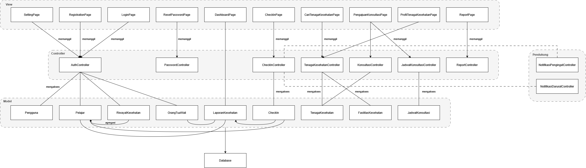
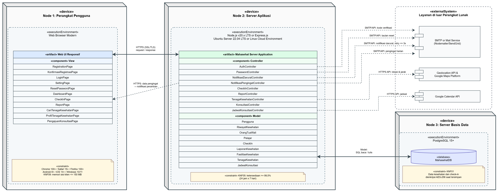

<h1>
IF2150 REKAYASA PERANGKAT LUNAK
 
TUGAS 6
 
ARSITEKTUR PERANGKAT LUNAK (APL)
</h1>
 

## *Mahasehat: Mental Health Monitoring App for Students*

### Untuk: *Stefani Angeline Oroh*

Dipersiapkan oleh:

| Informasi | Keterangan |
| --- | --- |
| Kelas | *03* |
| Kelompok | *04*  |
| Nama Kelompok | *pakespinwheel*  |

| NIM       | Nama               |
| --------- | ------------------ |
| *13525021* | *Haikal Muhammad Royyan* |
| *13525066* | *Cynthia Winda Wijaya* |
| *13525081* | *Rendy Salastra Putra* |
| *13525090* | *Sophia Imelda Rogate Marpaung* |
| *13525141* | *Christabelcyne Costan* |

---
 

# BAB 1: Style/Pattern Arsitektur Acuan

Arsitektur acuan yang dipilih untuk pengembangan perangkat lunak Mahasehat adalah **MVC (_Model-View-Controller_)**. Pola ini memisahkan logika aplikasi ke dalam tiga komponen utama yang saling terhubung, yaitu _Model_, _View_, dan _Controller_.
1. _Model (`<<entity>>`)_
Bertanggung jawab dalam merepresentasikan dan mengelola data serta logika yang berkaitan dengan entitas pada sistem. Model menangani data yang digunakan dalam proses bisnis dan menyediakan akses terhadap data tanpa bergantung pada bagaimana data tersebut ditampilkan kepada pengguna.
2. _View (`<<boundary>>`)_
Bertanggung jawab dalam menyajikan antarmuka pengguna (_User Interface_) berbasis web responsif kepada aktor, yaitu Pelajar, Orang Tua/Wali, dan Tenaga Kesehatan. View menerima masukan dari pengguna, meneruskannya kepada _Controller_, serta menampilkan hasil pemrosesan dalam bentuk formulir, grafik, informasi, maupun notifikasi.
3. _Controller (`<<control>>`)_
Bertanggung jawab sebagai perantara antara _View_ dan _Model_. _Controller_ menerima request atau aksi dari pengguna melalui _View_, mengatur alur pemrosesan, melakukan validasi yang diperlukan, memanggil _Model_ untuk mengakses atau mengolah data, serta mengembalikan hasil pemrosesan kepada _View_.

  
Pemilihan pola MVC didasarkan pada karakteristik sistem Mahasehat, terutama keberagaman aktor, pemisahan hak akses, pengolahan data kesehatan, serta kebutuhan keamanan dan responsivitas sistem yang telah didefinisikan pada SKPL:
1. Pemisahan antarmuka dan hak akses pengguna
Mahasehat memiliki tiga jenis aktor, yaitu Pelajar, Orang Tua/Wali, dan Tenaga Kesehatan, yang memiliki kebutuhan serta hak akses berbeda. MVC memungkinkan antarmuka pengguna dipisahkan dari proses pengolahan data sehingga setiap kebutuhan pengguna dapat ditangani melalui _View_ dan _Controller_ yang sesuai. Contohnya pada UC04 (Melihat Statistik dan Laporan Kondisi), Pelajar dapat melihat laporan kondisi personal, sedangkan Orang Tua/Wali hanya memperoleh data ringkasan sesuai hak aksesnya. Pemisahan ini didukung oleh ReportPage sebagai View dan ReportController sebagai Controller yang mengatur kalkulasi statistik serta pembatasan akses data berdasarkan peran pengguna. Hal ini juga selaras dengan KNF02 yang mengharuskan data yang diberikan kepada Orang Tua/Wali tidak mencakup teks jurnal pribadi Pelajar.
2. Pemisahan pengolahan data dan antarmuka
Mahasehat mengolah berbagai data dari _daily check-in_, seperti skala mood dan pola tidur, menjadi grafik tren, rangkuman kondisi, serta indikator risiko. Pemisahan antara _Model_, _View_, dan _Controller_ memungkinkan proses pengolahan data tersebut dilakukan tanpa mencampurkannya dengan kode antarmuka pengguna. Sebagai contoh, LaporanKesehatan berperan dalam merepresentasikan hasil pengolahan laporan, sedangkan ReportController mengatur kalkulasi statistik, pembuatan grafik, serta evaluasi ambang batas. Sementara itu, ReportPage bertanggung jawab menampilkan hasil tersebut kepada pengguna.
3. Mendukung keamanan dan kebutuhan non-fungsional
Mahasehat menangani data kesehatan dan catatan _daily check-in_ yang bersifat sensitif. Pemisahan tanggung jawab dalam MVC memudahkan pengelolaan akses dan pemrosesan data secara terstruktur sehingga logika keamanan tidak perlu ditempatkan langsung pada antarmuka pengguna. Hal ini mendukung KNF01 mengenai enkripsi data kesehatan dan check-in menggunakan AES-256 serta KNF02 mengenai pembatasan akses data berdasarkan hak pengguna.
4. Mendukung aplikasi _web_ responsif
Mahasehat dirancang sebagai aplikasi web responsif yang digunakan oleh pengguna melalui peramban pada berbagai perangkat. Pemisahan View dari proses bisnis memungkinkan antarmuka dikembangkan secara responsif tanpa mengubah logika pengolahan data pada _Controller_ dan _Model_. Hal ini sesuai dengan KNF07 dan KNF08 yang menekankan kemudahan dan kecepatan proses _daily check-in_ serta kompatibilitas pada berbagai peramban dan perangkat.

  

<i>Gambar 1. Arsitektur MVC</i>

  

Tabel 1.1. Spesifikasi Lingkungan Operasi Perangkat Lunak
| Komponen | Spesifikasi |
| :--- | :--- |
| *Server Application* | Node.js v20.x LTS or Express.js |
| *Database Management System (DBMS)* | PostgreSQL 15+ |
| *Client Side (Perangkat Pengguna)* | Web browser modern |
| *External APIs & Services* | Geolocation API & Google Maps Platform |
| *External APIs & Services* | Google Calendar API |
| *External APIs & Services* | SMTP or Mail Service (Nodemailer/SendGrid) |
| *Operating System for Server* | Ubuntu Server 22.04 LTS or Linux Cloud Environment |
| *Protokol Keamanan* | HTTPS dengan sertifikat SSL/TLS & enkripsi AES-256 |

Kaitan teknologi dengan pola MVC yang dipilih:
1. Node.js dan Express.js sebagai lingkungan _Controller_
Node.js dan Express.js digunakan sebagai lingkungan _server-side_ untuk menjalankan logika aplikasi. Pada implementasi MVC, _route handler_ dan komponen _Controller_ yang dibangun menggunakan Express.js menangani _request_ dari _View_, mengatur alur pemrosesan, serta menghubungkan _View_ dengan _Model_.
2. PostgreSQL sebagai penyimpanan data _Model_
PostgreSQL digunakan sebagai DBMS untuk menyimpan data yang direpresentasikan oleh _Model_, seperti data pengguna, _daily check-in_, laporan kesehatan, fasilitas kesehatan, dan jadwal konsultasi. Dengan demikian, _Model_ menjadi bagian yang mengelola representasi dan akses terhadap data sistem.
3. Web UI sebagai _View_
Antarmuka berbasis _web_ responsif pada peramban pengguna berperan sebagai _View_ dalam pola MVC. Komponen seperti CheckInPage, ReportPage, dan PengajuanKonsultasiPage menyediakan antarmuka untuk menerima masukan pengguna serta menampilkan hasil pemrosesan sistem.
4. External APIs & Services sebagai integrasi yang diakses melalui _Controller_
Layanan eksternal seperti Geolocation API, Google Maps Platform, Google Calendar API, dan Mail Service digunakan untuk mendukung fungsi pencarian tenaga kesehatan, penjadwalan konsultasi, serta pengiriman notifikasi. Integrasi tersebut ditangani melalui alur pemrosesan pada _Controller_ sehingga detail layanan eksternal tidak perlu ditangani langsung oleh _View_.

Pada bagian ini, tentukan *architectural style* atau *pattern* yang menjadi acuan untuk aplikasi yang Anda kembangkan. Misalnya *layered architecture*, *client-server*, *repository*, *pipe and filter architecture*, atau MVC (*Model-View-Controller*).

<i>Gambar 1. Contoh Arsitektur MVC</i>

Isi bab ini dengan hal-hal berikut:
1. **Style/pattern yang dipilih** beserta penjelasan singkat peran setiap bagiannya. Untuk MVC, jelaskan peran *Model*, *View*, dan *Controller*.
2. **Alasan pemilihan** berdasarkan karakteristik P/L Anda, misalnya jenis pengguna, alur proses bisnis, serta KF dan KNF pada dokumen SKPL.
3. **Gambar style/pattern yang diterapkan pada P/L Anda.** Jangan hanya menyalin Gambar 1. Isi setiap bagian pattern dengan komponen milik P/L Anda. Misalnya, kotak *Controller* berisi daftar *controller* yang ada di aplikasi dan kotak *Model* berisi daftar *model* yang ada di aplikasi.

Selain *style/pattern*, tuliskan juga lingkungan operasi P/L. Tabel berikut **disalin dari subbab 2.5 *Lingkungan Operasi Perangkat Lunak* pada dokumen SKPL** tanpa perubahan. Setelah tabel, jelaskan kaitan teknologi yang dipakai dengan *style/pattern* yang dipilih. Contohnya, Django (Python) secara bawaan mengikuti pola MVT (*Model-View-Template*), yaitu varian dari MVC.

Tabel 1.1. Lingkungan Operasi Perangkat Lunak

| Komponen | Spesifikasi |
| :--- | :--- |
| *Server* | *[contoh: Node.js v20 dengan Next.js, dijalankan secara lokal (localhost)]* |
| *Client* | *[contoh: Web Browser modern (Chrome, Firefox terbaru)]* |
| *DBMS* | *[contoh: PostgreSQL 15 pada Supabase sebagai basis data terpusat]* |
| *OS* | *[contoh: Cross-platform (Windows/Linux/MacOS) melalui browser]* |
| *...* | *...* |

<b><i>Catatan</i></b>: <i>Style/pattern yang dipilih di bab ini menjadi acuan untuk BAB 2 (pengelompokan komponen) dan BAB 3 (model arsitektur). Contoh pada dokumen ini memakai MVC secara konsisten dari BAB 1 sampai BAB 3. Kelompok boleh memakai pattern lain selama alasannya dijelaskan dan BAB 2 serta BAB 3 disesuaikan. Tabel 1.1 harus sama persis dengan subbab 2.5 dokumen SKPL; jangan menambah atau mengubah isinya karena SKPL sudah final.</i>

---

# BAB 2: Identifikasi Komponen / Modul / Subsistem

Tabel 2.1. Identifikasi Komponen/Modul/Subsistem

| Nama Komponen/Modul/Subsistem | Jenis                 | Penjelasan                                                                                                           |
| :---------------------------- | :-------------------- | :------------------------------------------------------------------------------------------------------------------- |
| *Pengguna*                 | *Model*                | *Merepresentasikan data akun pengguna yang dimiliki ketiga aktor.*     |
| *CheckIn*                 | *Model*                | *Merepresentasikan data hasil daily check-in pelajar berupa skala mood, durasi tidur, pola makan, faktor pemicu stress, catatan jurnal, dan tanggal pencatatannya.*     |
| *Pelajar*                 | *Model*                | *Merepresentasikan data akun pelajar yang melakukan registrasi, check-in harian, melihat statistik kondisi kesehatan, dan menentukan jadwal konsultasi dengan tenaga kesehatan.*     |
| *LaporanKesehatan*                 | *Model*                | *Menyimpan dan mengolah data hasil check-in menjadi data tren mingguan/bulanan, menyusun rangkuman kondisi kesehatan, dan menerapkan logika ambang batas untuk mendeteksi kondisi darurat pada pelajar.*     |
| *OrangTuaWali*                 | *Model*                | *Merepresentasikan data akun pengguna orang tua/wali yang mengonfirmasi registrasi akun pelajar di bawah umur, memantau laporan kondisi kesehatan pelajar, dan menerima serta menindaklanjuti notifikasi darurat.*     |
| *FasilitasKesehatan*                 | *Model*                | *Merepresentasikan data fasilitas kesehatan atau klinik yang direkomendasikan pada fitur pencarian, termasuk lokasi dan estimasi biaya konsultasi.*     |
| *TenagaKesehatan*                 | *Model*                | *Merepresentasikan data akun pengguna psikolog/psikiater yang dapat dipilih pelajar dari daftar rekomendasi dan meninjau pengajuan konsultasi yang masuk.*     |
| *JadwalKonsultasi*                 | *Model*                | *Merepresentasikan data pengajuan jadwal konsultasi antara pelajar dan tenaga kesehatan beserta statusnya.*     |
| *RiwayatKesehatan*                 | *Model*                | *Merepresentasikan data riwayat kesehatan mental dan kontak orang tua/wali yang diisi pelajar ketika proses registrasi akun.*     |
| *RegistrationPage*                 | *View*                | *Menampilkan formulir registrasi akun bagi pelajar.*     |
| *CariTenagaKesehatanPage*                 | *View*                | *Menampilkan daftar tenaga kesehatan, lokasi fasilitas kesehatan, estimasi biaya konsultasi, dan informasi jarak.*     |
| *ProfilTenagaKesehatanPage*               | *View*                | *Menampilkan profil tenaga kesehatan yang dipilih pelajar.*     |
| *CheckInPage*               | *View*                | *Menampilkan formulir pengisian daily check-in bagi pelajar.*     |
| *PengajuanKonsultasiPage*               | *View*                | *Menampilkan formulir pengajuan konsultasi serta jadwal yang dipilih oleh pelajar.*     |
| *ReportPage*                         | *View*                 | *Merepresentasikan antarmuka visualisasi grafik statistik, tren mingguan/bulanan, dan rangkuman kondisi.*                                                                                                                |
| *LoginPage*                         | *View*                 | *Merepresentasikan antarmuka login untuk pengguna serta fitur lupa password.*                                                                                                                |
| *ResetPasswordPage*                         | *View*                 | *Merepresentasikan antarmuka untuk memasukkan e-mail serta password baru.*                                                                                                                |
| *DashboardPage*                         | *View*                 | *Merepresentasikan antarmuka halaman utama setelah pengguna berhasil masuk akun.*                                                                                                                |
| *SettingPage*                         | *View*                 | *Merepresentasikan antarmuka halaman pengaturan/profil yang menyediakan opsi keluar akun.*                                                                                                                |
| *AuthController*                         | *Controller*                 | *Mengatur proses registrasi,login, dan logout, memvalidasi data akun pengguna, mengatur proses konfirmasi, perubahan status registrasi akun, sesi login, dan mengakhiri sesi login pengguna.*                                                                                                                |
| *TenagaKesehatanController*                         | *Controller*                 | *Mengatur proses pencarian tenaga kesehatan, pemrosesan izin akses lokasi, perhitungan jarak ke fasilitas kesehatan, dan pemilihan tenaga kesehatan.*                                                                                                                |
| *CheckInController*                         | *Controller*                 | *Mengatur proses penerimaan masukan, validasi format masukan, dan penyimpanan data check-in.*                                                                                                                |
| *JadwalKonsultasiController*                         | *Controller*                 | *Mengatur proses pemuatan jadwal, pengecekan dan pembaruan ketersediaan, dan pemilihan jadwal.*                                                                                                                |
| *NotifikasiPengingatController*                         | *Controller*                 | *Mengatur penjadwalan dan pengiriman notifikasi pengingat harian ke peramban pengguna.*                                                                                                                |
| *KonsultasiController*                         | *Controller*                 | *Mengatur proses pengelolaan pengajuan konsultasi, termasuk persetujuan dan perubahan jadwal.*                                                                                                                |
| *ReportController*                         | *Controller*                 | *Mengatur kalkulasi data statistik, pembuatan grafik, pembatasan filter privasi wali, serta evaluasi ambang batas.*                                                                                                                |
| *NotifikasiDaruratController*                         | *Controller*                 | *Mengatur pengiriman notifikasi darurat, pengambilan detail kondisi darurat, pencatatan konfirmasi penerimaan, dan pencatatan tindak lanjut.*                                                                                                                |
| *PasswordController*                         | *Controller*                 | *Mengatur reset password, termasuk pengiriman tautan reset.*                                                                                                                |

---

# BAB 3: Model Arsitektur Perangkat Lunak

Pada bab ini, arsitektur perangkat lunak Mahasehat dimodelkan melalui dua *architectural view* yang saling melengkapi. *Logical View* (3.1) memperlihatkan pembagian komponen dan hubungan antarkomponen yang menyediakan fitur aplikasi, sedangkan *Physical View* (3.2) memperlihatkan perangkat atau *node* tempat setiap komponen dijalankan beserta jalur komunikasinya. Kedua *view* memuat 29 komponen pada Tabel 2.1 dengan nama yang sama persis, yaitu 9 *Model*, 10 *View*, dan 9 *Controller*, serta mengikuti pola MVC yang dipilih pada BAB 1. Setiap garis pada diagram diberi label agar hubungan antarkomponen dapat dipahami tanpa penjelasan tambahan.

## 3.1 Logical View

Logical View digunakan untuk mendeskripsikan abstraksi utama dalam aplikasi Mahasehat beserta hubungan antarobjek/kelas yang mendukung kebutuhan fungsional sistem. View ini berfokus pada hubungan antarobjek yang digunakan untuk menyediakan fitur dalam aplikasi.

Logical View cocok digunakan pada Mahasehat karena dapat membantu pembaca memahami pembagian fungsi dan hubungan layanan yang mendukung kebutuhan aplikasi. Mahasehat memiliki berbagai objek yang saling berhubungan dalam mendukung fungsi utamanya, salah satunya pemantauan kesehatan mental dan layanan konsultasi. Objek seperti Pelajar, OrangTuaWali, TenagaKesehatan, RiwayatKesehatan, dan JadwalKonsultasi memiliki keterhubungan satu sama lain dalam menyediakan layanan dalam aplikasi

<i>Gambar 2. Logical View</i>

## 3.2 Physical View

*Physical View* menggambarkan pemetaan komponen perangkat lunak ke perangkat (*node*) tempat komponen dijalankan beserta jalur komunikasinya.

*Physical View* dipilih untuk Mahasehat karena aplikasi ini adalah aplikasi web *client-server* yang bergantung pada layanan eksternal (lokasi, kalender, e-mail) dan menangani data kesehatan sensitif yang harus dilindungi saat transmisi dan penyimpanan. Pertanyaan yang dijawab oleh *view* ini adalah: di perangkat atau *node* mana setiap komponen dijalankan, dan melalui protokol apa komponen-komponen itu berkomunikasi. Jawabannya menunjukkan lingkungan operasi pada Tabel 1.1 dan penempatan komponen yang mendukung KNF01, KNF05, KNF08, dan KNF09. *View* ini menggambarkan seluruh sistem dan memuat 29 komponen pada Tabel 2.1 dengan nama yang sama persis, yaitu 9 *Model*, 11 *View*, dan 9 *Controller*, serta mengikuti pola MVC yang dipilih pada BAB 1.

<i>Gambar 3. Physical View Mahasehat (UML Deployment Diagram)</i>

Gambar 3 menggambarkan lingkungan operasi pada Tabel 1.1 dalam tiga *deployment node*. Ketiga layanan pihak ketiga ditempatkan pada batas `«externalSystem»`, bukan dianggap sebagai satu *node* milik Mahasehat, karena perangkat dan lingkungan eksekusinya berada di luar kendali perangkat lunak. Pembagian MVC terlihat pada artefak: *View* berada pada artefak sisi klien, sedangkan *Controller* dan *Model* berada pada artefak sisi server. Basis data diletakkan sejajar dengan *Model* sebagai pemilik akses data, dan layanan eksternal diletakkan sejajar dengan *Controller* sebagai pemilik integrasi, sehingga setiap jalur komunikasi dapat ditelusuri ke komponen asalnya tanpa garis yang saling bersilangan.

Notasi pada Gambar 3:

| Elemen UML | Penggunaan pada Mahasehat |
| :--- | :--- |
| `«device»` | Perangkat pengguna, server aplikasi, dan server basis data sebagai tiga *deployment node*. |
| `«executionEnvironment»` | Web browser modern, Node.js v20.x LTS or Express.js pada Linux, dan PostgreSQL 15+. |
| `«artifact»` | `Web UI Responsif` dan `Mahasehat Server Application` sebagai artefak yang dideploy. |
| `«component»` | Seluruh 29 komponen Tabel 2.1 yang diwujudkan oleh kedua artefak. |
| `«database»` | `MahasehatDB` sebagai penyimpanan persisten bagi seluruh *Model*. Nama ini adalah nama artefak deployment, bukan komponen tambahan pada Tabel 2.1. |
| `«externalSystem»` | Batas bagi Geolocation API/Google Maps, Google Calendar, dan Mail Service yang tidak dikelola Mahasehat. |
| `«constraint»` | Batas kompatibilitas dan memori klien (KNF08–KNF09), ketersediaan server aplikasi (KNF05), serta enkripsi data saat tersimpan (KNF01). |
| Garis berpanah | *Communication path* yang diberi protokol dan, untuk layanan eksternal, keluar dari *controller* yang bertanggung jawab. Garis putus-putus menunjukkan komunikasi event atau pemanggilan layanan eksternal. |

Komponen pada tiap artefak disusun berurutan satu per satu sesuai Tabel 2.1 hanya untuk mencantumkan seluruh komponen; urutan baris tidak menyatakan relasi antarkomponen. Hubungan logis antarkomponen dijelaskan pada Logical View (3.1) dan diagram kelas M4.

### 3.2.1 Pemetaan Komponen ke *Node*

Tabel 3.4. Pemetaan komponen ke *node*

| *Node* | *Execution environment* (Tabel 1.1) | Artefak | Keterangan (komponen Tabel 2.1 yang ditempatkan) |
| :--- | :--- | :--- | :--- |
| Node 1: Perangkat Pengguna (`«device»`) | *Client Side (Perangkat Pengguna)*: Web browser modern. Sesuai KNF08: Chrome 100+, Safari 15+, dan Firefox 100+ pada Android 8.0+, iOS 14+, dan Windows 10/11 | Antarmuka web responsif (halaman *View*) | Seluruh *View*: `RegistrationPage`, `KonfirmasiRegistrasiPage`, `LoginPage`, `ResetPasswordPage`, `DashboardPage`, `SettingPage`, `CheckInPage`, `ReportPage`, `CariTenagaKesehatanPage`, `ProfilTenagaKesehatanPage`, `PengajuanKonsultasiPage`. Kendala: memori sisi klien maksimal 150 MB (KNF09) |
| Node 2: Server Aplikasi (`«device»`) | *Server Application*: Node.js v20.x LTS or Express.js; *Operating System for Server*: Ubuntu Server 22.04 LTS or Linux Cloud Environment | Aplikasi *server-side* berisi *route handler* dan logika *Controller* | Seluruh *Controller*: `AuthController`, `PasswordController`, `NotifikasiDaruratController`, `NotifikasiPengingatController`, `CheckInController`, `ReportController`, `TenagaKesehatanController`, `KonsultasiController`, `JadwalKonsultasiController`. Kendala: ketersediaan minimal 99,5% (KNF05) |
| Node 2: Server Aplikasi (`«device»`) | Sama dengan baris di atas | Kelas *Model* yang merepresentasikan dan mengakses data | Seluruh *Model*: `Pengguna`, `RiwayatKesehatan`, `OrangTuaWali`, `Pelajar`, `CheckIn`, `LaporanKesehatan`, `FasilitasKesehatan`, `TenagaKesehatan`, `JadwalKonsultasi` |
| Node 3: Server Basis Data (`«device»`) | *Database Management System (DBMS)*: PostgreSQL 15+ | Skema basis data dan data persisten milik seluruh *Model* | Data kesehatan dan *check-in* dienkripsi AES-256 saat tersimpan sesuai KNF01 |
| Batas sistem eksternal (`«externalSystem»`, di luar P/L) | *External APIs & Services*; bukan lingkungan eksekusi yang dikelola Mahasehat | Antarmuka API dan layanan pihak ketiga | Geolocation API & Google Maps Platform, Google Calendar API, SMTP or Mail Service (Nodemailer/SendGrid). Tidak termasuk Tabel 2.1 |

### 3.2.2 Jalur Komunikasi

Tabel 3.5. Jalur komunikasi antar-*node*

| Dari → Ke | Label pada Gambar 3 | Keterangan |
| :--- | :--- | :--- |
| Node 1 ↔ Node 2 | HTTPS (SSL/TLS): *request/response* | *View* di peramban mengirim *request* ke *route handler Controller*, kemudian server mengembalikan hasil pemrosesan melalui kanal terenkripsi yang sama. |
| Node 2 → Node 1 | HTTPS: data pengingat → notifikasi peramban | `NotifikasiPengingatController` mengirim data pengingat harian ke peramban pelajar sesuai spesifikasi komponen pada SKPL dan Tabel 2.1, dan peramban mengarahkan pelajar ke `CheckInPage` (UC03). Jalur ini tidak menambahkan layanan *push* eksternal yang tidak disebutkan dalam SKPL. |
| Node 2 ↔ Node 3 | Model: SQL baca / tulis | *Model* membaca dan menulis data ke PostgreSQL. Panah ini berasal dari *Model*, bukan dari *Controller*, karena *Controller* hanya mengakses data melalui *Model*. SKPL menetapkan AES-256 untuk data kesehatan dan *check-in* saat tersimpan, bukan untuk seluruh data tanpa pengecualian. |
| Controller → Geolocation API & Google Maps Platform | HTTPS API: lokasi & jarak | `TenagaKesehatanController` memanggil Geolocation API dan Google Maps Platform untuk lokasi dan jarak ke fasilitas kesehatan (KNF03). |
| Controller → Google Calendar API | HTTPS API: jadwal | `JadwalKonsultasiController` memanggil Google Calendar API untuk ketersediaan dan pengajuan jadwal. |
| Controller → SMTP or Mail Service | SMTP/API: kode verifikasi | `AuthController` mengirim kode verifikasi dan konfirmasi registrasi melalui Mail Service. |
| Controller → SMTP or Mail Service | SMTP/API: tautan reset | `PasswordController` mengirim tautan reset *password* melalui Mail Service. |
| Controller → SMTP or Mail Service | SMTP/API: notifikasi darurat; retry <= 3x | `NotifikasiDaruratController` mengirim notifikasi darurat melalui Mail Service. Saat transmisi gagal, *controller* ini mengulang pengiriman otomatis maksimal tiga kali sesuai KNF06. |
| Controller → SMTP or Mail Service | SMTP/API: pengingat harian | `NotifikasiPengingatController` juga mengirim pengingat harian melalui Mail Service, karena SKPL pada bagian lingkungan operasi menyebut *Mail Server* digunakan untuk mengirim pengingat, notifikasi darurat, dan informasi akun. Pengingat ini melengkapi jalur notifikasi peramban di atas. |

### 3.2.3 Alasan Penempatan

1. ***View* di sisi klien, *Controller* dan *Model* di sisi server.** *View* berupa antarmuka web responsif yang dijalankan pada kombinasi peramban dan sistem operasi dalam KNF08. Logika bisnis dan akses data ditempatkan di server agar tidak bergantung pada perangkat pengguna. Batas memori sisi klien maksimal 150 MB (KNF09) dicantumkan sebagai kendala deployment; penempatan ini membantu mengurangi beban klien, tetapi pemenuhannya tetap harus diukur saat implementasi.
2. **Hak akses dan privasi ditegakkan di server (KNF02).** Pembatasan data orang tua/wali, termasuk tidak diberikannya teks jurnal pelajar, dijalankan oleh *Controller* pada Node 2, bukan oleh *View* di perangkat pengguna yang berada di luar kendali sistem.
3. **Basis data dipisahkan dari server aplikasi.** Pemisahan ini memberi batas perlindungan dan pengelolaan tersendiri untuk data kesehatan (AES-256, KNF01), sekaligus memungkinkan strategi pencadangan dan penskalaan diterapkan secara terpisah. Pemisahan *node* saja belum menjamin ketersediaan 99,5% (KNF05); pencapaiannya tetap memerlukan pemantauan, pencadangan, dan mekanisme pemulihan pada tahap implementasi dan operasi.
4. **Layanan eksternal hanya diakses dari server.** Kunci API dan detail layanan eksternal tidak ditangani langsung oleh *View*, sesuai pernyataan pada BAB 1 bahwa integrasi layanan eksternal ditangani melalui *Controller*. Setiap koneksi ke layanan eksternal pada Gambar 3 keluar dari baris *controller* pemilik integrasinya agar keputusan deployment dapat ditelusuri kembali ke Tabel 2.1.
5. **Komunikasi peramban ke server memakai kanal terenkripsi.** Jalur Node 1 ↔ Node 2 memakai HTTPS dengan sertifikat SSL/TLS sesuai protokol keamanan pada Tabel 1.1, sedangkan data kesehatan dan *check-in* yang tersimpan di basis data dienkripsi AES-256 (KNF01). Pengamanan koneksi antara server aplikasi dan basis data tidak ditetapkan pada SKPL sehingga diputuskan pada tahap implementasi.
   
---

# Referensi

- Sommerville, I. (2016). *Software Engineering* (10th ed.). Pearson. Chapter 6: *Architectural Design*: [https://software-engineering-book.com/slides/](https://software-engineering-book.com/slides/)
- Diagram arsitektur: [https://www.drawio.com/](https://www.drawio.com/), [https://staruml.io/](https://staruml.io/)
